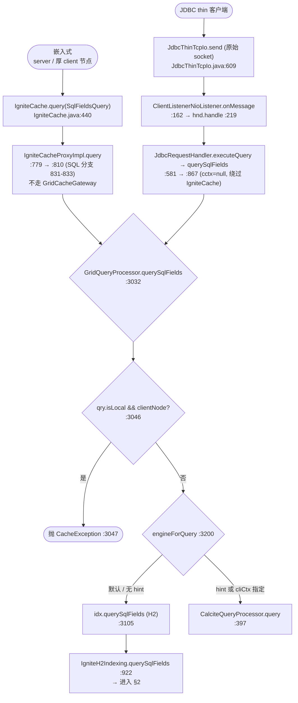
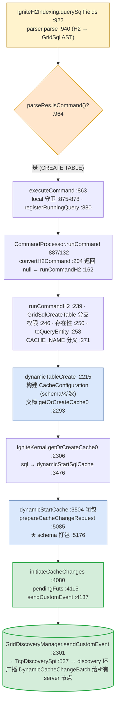
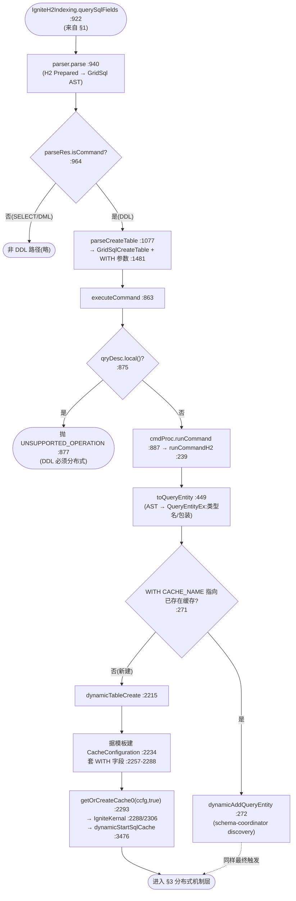
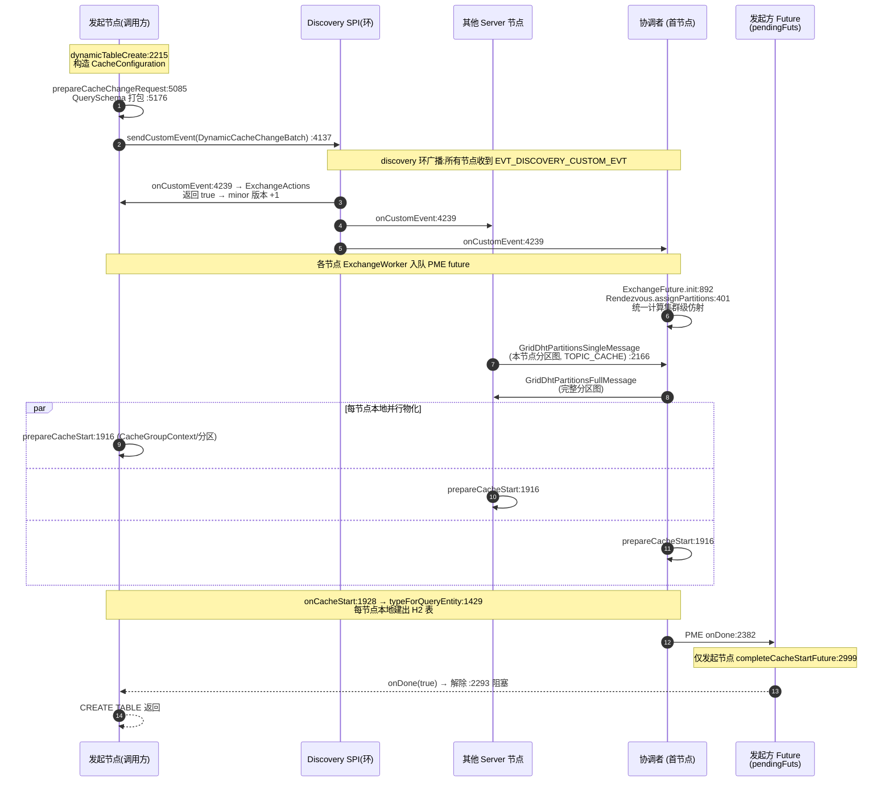
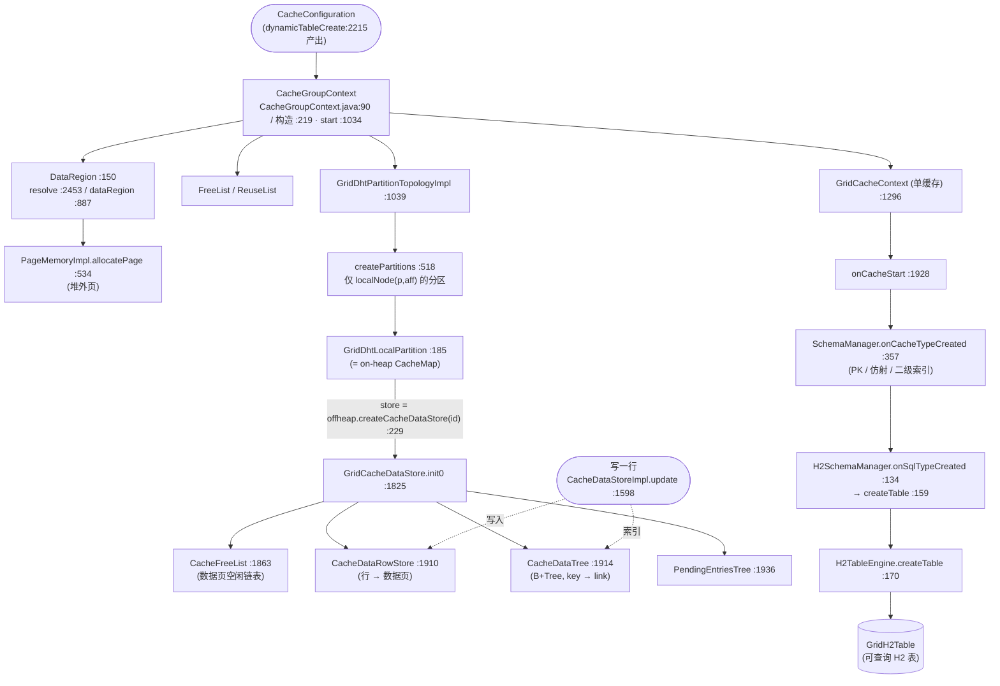
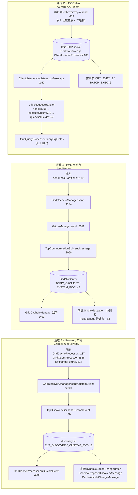
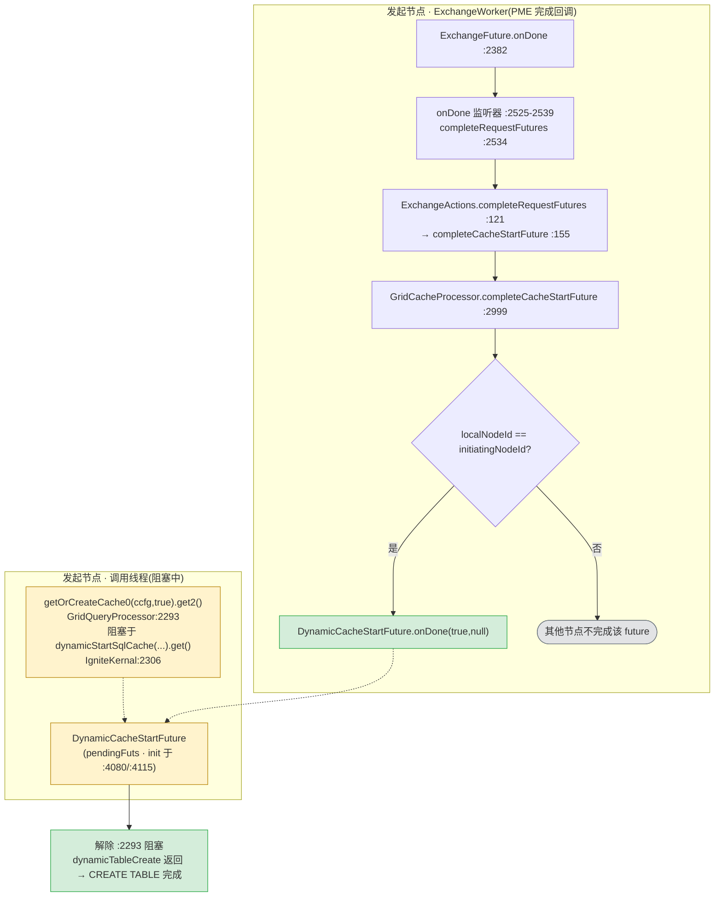
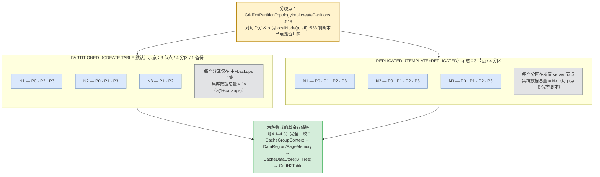

# Apache Ignite 2.17.0 CREATE TABLE 执行流程(全链路源码梳理)

> 起点:`IgniteCache.query(new SqlFieldsQuery("CREATE TABLE ..."))`
> 对象:`vendors/ignite`(tag `2.17.0`)
> 所有结论落实源码 `file:line`,默认走 **H2 引擎**(2.17 默认;Calcite 为可选实验引擎)。
> 配套文档:`01-ignite-ddl-support.md`(DDL 语句覆盖面与 API 入口)。

---

## 0. 端到端总览

```
[客户端/入口层]
  IgniteCache.query(SqlFieldsQuery)                IgniteCache.java:440
    └─ IgniteCacheProxyImpl.query                  IgniteCacheProxyImpl.java:779 / 810  (SQL 分支 831-833)
       └─ GridQueryProcessor.querySqlFields         GridQueryProcessor.java:2970 → 3032 → 3105
          └─ IgniteH2Indexing.querySqlFields        IgniteH2Indexing.java:922

[DDL 处理层 · 发起节点]
  parser.parse → GridSqlQueryParser.parseCreateTable   IgniteH2Indexing.java:940 / GridSqlQueryParser.java:1077
  executeCommand (拒绝 local DDL 875-878) → CommandProcessor.runCommandH2:239
    └─ toQueryEntity:449 (AST → QueryEntityEx)
       └─ GridQueryProcessor.dynamicTableCreate:2215  (构造 CacheConfiguration)
          └─ IgniteKernal.getOrCreateCache0:2288 →2306
             └─ GridCacheProcessor.dynamicStartSqlCache:3476   ← 交给缓存/分布式层

[分布式机制层]
  prepareCacheChangeRequest:5085 → DynamicCacheChangeRequest(含 QuerySchema)
  initiateCacheChanges:4080 → discovery.sendCustomEvent(DynamicCacheChangeBatch):4137
  ════════════ ★ 发起节点 → 集群各节点(server)边界 · discovery 广播 · 以下跑在每个收到事件的节点 ════════════
     每节点 onCustomEvent:4239 → ClusterCachesInfo.onCacheChangeRequested:619 → ExchangeActions(bump minor 版本)
     GridCachePartitionExchangeManager.onDiscoveryEvent:564 → exchangeFuture:1818 → addFuture:1910
     ExchangeWorker.body0:3182 → GridDhtPartitionsExchangeFuture.init:3321/892
        onCacheChangeRequest:1452 → CacheAffinitySharedManager.onCacheChangeRequest:870
           ├─ processCacheStartRequests:936 → prepareCacheStart:1916 (本地缓存对象 + 分区)
           └─ initAffinityOnCacheGroupsStart:1040 → calculateAndInit:1794 → GridAffinityAssignmentCache.calculate:329
                → RendezvousAffinityFunction.assignPartitions:401 → initialize:234
     PME 期间点对点收发分区图 ──[网络:p2p]──► GridDhtPartitionsSingleMessage / FullMessage

[数据存储层]
  prepareCacheContext:1988 → getOrCreateCacheGroupContext:2152 → startCacheGroup:2441
     CacheGroupContext:219 / .start():1034 (topology + offheapMgr)
     DataRegion → PageMemoryImpl.allocatePage:534
     GridDhtPartitionTopologyImpl.createPartitions:518 → getOrCreatePartition:900 → GridDhtLocalPartition:185
        store = grp.offheap().createCacheDataStore:229
        GridCacheDataStore.init0:1825 → CacheFreeList:1863 / CacheDataRowStore:1910 / CacheDataTree:1914
  SQL 落地:SchemaManager.onCacheTypeCreated:357 → H2SchemaManager.onSqlTypeCreated:134
        → createTable:159 → H2TableEngine.createTable:170 → GridH2Table

[返回路径]
  GridDhtPartitionsExchangeFuture.onDone:2382 (监听器 2525-2539)
     → ExchangeActions.completeRequestFutures:121 → GridCacheProcessor.completeCacheStartFuture:2999
        → DynamicCacheStartFuture.onDone(true) → 解除 getOrCreateCache0(:2293) 阻塞 → 返回客户端
```

**5 层归属一览:**

| 层级 | 起点 → 终点(本流程中的职责) | 关键类/方法 |
|---|---|---|
| 客户端/入口 | `IgniteCache.query` → `GridQueryProcessor.querySqlFields` | `IgniteCacheProxyImpl`、`GridQueryProcessor` |
| DDL 处理(发起节点) | SQL 解析 → `QueryEntity` → `CacheConfiguration` | `IgniteH2Indexing`、`CommandProcessor`、`GridQueryProcessor.dynamicTableCreate` |
| 分布式机制 | 动态缓存启动、分区交换(PME)、亲和性计算 | `GridCacheProcessor`、`ClusterCachesInfo`、`GridDhtPartitionsExchangeFuture`、`CacheAffinitySharedManager` |
| 数据存储 | 缓存组/分区/PageMemory/B+Tree 的物化 | `CacheGroupContext`、`DataRegion`、`PageMemoryImpl`、`GridDhtLocalPartition`、`CacheDataStore` |
| 网络通信 | discovery 广播、PME 点对点、JDBC thin 传输(贯穿全程) | `GridDiscoveryManager`/`TcpDiscoverySpi`、`GridIoManager`/`TcpCommunicationSpi`、`JdbcThinTcpIo`/`JdbcRequestHandler` |

> **★ 发起节点 ↔ 集群各节点 边界**:§1(入口)+ §2(DDL 处理)+ §3.1(止于 `sendCustomEvent:4137`)均在**发起节点**完成;§3.2 起 `onCustomEvent:4239` 由**每个收到 discovery 事件的节点**在本节点 discovery 线程执行(Javadoc:"…when discovery custom message is received"),发起节点也会收到自己发出的事件;数据侧物化(§4)只在 server/仿射节点。

### 图 1 — 端到端分层流程图(按 5 层划分,括注关键 file:line)

> 单节点视角的线性主链;⑤ 网络通信层贯穿全程(discovery 承载 ③ 的缓存启动广播、PME 点对点承载分区图交换、JDBC thin 承载入口请求,详见 §5)。

```mermaid
flowchart TD
    Start(["IgniteCache.query(new SqlFieldsQuery)"]):::entry --> n1

    subgraph L1["① 客户端 / 入口层"]
      n1["IgniteCacheProxyImpl.query<br/>IgniteCacheProxyImpl.java:779 / 810 (SQL 分支 831-833)"]
      n1 --> n2["GridQueryProcessor.querySqlFields<br/>GridQueryProcessor.java:3032 → 3105"]
      n2 --> n3["IgniteH2Indexing.querySqlFields<br/>IgniteH2Indexing.java:922"]
    end

    subgraph L2["② DDL 处理层(发起节点)"]
      n3 --> d1["parseCreateTable<br/>GridSqlQueryParser.java:1077"]
      d1 --> d2["executeCommand · 拒绝 local DDL<br/>IgniteH2Indexing.java:863 / 875-878"]
      d2 --> d3["runCommandH2:239 → toQueryEntity:449<br/>(AST → QueryEntity)"]
      d3 --> d4["dynamicTableCreate:2215<br/>构造 CacheConfiguration · 交棒 :2293"]
    end

    subgraph L3["③ 分布式机制层"]
      d4 --> e1["prepareCacheChangeRequest:5085<br/>QuerySchema 打包 :5176"]
      e1 --> e2["initiateCacheChanges:4080<br/>sendCustomEvent(DynamicCacheChangeBatch) :4137"]
      e2 --> Bound{"★ 发起节点 → 集群各节点<br/>discovery 广播 · 以下跑在每个收到事件的节点"}:::bound
      Bound --> e3["每节点 onCustomEvent:4239 → 升 minor 拓扑版本"]
      e3 --> e4["ExchangeFuture.init:892<br/>PME + 仿射 Rendezvous.assignPartitions:401"]
    end

    subgraph L4["④ 数据存储层"]
      e4 --> s1["prepareCacheStart:1916<br/>CacheGroupContext:219"]
      s1 --> s2["DataRegion → PageMemoryImpl.allocatePage:534"]
      s2 --> s3["GridDhtLocalPartition:185<br/>+ CacheDataStore.init0:1825"]
      s3 --> s4["H2TableEngine.createTable:170 → GridH2Table"]
    end

    s4 --> Done(["PME onDone:2382 → completeCacheStartFuture:2999<br/>解除 :2293 阻塞 · 返回客户端"]):::done

    classDef entry fill:#fff3cd,stroke:#b8860b,stroke-width:2px;
    classDef done fill:#d4edda,stroke:#28a745,stroke-width:2px;
    classDef bound fill:#f8d7da,stroke:#721c24,stroke-width:2px;
```



---

## 1. 客户端 / 入口层

### 图 2 — 两条入口路径汇聚于 `GridQueryProcessor.querySqlFields`

> DDL 字符串与 SELECT 走同一条 `SqlFieldsQuery` 通道,无独立 DDL 标志。关键差异:**嵌入式**路径经 `IgniteCacheProxyImpl`(需有缓存句柄);**JDBC thin** 完全绕过 `IgniteCache`,以 `cctx=null` 直接进入 `GridQueryProcessor`。两者在 `querySqlFields:3032` 汇合后,依次过 `clientNode+local` 守卫、引擎选择(`engineForQuery`,默认 H2),最终落到 `IgniteH2Indexing`(见 §2)。



### 1.1 嵌入式(server / 厚 client 节点)路径

DDL 字符串没有"特殊 DDL 标志",与 SELECT 走同一条 `SqlFieldsQuery` 通道。

**Hop 1** — 接口声明:`IgniteCache.query(SqlFieldsQuery)` `IgniteCache.java:440`(无方法体)。

**Hop 2** — `IgniteCacheProxyImpl.query(SqlFieldsQuery)` `IgniteCacheProxyImpl.java:779`,仅 up-cast 委托给泛型 `query(Query)`:
```java
@Override public FieldsQueryCursor<List<?>> query(SqlFieldsQuery qry) {
    return (FieldsQueryCursor<List<?>>)query((Query)qry);   // :780
}
```
> 注:`SqlFieldsQuery` 这条分支**不走 `GridCacheGateway` 的 guard/unguard**;网关模式只用于缓存数据操作(`query(Query, ClusterGroup)` 辅助方法 `:509` 只处理 TextQuery/SpiQuery/IndexQuery,不含 SQL)。

**Hop 3** — `IgniteCacheProxyImpl.query(Query<R>)` `IgniteCacheProxyImpl.java:810`,SQL 分支 `:831-833` 直接交给查询处理器:
```java
if (qry instanceof SqlFieldsQuery)
    return (FieldsQueryCursor<R>)ctx.kernalContext().query().querySqlFields(
        ctx, (SqlFieldsQuery)qry, null, keepBinary, true).get(0);
```
其中 `ctx.kernalContext().query()` 即 `GridQueryProcessor`;`cliCtx=null`(嵌入式路径无 thin 客户端上下文);`failOnMultipleStmts=true`。多语句脚本走 `queryMultipleStatements` `:784`(传 `failOnMultipleStmts=false`)。

**Hop 4** — `GridQueryProcessor` 重载链:
- 5 参 `querySqlFields(cctx, qry, cliCtx, keepBinary, failOnMultipleStmts)` `GridQueryProcessor.java:2970` → 补两个默认参数转发;
- 7 参分发方法 `querySqlFields(...)` `:3032`:
  - client 节点上禁止 local 查询:`if (qry.isLocal() && ctx.clientNode()) throw ...` `:3046-3047`;
  - 引擎选择 `engineForQuery` `:3200`(支持 `/*+ QUERY_ENGINE('calcite') */` hint 或 `cliCtx` 指定 Calcite);**默认 H2** 时 `qryEngine` 为 null,落入 else 分支;
  - 走遗留 H2 路径:`idx.querySqlFields(schemaName, qry, cliCtx, keepBinary, failOnMultipleStmts, cancel0)` `:3105-3112`。`idx` 是 `GridQueryIndexing` SPI(`:220` 字段,实例化为 `IgniteH2Indexing`)。

**Hop 5** — `IgniteH2Indexing.querySqlFields(...)` `IgniteH2Indexing.java:922`:`parser.parse(schemaName, remainingQry, ...)` `:940`;若 `parseRes.isCommand()` `:964`(DDL)则进入命令执行路径。**本层到此结束**,SQL 字符串已抵达查询/索引层。

### 1.2 JDBC thin 客户端路径(完全绕过 `IgniteCache`)

thin 协议不经过 `IgniteCacheProxyImpl`,直接进入 `GridQueryProcessor`:
- 服务端入口 `JdbcRequestHandler.querySqlFields(SqlFieldsQueryEx, GridQueryCancel)` `modules/core/.../processors/odbc/jdbc/JdbcRequestHandler.java:867`:
```java
return connCtx.kernalContext().query().querySqlFields(null, qry,
    cliCtx, true, protocolVer.compareTo(VER_2_3_0) < 0, cancel);   // :868-869
```
即 `GridQueryProcessor.querySqlFields` 的 6 参重载 `:3000`(cctx=`null`,无缓存对象参与)。详见 §5.3。

### 1.3 深入:从 `querySqlFields:922` 到网络层的核心流程

两条入口路径最终都汇到 `IgniteH2Indexing.querySqlFields:922`(运行在**接收并执行该 SQL 的节点**)。本小节给出从该点直到"经 discovery 把请求发到各服务端节点"的**核心路径聚焦视图**;逐字代码与各层细节见 §2(DDL 处理)、§3(分布式机制)、§6(返回路径)。

**入口 → 网络层 核心路径(聚焦视图):**



**8 个核心步骤(精炼,file:line):**

1. **解析 + 命令识别** — `querySqlFields:922` 循环支持多语句;`parser.parse:940` 把 SQL 经 H2 转成 `GridSql` AST;`checkClusterState:961`;`isCommand():964` 判出 DDL → `executeCommand:863`。
2. **守卫 + 注册** — local 守卫 `:875-878`(CREATE TABLE 不允许 `setLocal(true)`,否则抛 `UNSUPPORTED_OPERATION`);`registerRunningQuery:880`;`cmdProc.runCommand:887`。
3. **命令分派** — `runCommand:132` 先 `convertH2Command:204`,但该方法**只**转 INDEX(`:205/220`),CREATE TABLE 返回 `null` → 落入 `runCommandH2:162`(H2 直连分支)。
4. **建表执行(最核心)** — `runCommandH2:239` 的 `GridSqlCreateTable` 分支:权限 `CACHE_CREATE:246` → 本地 catalog 存在性 `schemaMgr.dataTable:250` → `toQueryEntity:258`(AST→`QueryEntity`)→ **`CACHE_NAME` 分叉 `:271`**:指向已有缓存则 `dynamicAddQueryEntity:272`,否则 `dynamicTableCreate:281`(新建主路径)。
5. **构建 `CacheConfiguration`** — `dynamicTableCreate:2215`:据模板 `:2234`(PARTITIONED/REPLICATED)装所有 `WITH` 字段 `:2257-2288`;交棒 `ctx.grid().getOrCreateCache0(ccfg, true):2293`(★ 离开查询处理器进入缓存层)。
6. **交棒缓存层** — `IgniteKernal.getOrCreateCache0:2306` 因 `sql=true` 走 `dynamicStartSqlCache:3476` → `dynamicStartCache:3504`。
7. **构造分布式请求** — 闭包 `:3525` → `prepareCacheChangeRequest:5085`:新建 `DynamicCacheChangeRequest:5102`,新缓存分支 `:5156` 把 **`CacheConfiguration`(`:5168`)+ `QuerySchema`(`:5176`)** 打包进请求。
8. **出网★** — `initiateCacheChanges:4080`:建 `DynamicCacheStartFuture` 入 `pendingFuts:4115`,`ctx.discovery().sendCustomEvent(new DynamicCacheChangeBatch(sndReqs)):4137` → `GridDiscoveryManager:2301` → `TcpDiscoverySpi:537` 投入 discovery 环,广播给**集群所有 server 节点**。

> 关键时序:发起方在 `:2293` 的 `.get2()` **阻塞**,直到该请求对应的 `DynamicCacheStartFuture` 在 PME(分区交换)完成后被 `completeCacheStartFuture:2999` 唤醒(§6)。即 CREATE TABLE 是一次集群级操作——网络广播出去后,发起方一直等到全集群交换结束才"收回"控制权。

**一句话串讲:** `querySqlFields:922` 解析 → `executeCommand:863` 守卫+注册 → `runCommandH2:162` 建表分支(权限/存在性/`toQueryEntity`/`CACHE_NAME` 分叉)→ `dynamicTableCreate:2215` 装配 `CacheConfiguration` → `getOrCreateCache0:2293` 交棒 → `prepareCacheChangeRequest:5085` 把 `CacheConfiguration`+`QuerySchema` 打进 `DynamicCacheChangeRequest` → `initiateCacheChanges:4137` 经 `sendCustomEvent(DynamicCacheChangeBatch)` **出 discovery 环发到所有服务端节点**。

---

## 2. DDL 处理层(发起节点:解析 + 构建 CacheConfiguration)

### 图 3 — DDL 处理流水线(解析 → AST → QueryEntity → CacheConfiguration → 交棒)

> 三个关键分支:**① `isCommand`** 区分 DDL 与 SELECT/DML;**② local 守卫**强制 DDL 必须分布式执行;**③ `CACHE_NAME`** 决定是往已有缓存追加 `QueryEntity`(`dynamicAddQueryEntity`,走 schema-coordinator discovery)还是新建缓存(`dynamicTableCreate`)。两条分支最终都进入 §3 的分布式缓存启动。



### 2.1 命令识别与 local-DDL 守卫

`IgniteH2Indexing.querySqlFields` `:922` → `parser.parse` `:940` 产出 `QueryParserResultCommand`;DDL 满足 `parseRes.isCommand()` `:964` → 调 `executeCommand(...)` `:863`:
```java
if (qryDesc.local())   // :875
    throw new IgniteSQLException("DDL statements are not supported for execution on local nodes only",
        IgniteQueryErrorCode.UNSUPPORTED_OPERATION);   // :876-877
...
res = cmdProc.runCommand(qryDesc.sql(), cmdNative, cmdH2, qryParams, cliCtx, qryId);   // :887
```
即:**CREATE TABLE 必须是分布式(非 local)语句**,否则在 `:875-878` 被拒。

### 2.2 解析:`CreateTable` → `GridSqlCreateTable`

`GridSqlQueryParser.parse` 分派 `:1888`;`CreateTable` 命中 `:1917` → `parseCreateTable(CreateTable)` `:1077`:
- 默认模板 `QueryUtils.TEMPLATE_PARTITIONED` `:1080`(可用 `WITH "TEMPLATE=REPLICATED"` 覆盖);
- 列收进 `LinkedHashMap<String,GridSqlColumn>` `:1141`,禁止 `_KEY/_VAL` 名 `:1148`;
- 主键收集 `pk_cols`,要求至少一个非主键列 `:1175-1178`;
- `WITH` 参数在 `:1185-1219` 按 `=` 拆分后逐条交给 `processExtraParam` `:1481` 分派(常量定义在 `:472-526`,见 `01-ignite-ddl-support.md`);
- key/value 包装逻辑 `:1222-1257`(value 默认包装,以便后续 `ALTER TABLE ADD COLUMN`)。

### 2.3 `runCommandH2`:AST → `QueryEntity`

`CommandProcessor.runCommand` `:132`:CREATE TABLE 无 native 命令(`convertH2Command` `:204` 只转 Index),落入 else → `runCommandH2(sql, cmdH2)` `:239`,CREATE TABLE 分支 `:243-298`:
- 权限检查 `ctx.security().authorize(cmd.cacheName(), CACHE_CREATE)` `:246`;
- 已存在表检查 `schemaMgr.dataTable(...)` `:250-256`;
- `QueryEntity e = toQueryEntity(cmd)` `:258` → `:449`;
- 据是否带已有 `CACHE_NAME` 二选一:
  - 已有缓存:`dynamicAddQueryEntity(...)` `:272`(走 schema-coordinator discovery 协议 `GridQueryProcessor.java:3528`/`:3536`);
  - 新建缓存:`ctx.query().dynamicTableCreate(...)` `:281`。

`CommandProcessor.toQueryEntity(GridSqlCreateTable)` `:449` 把 AST 转成 `QueryEntityEx`:
- 逐列建字段、收集 notNull/默认值/precision/scale `:461-503`;
- 类型名:`createTableValueTypeName(schema,tbl)` = `SQL_<schema>_<tbl>_<uuid>`(`QueryUtils.java:1439`),key 名追加 `_KEY`(`:1449`),可被 `KEY_TYPE/VAL_TYPE` 覆盖 `:505-512`;
- key/value 包装字段设置 `:514-546`。

### 2.4 `dynamicTableCreate`:构造 `CacheConfiguration` 并交棒

`GridQueryProcessor.dynamicTableCreate(...)` `:2215`:
1. 解析模板 `ctx.cache().getConfigFromTemplate(templateName)` `:2234`;null 时据 `PARTITIONED/REPLICATED` 建 `CacheConfiguration` 并强制 `FULL_SYNC` `:2237-2244`;
2. 校验模板、notNull 兼容性 `:2247-2252`;
3. 缓存名:空则 `QueryUtils.createTableCacheName` = `SQL_<schema>_<tbl>` `:2254-2255`;
4. 套上所有 `WITH` 派生字段:`setGroupName/setDataRegionName/setAtomicityMode/setBackups/setQueryParallelism/setEncryptionEnabled/setSqlSchema/setQueryEntities/setKeyConfiguration(affinityKey)` `:2257-2288`;
5. **启动缓存 `:2290-2303`**:
```java
res = ctx.grid().getOrCreateCache0(ccfg, true).get2();   // :2293
```

**交棒点(离开 `GridQueryProcessor`,进入 `GridCacheProcessor`):**
- `IgniteKernal.getOrCreateCache0(ccfg, sql=true)` `IgniteKernal.java:2288`,`sql=true` 分支 `:2306`:
```java
res = sql ? ctx.cache().dynamicStartSqlCache(cacheCfg).get() : ...;
```
- 进入 `GridCacheProcessor.dynamicStartSqlCache(CacheConfiguration)` `GridCacheProcessor.java:3476` —— 发起节点的 DDL 处理到此结束;真正"发起节点 → 集群各节点"的边界在 §3.1 末尾的 `sendCustomEvent:4137`(§3.2 起由各节点收到 discovery 事件后执行)。

---

## 3. 分布式机制层

### 图 4 — 跨节点时序(discovery 广播 → 各节点 PME → 协调者算仿射 → 仅发起方 future 完成)

> 关键认知:CREATE TABLE 是一次**集群级**操作。发起节点把 `CacheConfiguration` 通过 discovery 广播给所有节点,各节点本地各自跑一次 PME(分区交换);仿射由协调者统一计算后以分区图消息同步;**发起方的 future 一直阻塞,直到本节点上的 PME 完成(即整个集群交换结束)才返回**(对应 §6)。



### 3.1 动态缓存启动:构造请求 + discovery 广播

`dynamicStartSqlCache` `:3476` → `dynamicStartCache(...)` `:3504` → `prepareCacheChangeRequest(...)` `:5085`:
- 新建 `DynamicCacheChangeRequest(UUID.randomUUID(), cacheName, localNodeId())` `:5102`;
- 设 `req.sql(true)`、`deploymentId` `:5164`、`startCacheConfiguration(...)`(配置切分器)`:5168`;
- **`req.schema(new QuerySchema(QueryUtils.normalizeQueryEntities(...)))` `:5176` —— `QueryEntity`(表 schema)打包进请求**;
- `DynamicCacheChangeRequest`(`DynamicCacheChangeRequest.java:34`):`schema` QuerySchema 字段 `:99`、`startCfg` `:50`、`sql` `:84`、`deploymentId` `:42`。

`initiateCacheChanges(reqs)` `:4080`:注册 `DynamicCacheStartFuture` 到 `pendingFuts` `:4115`,然后广播:
```java
ctx.discovery().sendCustomEvent(new DynamicCacheChangeBatch(sndReqs));   // :4137
```
`DynamicCacheChangeBatch`(`DynamicCacheChangeBatch.java:37`)装一组 `DynamicCacheChangeRequest`,且 `exchangeNeeded()` `:101` 返回 `exchangeActions != null`(触发 PME)。

> 关键:**动态缓存启动用 discovery 广播,不是点对点消息**——和节点 join/leave 走同一通道(详见 §5.1)。

---

> **★ 发起节点 → 集群各节点 边界**:`sendCustomEvent:4137` 是发起节点的最后一动。从此处(`onCustomEvent:4239`)开始,代码不再由发起节点独占执行,而是由**每个收到该 discovery 事件的节点**在本节点 discovery 线程上回调(`GridCacheProcessor.onCustomEvent` 的 Javadoc:"Callback invoked from discovery thread when discovery custom message is received";投递见 `GridDiscoveryManager.java:668`)。发起节点也会收到自己发出的事件;数据侧物化(§4)只在 server/仿射节点。

---

### 3.2 各节点消费 discovery 事件

`GridCacheProcessor.onCustomEvent(msg, topVer, node)` `:4239`,命中 `DynamicCacheChangeBatch` `:4264`:
```java
boolean changeRequested = cachesInfo.onCacheChangeRequested((DynamicCacheChangeBatch)msg, topVer);
ctx.query().onCacheChangeRequested((DynamicCacheChangeBatch)msg);
return changeRequested;   // true → discovery 分配新 minor 拓扑版本,触发 PME
```
- `ClusterCachesInfo.onCacheChangeRequested` `:619` → `processCacheChangeRequests` `:647`:建 `ExchangeActions` `:645`,对启动分支调 `processStartNewCacheRequest` `:1074` → `registerCacheGroup`(建 `CacheGroupDescriptor`)`:1154` + `exchangeActions.addCacheToStart(...)` `:1200`;返回 `res.needExchange` `:661`。
- 起始版本设为 `topVer.nextMinorVersion()` `:701`。**`onCustomEvent` 返回 true → discovery 递增 minor 版本号 → 触发分区交换。**

### 3.3 分区交换(PME)

`GridCachePartitionExchangeManager.onDiscoveryEvent` `:564`(discovery 监听器,注册于 `:329/365`),命中 `DynamicCacheChangeBatch` `:632-642`:
```java
ExchangeActions exchActions = batch.exchangeActions();
if (exchActions != null) {
    exchId = exchangeId(n.id(), affinityTopologyVersion(evt), evt);
    exchFut = exchangeFuture(exchId, evt, cache, exchActions, null);   // :1818
}
...
addFuture(exchFut);   // :716 / :1910
```
单线程 `ExchangeWorker.body0()` `:3182` 出队后 `:3321` 执行 `exchFut.init(newCrd)`。

`GridDhtPartitionsExchangeFuture.init(boolean newCrd)` `:892`:
- 选协调者 `crd = srvNodes.get(0)` `:915`;
- `DynamicCacheChangeBatch` 事件 `:978-982` → `exchange = onCacheChangeRequest(crd)` 然后 `initCoordinatorCaches(newCrd)` `:996`;
- `onCacheChangeRequest(crd)` `:1452`:
```java
registerCachesFuture = cctx.affinity().onCacheChangeRequest(this, crd, exchActions);
return clientNode() ? ExchangeType.CLIENT : ExchangeType.ALL;
```

### 3.4 本地缓存对象启动 + 亲和性计算

`CacheAffinitySharedManager.onCacheChangeRequest(...)` `:870` 做两件事:

**(a) 本地缓存对象启动** — `processCacheStartRequests` `:936`:对每个启动请求,据 `CU.affinityNode(...)` 判断本节点是否持有该缓存,建 `StartCacheInfo` 并调 `cctx.cache().prepareStartCachesIfPossible(...)` `:998` → `prepareCacheStart` `:1916`(见 §4)。

**(b) 亲和性计算** — `initAffinityOnCacheGroupsStart` `:1040` → `initStartedGroup` `:1325` → `calculateAndInit` `:1794`:
```java
List<List<ClusterNode>> assignment = aff.calculate(topVer, evts, evts.discoCache()).assignment();
aff.initialize(topVer, assignment);
```
- `GridAffinityAssignmentCache.calculate` `:329`:`aff.assignPartitions(new GridAffinityFunctionContextImpl(sorted, prevAssignment, ...))` `:401/423`,`aff` 默认为 **`RendezvousAffinityFunction`**;
- 每个分区映射到一组节点(主 + backups);非中心化函数下**各节点本地独立计算得到相同结果**(`canCalculateAffinity` `:1431`),否则向协调者拉取(`GridDhtAssignmentFetchFuture` `:1404`);
- `GridAffinityAssignmentCache.initialize` `:234` 存入 ready 供交换完成时使用。

### 3.5 schema → H2 表(集群级)

CREATE TABLE 的 schema **不是**靠 `SchemaProposeDiscoveryMessage`(那只用于 ALTER/INDEX),而是随缓存描述传播,在交换期间的 `prepareCacheStart` 里物化:
- `GridCacheProcessor.prepareCacheStart` `:1916` 调 `ctx.query().onCacheStart(new GridCacheContextInfo(cacheCtx, clientCache), desc.schema(), desc.sql())` `:1928`;
- `GridQueryProcessor.onCacheStart` `:1261` → `onCacheStart0` `:1068` → `createQueryCandidates` `:1415` → `QueryUtils.typeForQueryEntity` `:1429`:每个 `QueryEntity` 在每个 server 节点上建出对应的 H2 表/索引。**因为是同一份 `QuerySchema` 在所有节点执行,无需二次往返。**

---

## 4. 数据存储层

### 图 5 — 存储层组件构成(`CacheConfiguration` → 物化到可查询 H2 表)

> 层级关系:`CacheGroupContext` 绑定 `DataRegion`/`PageMemory`,下挂分区拓扑;每个本地分区 `GridDhtLocalPartition` 持有一个 `CacheDataStore`(数据页空闲链表 `CacheFreeList` + 行存储 `CacheDataRowStore` + **键索引 B+Tree `CacheDataTree`**)。SQL 侧经 `SchemaManager` → `H2TableEngine.createTable` 产出 `GridH2Table`,其行通过 `link` 回指 B+Tree,从而把"逻辑表"接到上述存储上。



交换期间 `prepareCacheStart` `:1916` → `prepareCacheContext` `:1988` 把 `CacheConfiguration` 物化成存储骨架:

### 4.1 缓存组上下文

- `getOrCreateCacheGroupContext` `:2152` → `startCacheGroup` `:2441`:`new CacheGroupContext(...)` `:2479`,注册 `cacheGrps.put(grpId, grp)` `:2503`。
- `CacheGroupContext`(`CacheGroupContext.java:90`,构造 `:219`)持有:`ccfg`、`dataRegion`、`freeList/reuseList`、`top`(分区拓扑)、`offheapMgr`、`caches`(本组的各缓存上下文)。
- `CacheGroupContext.start()` `:1034`:建 `GridDhtPartitionTopologyImpl` `:1039`;据 `persistenceEnabled` 选 offheap 管理器(`:1044-1046`:持久化 → `GridCacheOffheapManager`,否则 `IgniteCacheOffheapManagerImpl`)`offheapMgr.start` `:1052`。
- 单缓存上下文 `createCacheContext` `:1201`(`new GridCacheContext` `:1296`),据 `cacheMode` switch(`:1330`,PARTITIONED → `GridDhtAtomicCache`)。

### 4.2 数据区 / PageMemory

- `startCacheGroup` 解析数据区 `cfg.getDataRegionName()` `:2453-2455` → `IgniteCacheDatabaseSharedManager.dataRegion(name)` `:887`(null → 默认数据区);同处返回该区 `FreeList/ReuseList`。
- `DataRegion`(`DataRegion.java:26`)是薄持有者,内含 `PageMemory`、`DataRegionMetricsImpl`、`DataRegionConfiguration`。
- `PageMemoryImpl.allocatePage(grpId, partId, flags)` `PageMemoryImpl.java:534`:堆外(direct buffer)分配页,持久化时对应磁盘 page-store 文件。这是与 on-heap 的 `GridCacheConcurrentMap` 不同的原生堆外内存。

### 4.3 分区:`GridDhtLocalPartition` + `CacheDataStore`

- `GridDhtPartitionTopologyImpl.createPartitions(affVer, aff, updateSeq)` `:518`:遍历所有分区,仅当 `localNode(p, aff)` `:533` 为真(本节点持有该分区)时 `getOrCreatePartition(p)` `:900`。
  - **分区 vs 复制的差异就在此**:PARTITIONED 下仅主+备份节点创建分区;REPLICATED 下仿射函数对所有分区返回全部节点,故每个 server 节点都建全部分区、各存一份完整拷贝。
- `GridDhtLocalPartition`(`GridDhtLocalPartition.java:94`,`extends GridCacheConcurrentMapImpl`,构造 `:185`):
  - on-heap 入口映射 `singleCacheEntryMap`(`:209-210`,单缓存组场景);
  - `store = grp.offheap().createCacheDataStore(id)` `:229` —— 每个分区的持久化存储;
  - 持久化 + WAL 开启时,记录 `PartitionMetaStateRecord` `:232-233`。

### 4.4 `CacheDataStore`:B+Tree 与行存储

- `IgniteCacheOffheapManager.createCacheDataStore(p)` `:131` → 持久化下 `GridCacheOffheapManager.createCacheDataStore0` `:234` → `GridCacheDataStore.init0(checkExists)` `:1825`,在 `init.compareAndSet(false,true)` `:1844` 内建:
  - `CacheFreeList` `:1863`(数据页空闲链表,从 `PageMemory` 申请 `FLAG_AUX` 页 `:1879`);
  - `CacheDataRowStore` `:1910`(把行写进数据页);
  - `CacheDataTree` `:1914`(**以缓存键为键的 B+Tree**,索引每行);
  - `PendingEntriesTree` `:1936`(TTL/事务待处理);
  - `CacheDataStoreImpl` `:1958`。
- 行接口 `CacheDataRow`(`CacheDataRow.java:30`):`value()/version()/partition()/link()`,即一个 (key,value) 在堆外/磁盘上的表示。
- **写一行**:`CacheDataStoreImpl.update(...)` `IgniteCacheOffheapManagerImpl.java:1598` → `makeDataRow` `:1615` → `rowStore.addRow` `:1633`(字节进数据页)→ `dataTree.put(dataRow)` `:1646`(key→link 进 B+Tree)。

> 完整存储链:**on-heap `GridDhtCacheEntry`(只放元数据)→ `CacheDataRow/DataRow`(堆外)→ 数据页字节(`CacheDataRowStore`+`CacheFreeList`)→ B+Tree 索引(`CacheDataTree`: key→`link`)→ `PageMemoryImpl` 的页**。

### 4.5 SQL 行 ↔ 二进制:H2 表落地

- 逻辑 schema:`QueryEntity`(`QueryEntity.java:59`)的 `keyFieldName` `:70` / `valueFieldName` `:73` / `keyFields` `:81`。
- 桥接:`SchemaManager.onCacheCreated` `:334`(建 schema)→ `onCacheTypeCreated(cacheInfo, type, isSql)` `:357`:建 `TableDescriptor` `:371`、`createPkIndex` `:383`、`createAffinityIndex` `:384`、建二级索引 `:387-388`,并通知 H2 监听器 `lsnr.onSqlTypeCreated` `:380`。
- `H2SchemaManager.onSqlTypeCreated` `:134`:建 `H2TableDescriptor` `:139` → `createTable(tblDesc, conn)` `:159`:
  - `GridH2RowDescriptor`(基于 `GridQueryRowDescriptorImpl`)`:167-168`;
  - **`H2TableEngine.createTable(conn, sql, rowDesc, tbl, idxProc)` `:170`** —— 执行 H2 的建表 DDL,产出 `GridH2Table`,注册进 `dataTables` `:144/61`(内存级 H2 catalog)。
- `GridH2Table`(`GridH2Table.java:83`)绑定 `H2TableDescriptor` + 索引;`H2Row`(`H2Row.java:28`,`implements org.h2.result.Row`)是 H2 看到的每行基类,带回指存储层的 `link`。

> 这是 CREATE TABLE 逻辑 schema 变为"可查询 H2 表"的瞬间,该表背后即 §4.3-4.4 的存储。

### 4.6 WAL / 持久化(仅持久化缓存组)

- `GridCacheDatabaseSharedManager`:checkpoint、数据区映射、各区 FreeList/ReuseList。
- `FilePageStoreManager`:`(groupId, partitionId)` → 磁盘 page-store 文件(`GridCacheOffheapManager.java:243` 正是据此判断分区文件是否已存在)。
- `ctx.wal()`(`IgniteWriteAheadLogManager`):分区创建(`GridDhtLocalPartition.java:233`)与每次行写(`CacheFreeList/rowStore` 构造时传入 `ctx.wal()`)都记 WAL。
- 纯内存数据区:`persistenceEnabled=false`,无 page-store 文件、不记 WAL,页仍在堆外但不 checkpoint。

---

## 5. 网络通信层(贯穿全程的三条通道)

### 图 6 — 三条网络通道对比(发送链 · 消息类 · 传输)

> CREATE TABLE 触发三条互不重叠的网络通道:**A discovery 广播**(承载缓存启动/schema/仿射,非点对点,走环)、**B PME 点对点**(分区图经 `TcpCommunicationSpi`,topic=`TOPIC_CACHE`)、**C JDBC thin**(原始 socket,仅客户端 DDL 请求)。嵌入式路径只用到 A+B;JDBC thin 路径先经 C 进入,再触发 A+B。



### 5.1 通道 A:discovery 广播(告知"新缓存组存在")

承载缓存启动与 schema 提议,**非点对点**,走 discovery 环。
- 发送:`GridDiscoveryManager.sendCustomEvent(DiscoveryCustomMessage)` `GridDiscoveryManager.java:2301` → 包成 `CustomMessageWrapper` → `getSpi().sendCustomEvent(...)` `:2305`;
- SPI:`TcpDiscoverySpi.sendCustomEvent` `:537` → `impl.sendCustomEvent` `:545`(把 `TcpDiscoveryCustomEventMessage` 入环,各节点都收到);
- 缓存启动发送点:`GridCacheProcessor.java:4137`(及单缓存 `:4703`)`sendCustomEvent(new DynamicCacheChangeBatch(...))`;
- schema 提议发送点:`GridQueryProcessor.java:3536` `sendCustomEvent(new SchemaProposeDiscoveryMessage(op))`;
- 仿射切换发送点:`GridDhtPartitionsExchangeFuture.onAffinityInitialized` `:3301-3314` `sendCustomEvent(new CacheAffinityChangeMessage(...))`;
- 接收:`GridCacheProcessor.onCustomEvent` `:4239`(分流 `DynamicCacheChangeBatch` `:4264` / `SchemaAbstractDiscoveryMessage` `:4240` / `CacheAffinityChangeMessage` `:4246`)。
- 消息类:`DynamicCacheChangeBatch` `:37`、`SchemaProposeDiscoveryMessage`(`extends SchemaAbstractDiscoveryMessage`)、`CacheAffinityChangeMessage`(`:38`,内嵌 `GridDhtPartitionsFullMessage`)、事件封装 `DiscoveryCustomEvent`(`EVT_DISCOVERY_CUSTOM_EVT=18`)。

### 5.2 通道 B:PME 点对点(分区图/计数器,走 TcpCommunicationSpi)

discovery 升版本后,`GridDhtPartitionsExchangeFuture` 用点对点消息在协调者与各节点间交换分区图。
- 发送链:`GridCacheIoManager.send(node, msg, plc)` `GridCacheIoManager.java:1194` → `cctx.gridIO().sendToGridTopic(node, TOPIC_CACHE, msg, plc)` `:1209` → `GridIoManager.sendToGridTopic` `GridIoManager.java:2150` → `send(...)` `:2011`(建 `GridIoMessage`)→ `TcpCommunicationSpi.sendMessage` `:2058-2059`;
- topic/policy:`GridTopic.TOPIC_CACHE` `GridTopic.java:62`、`GridIoPolicy.SYSTEM_POOL=2` `GridIoPolicy.java:35`;接收侧 `GridCacheIoManager.start0()` `:499` 注册 `TOPIC_CACHE` 监听器。
- 消息类:
  - `GridDhtPartitionsSingleMessage` `:48`(单节点分区图,节点→协调者;字段 `parts` `:55`、`partCntrs` `:67` 等);
  - `GridDhtPartitionsFullMessage` `:62`(集群完整分区图,协调者→所有节点)。
- 发送点:`GridDhtPartitionsExchangeFuture.sendLocalPartitions(node)` `:2119` → `cctx.io().send(node, msg, SYSTEM_POOL)` `:2166`(由 `sendPartitions` `:2298` 调用);Full 消息由协调者 `createPartitionsMessage(false,false)` `:2191` 构造后发给各节点(`waitAndReplyToNode` `:3099` 等)。

> 仿射结果本身是经 **discovery**(通道 A 的 `CacheAffinityChangeMessage`)广播,而非通信 SPI;通信 SPI 只承载分区图消息。

### 5.3 通道 C:JDBC thin 传输(原始 TCP socket)

不走 discovery/通信 SPI,长度前缀 + 二进制 `JdbcRequest`。
- 客户端 `JdbcThinTcpIo.send(byte[])` `JdbcThinTcpIo.java:609`:4 字节小端长度前缀 `:612-615` + 载荷 `:617` + flush;编码 `sendRequestRaw` `:592`(`req.writeBinary` `:598`)。
- 请求封装 `JdbcRequest` `:33`:首字节为命令类型(`QRY_EXEC=2` `:35`、`BATCH_EXEC=6` `:47` 等);CREATE TABLE 经 `JdbcQueryExecuteRequest`(`expectedStatementType=UPDATE`)→ 线上类型 `QRY_EXEC`。
- 服务端 NIO:`ClientListenerProcessor` `:185` 建 `GridNioServer` + listener `ClientListenerNioListener`;`onMessage(ses, msg)` `:162`:`parser.decode` `:185` → `hnd.handle(req)` `:219` → `handleResponse` 写回 `:257`。
- 处理 `JdbcRequestHandler.handle` `:258` → `doHandle` switch:`QRY_EXEC` → `executeQuery` `:312-313/581`:取 SQL `:611`、建 `SqlFieldsQueryEx` `:613-633` → `querySqlFields(qry, cancel)` `:867` → `kernalContext().query().querySqlFields(...)` `:868-869`(直接进 `GridQueryProcessor`,无 `IgniteCache`)。

> 三条通道对照:discovery 广播(缓存/schema/仿射)、PME 点对点(分区图)、thin 传输(JDBC DDL 请求)。CREATE TABLE 在嵌入式路径下主要触发通道 A + 通道 B;在 JDBC thin 路径下先经通道 C 进入,再触发 A + B。

---

## 6. 返回路径(回到客户端)

### 图 7 — 阻塞调用线程与 PME 完成回调在 `DynamicCacheStartFuture` 上汇合

> 发起节点的**调用线程**自 `:2293` 起阻塞在 `getOrCreateCache0(...).get()`;**ExchangeWorker 线程**在 PME 完成后经 `onDone` 监听器一路回调到 `completeCacheStartFuture:2999`。关键:**仅当本节点是发起节点时**(`localNodeId == initiatingNodeId`)才唤醒该 future——即调用方一直阻塞到本节点的 PME 完成(整个集群交换结束)才返回。



发起方的 `DynamicCacheStartFuture` 在 `initiateCacheChanges` `:4080` 创建、按 `req.requestId()` 存入 `pendingFuts` `:4115`。当 `GridDhtPartitionsExchangeFuture` 成功完成:
- `onDone(...)` `GridDhtPartitionsExchangeFuture.java:2382` 注册内部监听器 `:2525-2539`:
```java
listen(() -> {
    ...
    if (exchActions != null && err0 == null)
        exchActions.completeRequestFutures(cctx, null);   // :2534
});
```
- `ExchangeActions.completeRequestFutures(ctx, err)` `ExchangeActions.java:121`:遍历 `cachesToStart` → `ctx.cache().completeCacheStartFuture(req, true, null)` `:148/155`;
- `GridCacheProcessor.completeCacheStartFuture(req, success, err)` `:2999`:**仅当本节点是发起节点时**(`req.initiatingNodeId()` 等于 `localNodeId()`)取出 `DynamicCacheStartFuture` 并 `onDone(true, null)`。

此 `onDone(true)` 解除 `IgniteKernal.java:2306` 的 `dynamicStartSqlCache(...).get()`,进而解除 `GridQueryProcessor.java:2293` 的 `.get2()`,`CREATE TABLE` 才返回给 SQL 调用方。**即:发起方一直阻塞到本节点上的 PME 完成(集群级交换结束),才会返回**。

---

## 7. 分区 vs 复制(同一套存储链,仅分区归属不同)

### 图 8 — 分区归属差异(PARTITIONED 切片分散 vs REPLICATED 全量副本)

> 唯一分歧点:`createPartitions:518` 对每个分区 `p` 调 `localNode(p, aff):533` 判断本节点是否归属。PARTITIONED(默认)下每个分区只在**主+backups 子集**节点上,数据被切片分散;REPLICATED 下仿射函数对每个分区返回**全部** server 节点,每节点存一份完整副本。下方分区归属为**示意**(实际由 `RendezvousAffinityFunction` 与节点拓扑决定);两种模式之下的存储链完全相同。



整条存储链(§4.1-4.5)对两种模式完全一致,唯一分歧在 `GridDhtPartitionTopologyImpl.createPartitions` `:518` 的 `localNode(p, aff)` `:533`:
- **PARTITIONED**(CREATE TABLE 默认):仅 `p` 的主+备份节点实例化 `GridDhtLocalPartition` + `CacheDataStore`;
- **REPLICATED**:仿射函数对所有分区返回全部节点,每个 server 节点建全部分区、各存一份完整拷贝。

---

## 8. 关键方法索引表(快速定位)

| 层 | 方法 | file:line |
|---|---|---|
| 入口 | `IgniteCache.query(SqlFieldsQuery)` | `IgniteCache.java:440` |
| 入口 | `IgniteCacheProxyImpl.query(SqlFieldsQuery)` / `query(Query)` | `IgniteCacheProxyImpl.java:779 / 810`(SQL `831-833`) |
| 入口 | `GridQueryProcessor.querySqlFields` 5参/7参 | `GridQueryProcessor.java:2970 / 3032`(H2 分派 `3105-3112`) |
| 入口 | `IgniteH2Indexing.querySqlFields` | `IgniteH2Indexing.java:922` |
| DDL | `IgniteH2Indexing.executeCommand`(local 拒绝) | `IgniteH2Indexing.java:863 / 875-878` |
| DDL | `GridSqlQueryParser.parseCreateTable` | `GridSqlQueryParser.java:1077` |
| DDL | `CommandProcessor.runCommandH2`(CREATE TABLE) | `CommandProcessor.java:239`(分支 `243-298`) |
| DDL | `CommandProcessor.toQueryEntity` | `CommandProcessor.java:449` |
| DDL | `GridQueryProcessor.dynamicTableCreate` | `GridQueryProcessor.java:2215`(交棒 `:2293`) |
| 分布式 | `IgniteKernal.getOrCreateCache0` | `IgniteKernal.java:2288`(`:2306`) |
| 分布式 | `GridCacheProcessor.dynamicStartSqlCache` / `dynamicStartCache` | `GridCacheProcessor.java:3476 / 3504` |
| 分布式 | `prepareCacheChangeRequest`(打包 schema) | `GridCacheProcessor.java:5085`(`:5176`) |
| 分布式 | `initiateCacheChanges`(discovery 广播) | `GridCacheProcessor.java:4080`(发送 `:4137`) |
| 分布式 | `onCustomEvent` / `ClusterCachesInfo.onCacheChangeRequested` | `GridCacheProcessor.java:4239 / ClusterCachesInfo.java:619` |
| 分布式 | `GridCachePartitionExchangeManager.onDiscoveryEvent` / `exchangeFuture` | `:564 / :1818` |
| 分布式 | `GridDhtPartitionsExchangeFuture.init` / `onCacheChangeRequest` | `:892 / :1452` |
| 分布式 | `CacheAffinitySharedManager.onCacheChangeRequest` | `:870`(start `:936` / affinity `:1040→1325→1794`) |
| 分布式 | `GridAffinityAssignmentCache.calculate` / `initialize` | `:329 / :234` |
| 存储 | `GridCacheProcessor.prepareCacheStart` / `prepareCacheContext` | `:1916 / :1988` |
| 存储 | `getOrCreateCacheGroupContext` / `startCacheGroup` | `GridCacheProcessor.java:2152 / 2441` |
| 存储 | `CacheGroupContext` 构造 / `.start()` | `CacheGroupContext.java:219 / 1034` |
| 存储 | `IgniteCacheDatabaseSharedManager.dataRegion` | `:887` |
| 存储 | `PageMemoryImpl.allocatePage` | `PageMemoryImpl.java:534` |
| 存储 | `GridDhtPartitionTopologyImpl.createPartitions` / `getOrCreatePartition` | `:518 / :900` |
| 存储 | `GridDhtLocalPartition` 构造 / `createCacheDataStore(id)` | `GridDhtLocalPartition.java:185 / 229` |
| 存储 | `GridCacheDataStore.init0`(FreeList/RowStore/DataTree) | `GridCacheOffheapManager.java:1825` |
| 存储 | `CacheDataStoreImpl.update`(写一行) | `IgniteCacheOffheapManagerImpl.java:1598` |
| 存储 | `SchemaManager.onCacheTypeCreated` | `:357` |
| 存储 | `H2SchemaManager.onSqlTypeCreated` / `createTable` / `H2TableEngine.createTable` | `H2SchemaManager.java:134 / 159 / 170` |
| 网络 | `GridDiscoveryManager.sendCustomEvent` / `TcpDiscoverySpi.sendCustomEvent` | `:2301 / :537` |
| 网络 | `GridCacheIoManager.send` / `GridIoManager.send` | `GridCacheIoManager.java:1194 / GridIoManager.java:2011` |
| 网络 | `GridDhtPartitionsExchangeFuture.sendLocalPartitions` | `:2119`(发送 `:2166`) |
| 网络 | `JdbcThinTcpIo.send` / `JdbcRequestHandler.querySqlFields` | `JdbcThinTcpIo.java:609 / JdbcRequestHandler.java:867` |
| 返回 | `GridDhtPartitionsExchangeFuture.onDone` / `ExchangeActions.completeRequestFutures` | `:2382 / ExchangeActions.java:121` |
| 返回 | `GridCacheProcessor.completeCacheStartFuture` | `:2999` |

---

## 附:与前一篇的衔接

- DDL 语句覆盖面、`WITH` 参数全集、API 入口对比见 `01-ignite-ddl-support.md`。
- 本文聚焦 **H2 引擎下 CREATE TABLE 的执行链**。若启用 Calcite 引擎,DDL 解析/转换走 `DdlSqlToCommandConverter`(`modules/calcite/.../prepare/ddl/`),但 `CREATE TABLE` 同样落到 `GridQueryProcessor.dynamicTableCreate` 之后的**分布式/存储链路与本文 §3-§6 完全相同**——即引擎只决定"如何把 SQL 变成 `CacheConfiguration`",不决定缓存如何分布与存储。
