# Apache Ignite 2.17.0 数据存储层设计(源码级深挖)

> 面向"资深 Java 工程师、但没写过存储引擎"的读者。所有结论落实 `vendors/ignite`(tag 2.17.0)源码 `file:line`。
> 配套:`01-ignite-ddl-support.md`、`02-create-table-execution-flow.md`(后者 §4 是存储层的速览,本文是其完整展开)。

---

## 0. 一句话心智模型

> **Ignite 把每个缓存组(cache group)的键空间切成固定数量的"分区";每个分区的数据用一个堆外(off-heap)、定长、按页管理的 `PageMemory` 承载——页里组织着一棵按键排序的 B+Tree(只存"链接 link")和一堆存真实字节的数据页;写操作先记一条 WAL 日志、改内存页,再由后台 Checkpoint 线程把脏页批量刷到磁盘的 `part-N.bin` 文件;分区通过 rendezvous 亲和性被分配到集群节点,节点拓扑变化时由 PME(分区交换)重算归属、rebalance 拷贝整个分区的字节。**

如果你只记一句话,记上面这句。下面把每个概念拆开。

---

## 1. 为什么这么设计(设计受力)

在进入源码前,先理解存储引擎要解决的几个根本矛盾,后续每个抽象都是其中之一:

| 矛盾 | Ignite 的解法 | 对应模块 |
|---|---|---|
| 堆上对象受 GC 限制,无法承载 TB 级数据 | 数据放**堆外**(off-heap direct buffer),自己管理 | `PageMemory` |
| 堆外内存不能无限大,冷数据要落盘 | **页式存储**:内存是磁盘页的缓存,满了按策略换出 | `PageMemory` + `PageStore` |
| 进程崩溃会丢内存里没落盘的数据 | **WAL**:先写日志再改页,崩溃后重放 | `FileWriteAheadLogManager` |
| 脏页迟早要刷盘、WAL 不能无限长 | **Checkpoint**:周期性全量刷脏页 + 推进 WAL 截断点 | `GridCacheDatabaseSharedManager` |
| 亿级 key 的快速点查与范围扫 | **B+Tree**:浅而胖的有序索引 | `BPlusTree` / `CacheDataTree` |
| 变长行反复增删导致数据页碎片化 | **FreeList**:按"剩余空间"分桶的页空间索引 | `AbstractFreeList` / `CacheFreeList` |
| 单机容量/可用性不够 | **分区 + 亲和性 + 副本**:数据横向切分到多节点 | `RendezvousAffinityFunction` / 分区 |
| 并发写与刷盘的一致性 | **Checkpoint 读写锁 + 页锁 + entry 锁**三道闸 | 见 §10 |

---

## 2. 全景分层架构

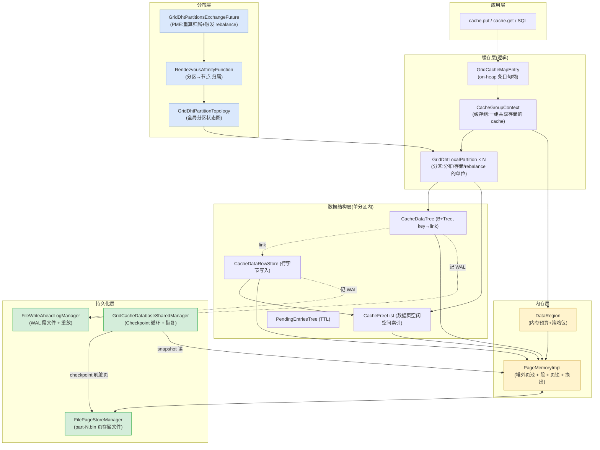

**6 个核心模块一句话职责**(后面逐个展开):

| 模块 | 核心类 | 职责 | 解决的问题 |
|---|---|---|---|
| 内存层 | `PageMemoryImpl` / `DataRegion` | 堆外定长页池,带换出 | 避 GC、支撑大数据 |
| 页存储 | `FilePageStore` / `FilePageStoreManager` | 每分区一个 `.bin` 文件 | 落盘与冷启动恢复 |
| WAL | `FileWriteAheadLogManager` | 追加日志,先于页刷盘 | 崩溃不丢未刷数据 |
| Checkpoint | `GridCacheDatabaseSharedManager` | 周期刷脏页 + 推进 WAL | 收口持久化、截断 WAL |
| 数据结构 | `BPlusTree`/`CacheDataTree`/`AbstractFreeList`/`CacheDataRowStore` | 有序索引 + 空间分配 + 行布局 | 变长行的存取、点查/范围扫 |
| 分布 | `CacheGroupContext`/`GridDhtLocalPartition`/`RendezvousAffinityFunction`/拓扑/PME | 切分、归属、迁移 | 横向扩展与高可用 |

---

## 3. 核心概念速查表(术语表)

| 术语 | 含义 | 源码锚点 |
|---|---|---|
| **Page(页)** | 定长(默认 4KB)的堆外内存块,所有数据结构的载体 | `PageMemoryImpl`, `DataStorageConfiguration.DFLT_PAGE_SIZE` |
| **pageId** | 64 位页标识:`pageIdx[32] \| partId[16] \| flag[8] \| offset[8]` | `PageIdUtils.pageId:161` |
| **link** | 64 位行指针:`pageId[56] \| itemId[8]`,B+Tree 叶子只存它 | `PageIdUtils.link:92` |
| **CacheGroup(缓存组)** | 一组共享底层存储(同分区/同 DataRegion)的 cache | `CacheGroupContext.java:90` |
| **Partition(分区)** | 缓存组键空间的水平切片;= 分布/存储/rebalance 单位 | `GridDhtLocalPartition.java:94` |
| **DataRegion(数据区)** | 一份内存预算 + 策略(PageMemory/换出策略/metrics)的捆绑 | `DataRegion.java:26` |
| **CacheDataStore** | 单分区的存储管家:一棵 B+Tree + 一个 FreeList + 行存储 | `CacheDataStoreImpl` |
| **B+Tree 叶子项** | 一个 `(link, hash[, cacheId])`,**不含**键值字节 | `AbstractDataLeafIO.storeByOffset:44` |
| **数据页(flag=DATA)** | 存真实行字节:槽位表 + 变长行 | `AbstractDataPageIO.java:38` |
| **FreeList 桶** | 256 个按"剩余空间"2 的幂分级的桶 | `AbstractFreeList.BUCKETS=256` |
| **WALPointer** | WAL 记录地址:`(segmentIdx, fileOff, len)` | `WALPointer.java:27` |
| **Checkpoint** | 把所有脏页刷盘 + 写标记,推进 WAL 截断点 | `GridCacheDatabaseSharedManager` |
| **checkpointReadLock** | 持有期间 Checkpoint 不会做内存快照;**所有改页操作都要持它** | `CheckpointReadWriteLock.java` |

---

## 4. 内存层:PageMemory 与 DataRegion

> 给新手的背景:**页(page)** 是数据库/操作系统的通用抽象——把内存切成固定大小的块来管理,就像 OS 的虚拟内存页。固定大小的好处是分配/回收/寻址都极简(O(1)),坏处是要管理"页内变长数据"和"内存满了换谁出去"。Ignite 的 `PageMemory` 就是一个**堆外的、页式、带换出策略的缓存池**——它本质上是磁盘页文件在内存里的缓存(cache of disk pages),和 OS 的 page cache 思想一致。

### 4.1 pageId 的位编码

一个 pageId 是 64 位,四个字段打包:

```
 bit:  63      56 55   48 47      32 31                 0
      ┌─────────┬────────┬───────────┬────────────────────┐
      │ offset  │  flag  │  partId   │      pageIdx       │
      │  (8b)   │  (8b)  │  (16b)    │      (32b)         │
      └─────────┴────────┴───────────┴────────────────────┘
```
(`FullPageId.java:34` 的位布局;`PageIdUtils.java:29-41` 的宽度常量)

- **pageIdx**(`:105`):该页在分区文件中的序号 = 磁盘偏移 `pageIndex * pageSize + 17`(`FilePageStore.pageOffset:807`)。
- **partId**(`:182`):分区号。
- **flag**(`:174`):页种类(`PageIdAllocator:32-45`):`FLAG_DATA=1`(数据/元/跟踪页)、`FLAG_IDX=2`(B+Tree 索引页)、`FLAG_AUX=4`(FreeList 等内部结构页)。
- **offset/rotation**(最高 8 位):在普通 pageId 里通常为 0;在 **link** 里复用为 **itemId**(行在数据页内的槽号,见 §5.5)。

> **设计要点**:pageId 自描述——仅凭 64 位就能还原(分区,页,种类),无需额外查找。这是"link 只占 8 字节却能定位一切"的基础。

### 4.2 PageMemoryImpl:堆外页池

`PageMemoryImpl.java:130 implements PageMemoryEx`。每个页 = **48 字节内存头 + 4KB 数据**(`PAGE_OVERHEAD=48` at `:152`)。头里存:marker/timestamp、相对指针、fullPageId、pinCount、页锁、临时缓冲指针(`PageMemoryImpl.java:105-128`)。

**段(Segment)分片降争用**:`Segment[] segments`(`:211`),每个页哈希到一个固定段:`segmentIndex = hash(effPageId*65537 + grpId) % n`(`:1885`)。所有该页的操作(acquire/lock/evict)只动一个段的锁,不同页的并发几乎不撞。

**每段持有**(`:1954-1999`):
- `LoadedPagesMap`(grpId, effPageId → 相对指针):常驻页的索引。
- `PagePool`:该段的空闲页池——一个 **Treiber 无锁栈**(回收页)+ bump 分配器(新页)。
- `PageReplacementPolicy`:换出策略。
- `dirtyPages` / `checkpointPages`:脏页集 / checkpoint 快照(见 §6)。

**分配一页 `allocatePage(grpId, partId, flags)`**(`:534`):
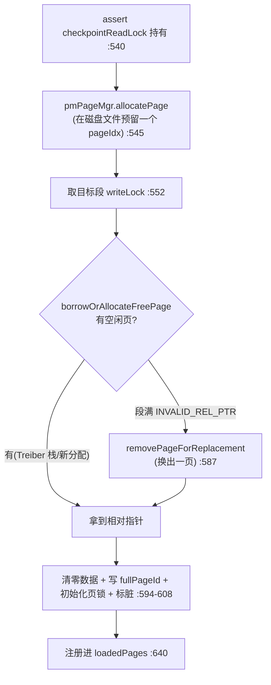

> **关键**:分配/换出页会改变页空间,所以**必须持有 checkpointReadLock**(`:540`),否则会和 Checkpoint 的快照竞争。

**读一页 `acquirePage`**(`:708`):命中段读锁→查 loadedPages→pin+通知换出策略→返回指针;未命中→升级段写锁→分配缓冲→**先释放段锁再做磁盘读**(`:886-901`,读盘慢,不能占着段锁阻塞本段其它页流量)。

### 4.3 页锁:OffheapReadWriteLock

每个页头偏移 32 字节处有一把 `OffheapReadWriteLock`(`:141`)。`readLock/writeLock/tryWriteLock`(`:1559/:1605`)带 **tag 校验**——tag = pageId 的 flag+offset,防止你锁住的页已经被换出/复用为别的逻辑页。`pinCount>0` 的页**绝不被换出**(`tryToRemovePage:2150`)。

### 4.4 换出(两种,别混淆!)

| 机制 | 触发条件 | 粒度 | 类 |
|---|---|---|---|
| **PageReplacementPolicy**(页级) | `persistenceEnabled=true`,段物理满 | 整页 RAM↔磁盘 | `ClockPageReplacementPolicy`(默认)/`SegmentedLru`/`RandomLru` |
| **PageEvictionTracker**(条目级) | `persistenceEnabled=false`,`DataPageEvictionMode≠DISABLED` | 把数据页里的 entry 挤出去 | `Random2LruPageEvictionTracker` 等 |

> 默认持久化场景用的是**页级换出**(CLOCK 算法)。换出时若页是脏的(已改未刷),会先 `flushDirtyPage` 写回 `PageStore` 再回收缓冲(`tryToRemovePage:2167`)。

### 4.5 DataRegion:内存预算 + 策略包

`DataRegion.java:26`——一个不可变捆绑:`(PageMemory, DataRegionConfiguration, DataRegionMetricsImpl, PageEvictionTracker)`。

`DataRegionConfiguration`(`:71`)关键项:

| 字段 | 默认 | 含义 |
|---|---|---|
| `maxSize` | `DFLT_DATA_REGION_MAX_SIZE` | 该区堆外内存上限 |
| `initSize` | min(MAX, 256MB) | 初始大小 |
| `persistenceEnabled` | `false` | 是否持久化(决定走 PageStore/WAL 与否) |
| `pageEvictionMode` | `DISABLED` | 非持久化时的条目级淘汰 |
| `pageReplacementMode` | `CLOCK` | 持久化时的页级换出 |

**按名解析**:`IgniteCacheDatabaseSharedManager.dataRegion(name):887`——传 `null` 返回默认区(`dataRegionMap:144`)。一个 cache 通过 `CacheConfiguration.setDataRegionName(...)` 绑定一个区。

> **为什么要多个区?** 隔离工作负载:不同区有独立内存预算、独立换出策略、独立 metrics,且**持久化开关独立**——可以让"热缓存"纯内存、"账本"持久化。

### 4.6 CacheGroupContext → 一个 DataRegion → 一个 PageMemory

一个缓存组**终身绑定**一个区(`CacheGroupContext.dataRegion:150`)。绑定发生在 `GridCacheProcessor.startCacheGroup:2453-2494`:

```java
String memPlcName = cfg.getDataRegionName();                              // :2453
DataRegion dataRegion = sharedCtx.database().dataRegion(memPlcName);      // :2455
FreeList freeList   = sharedCtx.database().freeList(memPlcName);          // :2465
ReuseList reuseList = sharedCtx.database().reuseList(memPlcName);         // :2466
new CacheGroupContext(..., dataRegion, ..., freeList, reuseList, ...);    // :2479
```

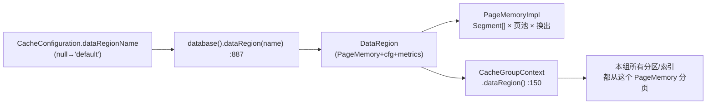

---

## 5. 数据结构层:B+Tree / FreeList / 行存储

> 给新手的背景:**B+Tree** 是数据库索引的事实标准。要点:① 只有**叶子**存数据指针,内部节点只存"导航键";② 叶子按序**链表**相连(范围扫只顺着叶子走,不回溯内部节点);③ 节点很"胖"(一页装几百个键)→ 树很"浅"(2-4 层就能管几十亿键)→ 点查只读"层数"个页。

### 5.1 BPlusTree:通用堆外 B+Tree

`BPlusTree.java:214`。**一个树节点 = 一个 PageMemory 页**(类 Javadoc `:96-212`)。内部节点布局(Javadoc `:128-136`):
```
   item(0)     item(1)        ...          item(N-1)
link(0)     link(1)     link(2)  ...  link(N-1)       link(N)     ← N 个键, N+1 个子指针
```

关键方法:
- `put(row)`(`:2623`)/ `findOne(row)`(`:1580`)/ `remove(row)`(`:2077`)/ `find(lower,upper)`(`:1326`,范围扫用叶子链表的 `ForwardCursor`)。
- 每个 B+Tree 有一个 **meta 页**(`metaPageId:247`)存根指针与层数,持久化。

> ⚠️ Ignite 的 B+Tree **不维护"非根节点半满"**不变量(`:181-187` 注释明说)——别假设填充因子,只假设结构正确。

### 5.2 CacheDataTree:缓存主索引(叶子只存 link)

`CacheDataTree.java:56 extends BPlusTree<CacheSearchRow, CacheDataRow>`。叶子项的物理内容(`AbstractDataLeafIO.storeByOffset:44-59`):
```
8 字节: row.link()
4 字节: row.hash()
4 字节: row.cacheId()   (仅共享缓存组)
```
**注意:叶子不存键字节、不存值字节**,只存 `(link, hash[, cacheId])`。键比较:先比 cacheId,再比 hash,hash 相同才**顺着 link 去数据页读键字节**比较(`CacheDataTree.compare:333` / `compareKeys:398`)——这是"不在索引里重复存键字节"的代价。

### 5.3 FreeList:数据页空闲空间管理

> 给新手的背景:数据页里是变长行,反复增删改会让页内出现碎片(200 字节空隙散成 4×50,放不下 150 字节的新行)。需要一个结构:**"给我 N 字节,立刻找到一块 ≥N 连续空闲的数据页"**,并在每次写入后更新该页的空闲额。

`AbstractFreeList.java:58 extends PagesList`——它**本身也是页式结构**(一棵按页 ID 组织的列表),核心是 **256 个"剩余空间"桶**(`BUCKETS=256`,`REUSE_BUCKET=255`):

```
按剩余空间做 2 的幂分级(step = pageSize/256,例 4KB→step=16)
桶号 b 容纳: 剩余空间 ∈ [b*2^shift, (b+1)*2^shift)

  bucket255: [回收的全空页]      ← REUSE_BUCKET
  bucket 8 : [pgA(剩余~128B)]
  bucket 4 : [pgB, pgC(剩余~64B)]
  bucket 1 : [pgD(剩余~16B)]
  ...
```
`bucket(freeSpace)`(`:554`):`freeSpace >>> shift`。要放一个 S 字节的行,取 `bucket(S)`,**该桶或更高桶里的任意页都保证能放下**(≥S 字节)。这是经典的"大小分级"空闲表:分摊 O(1) 放置,碎片被桶宽上界限制。

API(`FreeList.java`):`insertDataRow`(`:584`)/`updateDataRow`(`:780`,**就地改**若新字节放得下旧槽,返回 true→link 不变)/`removeDataRowByLink`(`:806`)。

**一次 `insertDataRow` 的流程**(`AbstractFreeList.java:584 → writeSinglePage:692`):
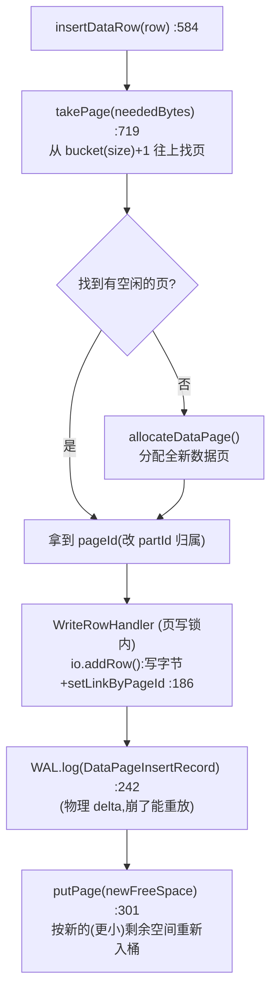

### 5.4 数据页布局(槽位表)

`AbstractDataPageIO.java:38`——经典的"两数组相向生长"槽位布局(类 Javadoc `:38-97` 有 ASCII):
```
 ┌──────────────────────┬─────────────────────────────┐
 │  items 表(每项 2B)  │        行字节(变长)        │
 │ direct / indirect    │  key | value | ver | expire │
 │  →→→ 生长            │              ←←← 生长       │
 └──────────────────────┴─────────────────────────────┘
        free space = 中间空隙
```
- **direct item**:直接存行数据偏移;**indirect item**(删除后产生):存指向某 direct item 的索引——这样**行的外部 link(item Id)在页整理(defrag)后永不变**。
- `getFreeSpace:337`:空隙大小 − 保留量(保留量保证"返回的 free space = 还能放的最大行")。

### 5.5 link 的编码与回填

`link = pageId | (itemId << 56)`(`PageIdUtils.link:92`,`itemId ≤ 0xFE`)。所以一个 link 64 位 = `[itemId:8 | flag:8 | partId:16 | pageIdx:32]`,**自描述**。

回填时机:行字节写入数据页时,由页本身把 link 写回行对象(`AbstractDataPageIO.addRow:929 → setLinkByPageId:1183`)。随后调用方把这个 link 插进 B+Tree(`dataTree.put`)。

```
   写一行:  RowStore.addRow ──► FreeList.insertDataRow
                                    │
                                    ▼  io.addRow:929
                          ┌─────────────────────┐
                          │ 数据页(FLAG_DATA)   │
                          │  写入 key/val/ver/exp│
                          │  生成 itemId         │
                          │  row.link = pageId|itemId<<56   ← setLinkByPageId:1183
                          └─────────────────────┘
                                    │
                                    ▼
                          CacheDataTree.put(link, hash)   ← B+Tree 叶子存 link
```

### 5.6 行对象:SearchRow vs DataRow

| 类型 | 字段 | 用途 | 源码 |
|---|---|---|---|
| `CacheSearchRow` | key, link, hash, cacheId | B+Tree **导航探针**(轻,不读 value) | `CacheSearchRow.java:25`;`SearchRow.java:41`(link 初始 0) |
| `CacheDataRow` | + value, version, expireTime, partition | **完整行** | `CacheDataRow.java:30`;`DataRow.java:31` |

> **性能杠杆**:B+Tree 遍历全程用 `keySearchRow`(便宜);只在命中叶子时才 `getRow`(`CacheDataTree.getRow:374`)顺着 link 读出完整 `DataRow`。

### 5.7 CacheDataStore:单分区的"四件套"管家

一个本地分区 = **{1 CacheFreeList, 1 CacheDataRowStore, 1 CacheDataTree, 1 PendingEntriesTree}**,在 `GridCacheOffheapManager.init0:1825-1970` 一次性建好,共享同一 PageMemory 与分区页。

`CacheDataStoreImpl.update(...)`(`IgniteCacheOffheapManagerImpl.java:1598`)是一次单行写入的总编排:
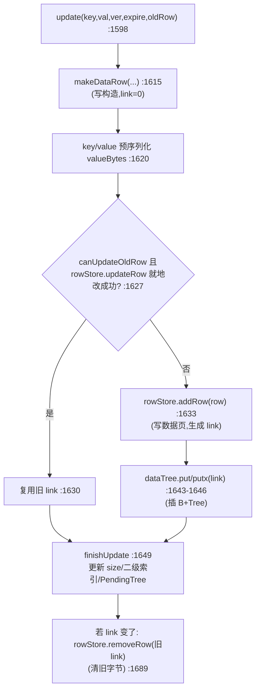

`find(key)` 读路径(`:1787`):`dataTree.findOne(new SearchRow(cacheId,key))` → 命中叶子取 link → `rowStore.dataRow(...)` 顺着 link 从数据页反序列化。

### 5.8 PendingEntriesTree:TTL 时间索引

`PendingEntriesTree.java:32`——同分区的**第二棵 B+Tree**,但键是 `(expireTime, link)`(`compare:84`)。写入带 expireTime 的行时 `updatePendingEntries:1700` 往里放一条;后台 TTL 线程从最左(最小 expireTime)扫,高效淘汰过期项。同样只存 link。

### 5.9 与 H2(SQL)的衔接

缓存 B+Tree 存 cache 行;SQL 引擎(H2)需要 H2 `Value[]`。桥梁:`H2Row`(implements H2 `Row`)持有一个 cache **link** + H2 Value[]。H2 自己的索引(排序索引/哈希索引)是独立的 B+Tree(`GridH2Table`),叶子**指向同一个 link**。所以三种访问路径(cache get / SQL 查询 / TTL 扫)都经由同一个 link 找到同一份行字节:

```
SQL 查询 ──► H2 索引 ─┐
cache get ──► CacheDataTree ─┤──► link ──► 数据页字节 ──► 行
TTL 扫描 ──► PendingTree ──┘
```

---

## 6. 持久化层:WAL 与 Checkpoint

> 给新手的背景:**WAL(预写日志)** 是数据库持久化的通用技术:每次改页**前**先往一个追加日志里写一条"我改了什么",再改内存页。这样即便进程崩溃、内存页丢了,也能**重放日志**恢复。**Checkpoint(检查点)** 是定期把内存里所有"脏页"(改过但没落盘的页)批量刷盘,并记一个标记,使恢复只需重放标记之后的日志——既收口持久化,又能删除旧日志。

### 6.1 WAL:FileWriteAheadLogManager

接口 `IgniteWriteAheadLogManager.java`:`log(WalRecord):70`、`flush(ptr, fsync):100`、`replay(start):120`、`truncate(high):161`、`notchLastCheckpointPtr(ptr):171`。实现 `FileWriteAheadLogManager.java:172`。

**段文件**:WAL 切成固定大小(默认 64MB)的 `.wal` 段文件,命名 `0000000000001234.wal`(`WAL_NAME_PATTERN:181`)。活跃段在 `wal/`,封存后移到 `wal/archive/`(可压缩成 `.wal.zip`,`:194`)。满了自动 rollover(`rollOver:1380`),且"WAL 太长没 checkpoint"会**强制触发 checkpoint**(`:1434`)。

**WALPointer**(`WALPointer.java:27`):`(segmentIdx, fileOff, len)`,16 字节。它是 WAL/Checkpoint/恢复之间流通的"货币"。

**记录类型**(`WALRecord.RecordType`,`WALRecord.java:41`),按用途分(`RecordPurpose`):
- **PHYSICAL**:重建页原始字节(`PageSnapshot`、各种 `PageDeltaRecord` 如 `DataPageInsertRecord`)。
- **LOGICAL**:重放缓存操作(`DataRecord`/`DataEntry`、`TxRecord`)。
- 关键标记:`CHECKPOINT_RECORD`(`:53`,含安全重放指针 `cpMark`)。

**一次普通行写产生两条**(对存储新人很重要):
1. **物理** `DataPageInsertRecord`(`AbstractFreeList.java:242`)——数据页字节 delta,崩溃后重放能重建页。
2. **逻辑** `DataRecord(DataEntry)`(`GridCacheMapEntry.java:3472`)——"对 key 做了 put",重放能重建缓存态。

**WAL 模式**(`WALMode.java:27`)— 持久性 vs 速度:

| 模式 | 含义 | 抗崩溃 |
|---|---|---|
| `FSYNC`(默认) | 提交返回前 fsync 到磁盘 | 抗掉电 |
| `LOG_ONLY` | flush 到 OS page cache | 抗进程崩溃,不抗掉电 |
| `BACKGROUND` | 后台定时 flush | 最后几次更新可能丢 |
| `NONE` | 关 WAL | 仅优雅关机能持久 |

**与 Checkpoint 的耦合**:`truncate(high):1150` 只删满足**全部**条件的段:`idx ≥ lastCheckpointPtr.index()` 不删、是最后活跃段不删、`high` 边界内不删、被别人 reserve(rebalance/CDC)不删。`notchLastCheckpointPtr:1208` 是 Checkpoint 完成后回填"最后完成 checkpoint 位置"的入口——它让旧段变得可删。

### 6.2 Checkpoint:GridCacheDatabaseSharedManager

**核心正确性原语——Checkpoint 读写锁**(`CheckpointReadWriteLock.java:33`,经 `CheckpointTimeoutLock:42` 暴露,`GridCacheDatabaseSharedManager.checkpointReadLock:1596`):
- **读锁**:任何"改页"的操作(B+Tree 分裂、FreeList 改、写行)**都要持读锁**;持锁期间 Checkpoint 不会做内存快照(保证快照一致性)。
- **写锁**:**仅 Checkpoint 线程**在"快照瞬间"持有;持写锁时所有改页操作暂停。
- 悬念:**脏页数超阈值时,前台写线程会被强制等下一个 checkpoint**(`CheckpointTimeoutLock.checkpointReadLock:131-152`)——背压。

**触发**:
- 后台周期(`Checkpointer.body:246`,默认 3 分钟或脏页够多);
- 前台:脏页过多(`CheckpointTimeoutLock:134`);
- WAL 过长(`FileWriteAheadLogManager:1434`);
- 显式 `forceCheckpoint`(`:1823`);启动后 `"node started"`(`onStateRestored:2054`)。

**Checkpointer 八阶段**(`Checkpointer.doCheckpoint:379` + `CheckpointWorkflow.markCheckpointBegin:221 / markCheckpointEnd:541`):

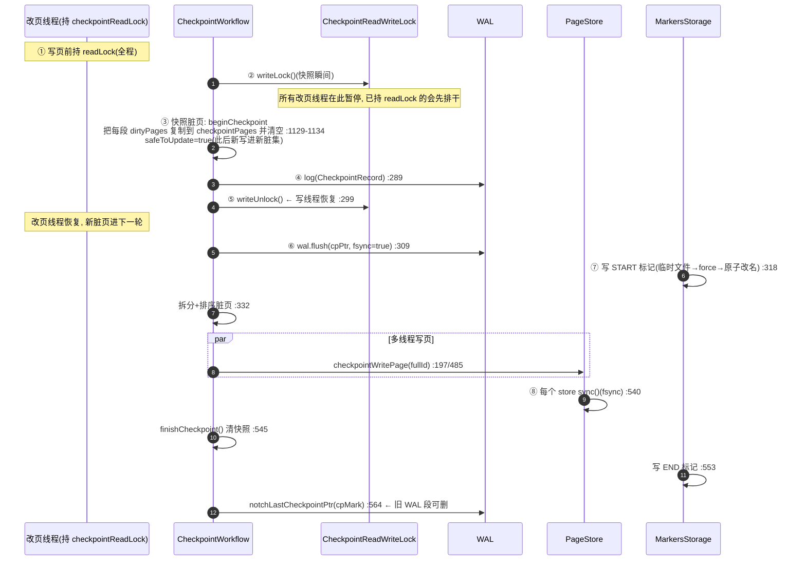

> **为什么这么设计**:快照(writeLock)只占极短时间(冻结脏集 + 写一条 WAL 标记即放锁);真正耗时的"刷 N 页 + fsync"在**无锁**阶段多线程进行,不阻塞写线程。代价:快照期间改的页要用 **copy-on-write**——见下。

**Copy-on-Write 快照**(`PageMemoryImpl.postWriteLockPage:1630`):当一个正被本轮 checkpoint 选中要刷的页,又被前台线程 writeLock 改时,系统把该页**拷贝一份到 checkpointPool**,脏位清零,checkpoint 刷的是这份冻结副本,前台继续改活页。副本指针存在页头 `tempBufferPointer`。→ checkpoint 看到一致的时间点快照,写线程几乎不阻塞。

**磁盘布局**:
```
${IGNITE_WORK}/
├── db/
│   ├── cacheGroup-<grpId>/
│   │   ├── index.bin          ← 索引分区页存储
│   │   ├── part-0.bin         ← 分区 0:[ 17B头 | page0 | page1 | ... ](每页带 CRC)
│   │   └── part-N.bin ...
│   ├── metastorage/
│   └── cp/                    ← CheckpointMarkersStorage
│       ├── <cpTs>-<cpId>-START.bin   ← 有 START 没 END = 上次崩在 checkpoint 中途
│       └── <cpTs>-<cpId>-END.bin
├── wal/                       ← 活跃段
└── wal/archive/               ← 封存段(可压缩/删除)
```

### 6.3 崩溃恢复

启动入口 `GridCacheDatabaseSharedManager.startMemoryRestore:1881`:

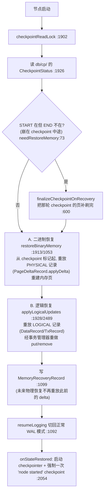

**关键洞见**:START/END 双标记让 checkpoint 对崩溃原子——要么 END 存在(完全持久),要么不存在(恢复时补做)。恢复 = 补做中断的 checkpoint + 重放 PHYSICAL WAL + 重放 LOGICAL WAL。

---

## 7. 分布层:分区 / 拓扑 / 亲和性

> 给新手的背景:**分区(partition)** 是分布式 KV/缓存的标准切分方式:把键空间哈希成 N 个固定槽,每个槽整体放到某(几)个节点。**亲和性(affinity)** 决定"分区 p 放哪些节点(主+副本)"。好处:① 节点扩缩容只迁移少数分区;② 主备提供高可用。

### 7.1 分区:键空间的水平切片

默认 **1024 个分区**(`RendezvousAffinityFunction.DFLT_PARTITION_COUNT=1024`,`:79`)。路由:
```
partition(key) = affFunction.partition(affinityKey(key))    // GridCacheAffinityManager.partition:156
```
其中 `affinityKey` 允许**同值聚到同分区**(colocation):键类里标 `@AffinityKeyMapped` 的字段(或 `CacheKeyConfiguration.setAffinityKeyFieldName`)决定,默认是键本身(`GridCacheDefaultAffinityKeyMapper.affinityKey:78`)。`calculatePartition`(`:131`):`hash & mask`(2 的幂快速路径)或 `abs(hash) % parts`。

### 7.2 亲和性:Rendezvous(最高随机权重)哈希

`RendezvousAffinityFunction.assignPartition:353`——对分区 p,为每个节点算 `hash(node.consistentId, p)`(Wang 64 位混合 `:478`),**按 hash 升序**取前 `backups+1` 个节点作为 `[primary, backup...]`。

**为什么用 rendezvous**:加/减一个节点,**只改变该节点 hash 进出 top-k 的那些分区**,其余分区归属不变——满足亲和契约("无新节点加入时,主不丢")。对比朴素的 `hash(key) % numNodes`,加一个节点会重映射几乎所有键。

**GridAffinityAssignmentCache**(`:329`):按 `AffinityTopologyVersion` 缓存分配结果,**只在拓扑变化时重算**。查询 `nodes(part, topVer)`(`:684`)即 `cachedAffinity(topVer).get(part)`。

### 7.3 分区状态机:GridDhtLocalPartition

`GridDhtLocalPartition.java:94`。**状态 + 预留数 + 大小**打包进一个 `AtomicLong`(`:129-131`),CAS 串行化"改状态"与"增预留",杜绝竞态。

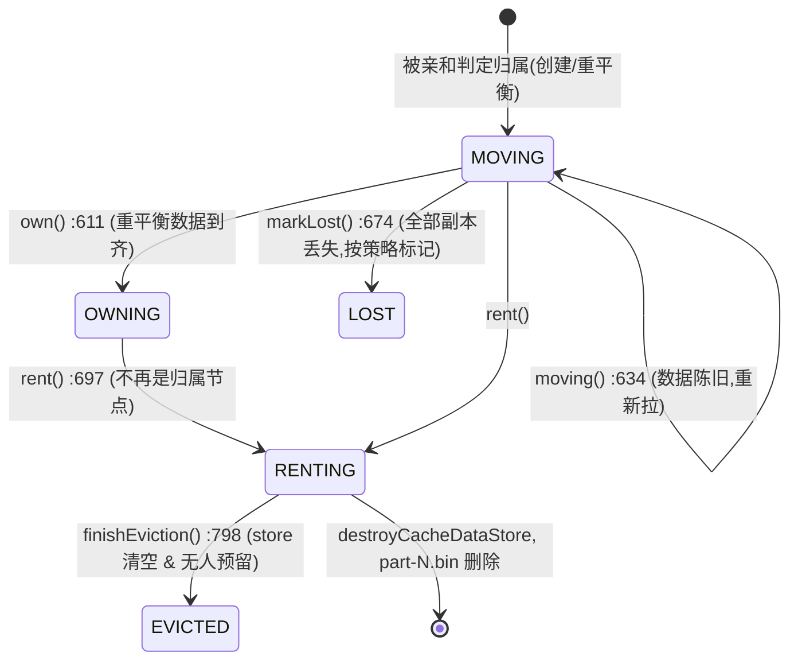

- **reserve()/release()**(`:463/:497`):读写操作**钉住**分区,防止拓扑在脚下把它驱逐。`RENTING/EVICTED` 状态下 reserve 失败。
- **MOVING**:该归本节点,但数据还在从别处流式拉(rebalance),读可能不全。
- **OWNING**:完全归属,读写安全。
- **RENTING**:不再归属,正在排空清理。
- **EVICTED**:物理释放,`destroyCacheDataStore` → 删 `part-N.bin`。

### 7.4 拓扑:全局分区状态图

`GridDhtPartitionTopologyImpl.java`:每个缓存组维护 `node2part`(`:116`)——`Map<UUID, Map<partId, GridDhtPartitionState>>`,即**每个节点、每个分区的状态**。带版本号 `updateSeq`(`:143`)拒绝过期更新;`StripedCompositeReadWriteLock(16)` 保护。

- `localPartition(p)`(`:1064`)/ `getOrCreatePartition(p)`(`:900`):**仅在亲和判定本节点归属 p 时**才创建本地分区对象(`localPartition0:1022`)。
- `nodes(p, topVer)`(`:1162`):先取亲和归属,再 union 进 `diffFromAffinity`(临时物理持有者)。

### 7.5 PME(分区交换)+ Rebalance

拓扑变化(节点 join/leave)触发 PME(`GridCachePartitionExchangeManager.onDiscoveryEvent:564 → exchangeFuture:1818 → GridDhtPartitionsExchangeFuture.init:892`):

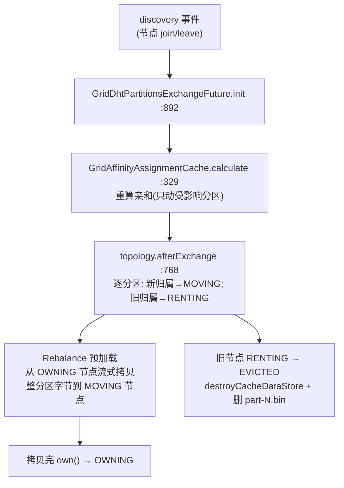

### 7.6 三位一体:分区 == 存储 == rebalance 单位

这是 Ignite 分布式存储的精髓,把"分布、存储、迁移"三个概念对齐到同一个对象:

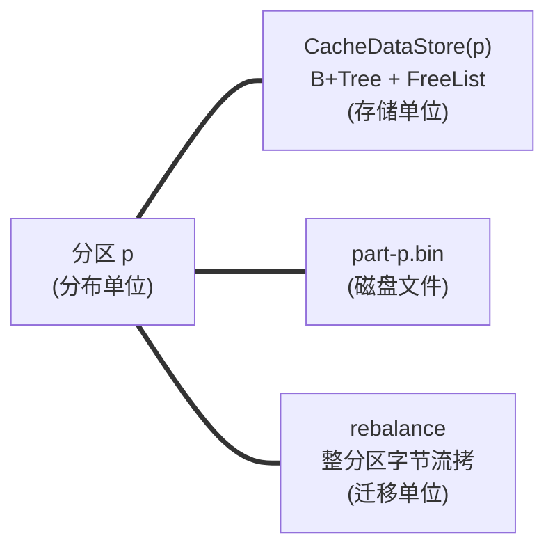

`GridDhtLocalPartition` 构造时 `store = grp.offheap().createCacheDataStore(id)`(`:229`);`createCacheDataStore0`(`GridCacheOffheapManager:234`)查 `pageStore().exists(grpId,p)`;文件名 `part-%d.bin`(`FilePageStoreManager:116`)。所以迁移一个分区 = 拷贝一棵 B+Tree 的全部内容,标识就是 `(groupId, partId)`。

---

## 8. 序列化层:对象 → 页里的字节

### 8.1 CacheObject:存储层的值抽象

`CacheObject.java:28`——四种类型:`TYPE_REGULAR=1`(Java 对象)、`TYPE_BYTE_ARR=2`、`TYPE_BINARY=100`、`TYPE_BINARY_ENUM=101`。关键契约:`valueBytes(ctx)`(→ 进数据页的 byte[])、`putValue(long addr)`(直接写进页内存地址,被 `DataPageIO` 用)、`cacheObjectType()`。`KeyCacheObject.java:23` 扩展:`hashCode()`(预算好的,存进 B+Tree 叶子)、`partition()`(路由用)。

`CacheObjectContext.java:27` 每缓存一个,`binaryEnabled()` 决定值是 `BinaryObject` 还是反序列化 POJO。

### 8.2 BinaryObject:自描述二进制格式

`BinaryObjectImpl.java:60`——一个 `byte[]` 的窗口。**24 字节定长头**(`GridBinaryMarshaller.java:208-229`):

```
偏移: 0    1    2     4     8     12    16    20    24
      ┌────┬──┬─┬─────┬─────┬─────┬─────┬─────┬─────────────┐
      │ver │fl│fl│typeId│hash│total│schema│schema│  字段值 ...  │
      │    │ag│ag│      │Code│ Len │ Id   │/rawOf│             │
      └────┴──┴─┴─────┴─────┴─────┴─────┴─────┴─────────────┘
      1B   1B 1B  4B    4B    4B    4B    4B
```

- 头里有 typeId、schemaId、字段偏移表(footer)→ **任意字段可按偏移直读,无需读其它字段**(部分反序列化)。
- **schema 演进**:加字段→换 schemaId,旧读节点按偏移表跳过未知字段。
- **紧凑脚印**:flag `FLAG_OFFSET_ONE_BYTE`(小对象 footer 每项 1 字节)、`FLAG_COMPACT_FOOTER`(footer 只存偏移不存字段 ID)。

转换:`IgniteCacheObjectProcessor.toCacheObject`(`:162`)——`binaryEnabled` 时 `toBinary()`→`marshal()` 成二进制字节;否则包成 `CacheObjectImpl`(直接持 Java 对象)。`prepareForCache`(`:84`)是落库前"冻结字节形态"的最后闸门。

### 8.3 行在数据页里的字节布局

`DataPageIO.writeRowData:51`——一行在数据页的字节顺序(权威):
```
[ payloadSize:short(2) | cacheId?:int(4) | keyBytes | valueBytes | version(var) | expireTime:long(8) ]
```
(共享缓存组才有 cacheId;version 是 `GridCacheVersion`=拓扑版本+序号+节点 ID)。大值跨页时按同样顺序分片(`writeFragmentData`)。

---

## 9. 端到端:一次 put / get 的全链路

> 这一节是把 §4–§8 串起来——看所有模块如何**协作**完成一次真实写入/读取。

### 9.1 put 全链路

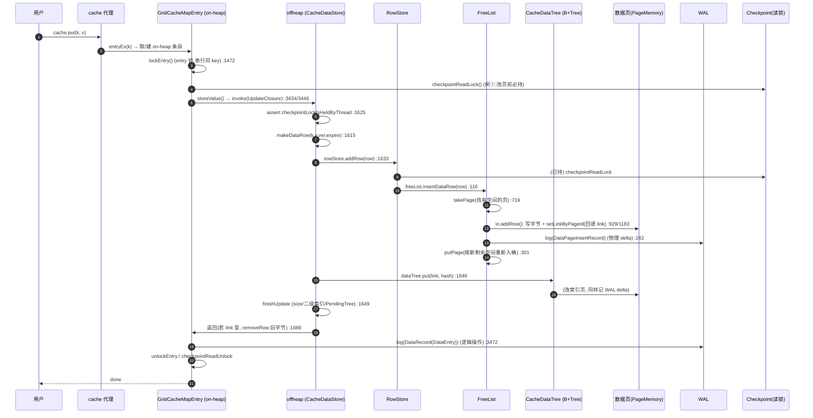

**三道锁在 put 上的体现**:
1. **entry 锁**(`GridCacheMapEntry.lock:225`):`ReentrantLock`,串行化**同一 key** 的 read-modify-write(不同 key 并行)。
2. **checkpointReadLock**(`RowStore.addRow:113`):改任何页前必持,保证 Checkpoint 快照一致性。
3. **页锁**(页头 `OffheapReadWriteLock`):串行化**同一页**的并发改(FreeList/B+Tree 经由 PageHandler 持)。

**两条 WAL 记录**:物理 `DataPageInsertRecord`(重建页字节)+ 逻辑 `DataRecord`(重建缓存态)。重放时各司其职。

### 9.2 get 全链路

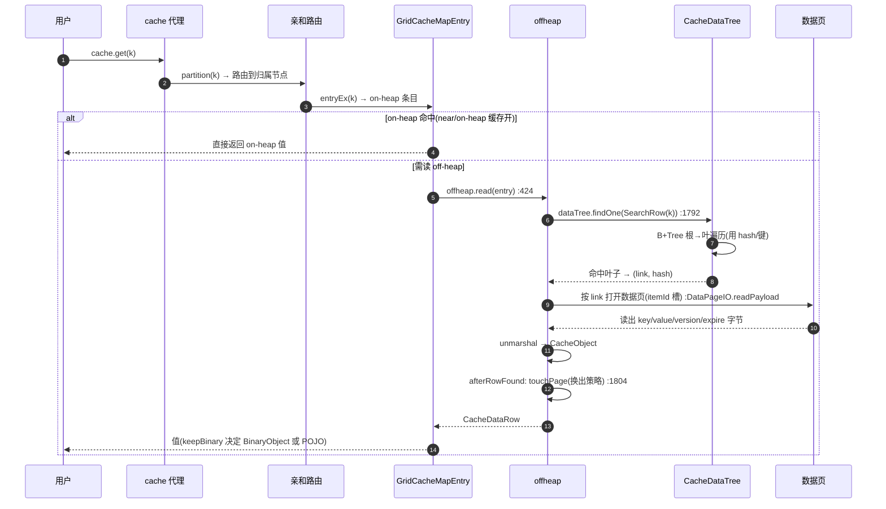

### 9.3 on-heap ↔ off-heap 两层关系

- `GridCacheConcurrentMap`(`:40/:52`)持 `GridCacheMapEntry`(on-heap 句柄)。纯 off-heap 时 entry 的 value 为空,值只在数据页(经 B+Tree link 寻址)。
- near / `setOnheapCacheEnabled(true)` 时,entry 同时持 on-heap 值;内存压力下 `PageEvictionTracker` 挤出数据页,下次访问重新从 off-heap 读。
- **两层一致性**:所有变更都经 `storeValue → CacheDataStoreImpl.update` 先写 off-heap。

---

## 10. 并发与一致性总览

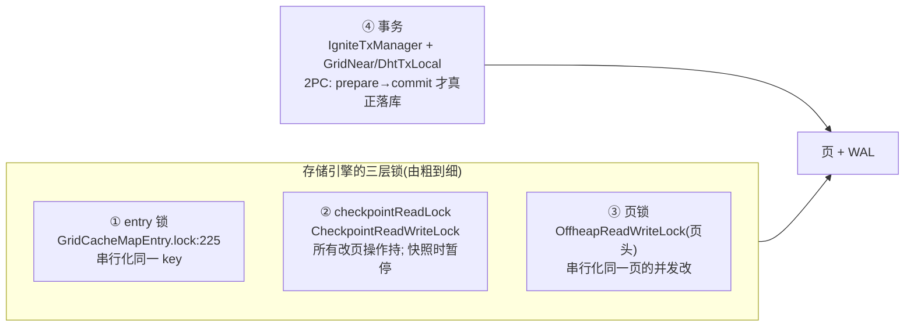

| 层 | 粒度 | 谁持 | 防什么 |
|---|---|---|---|
| entry 锁 | 单 key | 每次 `innerUpdate/innerSet` | 同 key 的并发 RMW |
| checkpointReadLock | 全节点 | 每个改页路径(`RowStore.addRow:113` 等) | Checkpoint 快照时被改 |
| 页锁 | 单页 | FreeList/B+Tree 经 PageHandler | 同页并发改 |
| 事务 | 多 key | `IgniteTxManager.prepareTx:1131/commitTx:1501` | 跨 key/跨节点原子;2PC |

**事务**:put 先写进 entry/写集,**commit 时**才经 `storeValue → CacheDataStoreImpl.update` 真正落库 + 写 WAL DataRecord。分布式 2PC:near(协调)→ dht(主)→ backup,各跑 prepare/commit。

> **MVCC 说明**:2.17.0 **没有**多版本行存储(`CacheDataRow` 无 MVCC 列;无 `CacheCoordinatorsSharedManager`)。代码里的 `ctx.mvcc()` 指的是**锁管理器/锁候选**(lock candidate),不是快照隔离的 MVCC。行版本是单版本,靠 `GridCacheVersion`(拓扑版本+序号+节点)做冲突检测。实验性 MVCC 栈在更早分支存在过,2.17 前已移除。

---

## 11. 模块关系与协作全景

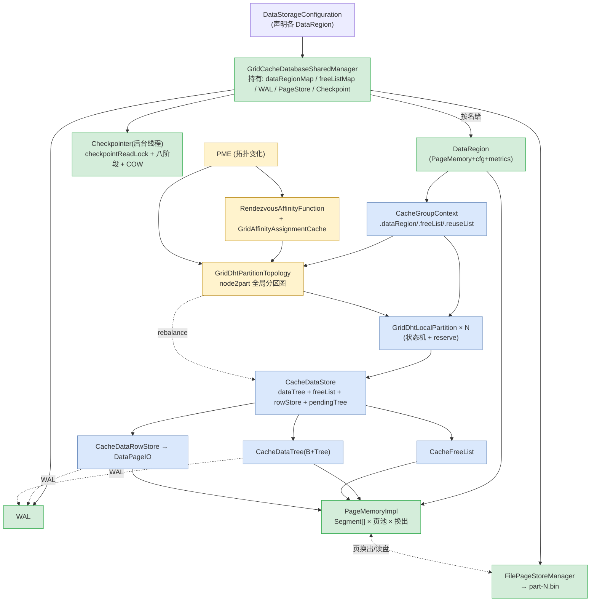

**一句话讲清协作**:
- `CacheGroupContext` 是"逻辑所有者",但它**不拥有内存**——内存由 `GridCacheDatabaseSharedManager` 经 `DataRegion`/`PageMemory` 统一供给。
- 分区 `GridDhtLocalPartition` 是"分布/存储/rebalance 三合一"的实体,持有 `CacheDataStore`。
- `CacheDataStore` 用 `B+Tree` 做有序索引、`FreeList` 做空间分配、`RowStore`/`DataPageIO` 写行字节——三者都向 `PageMemory` 要页,改页即记 `WAL`。
- `Checkpointer` 周期性冻结脏页快照(COW)、多线程刷到 `PageStore`、推进 WAL 截断点——这是持久化的收口。
- 分布层(`Affinity`/`Topology`/`PME`)决定"哪些分区在本节点",本节点的分区对象由此创建/驱逐,数据随之 rebalance。

---

## 12. 关键设计要点回顾(新人视角)

| 设计 | 解决的问题 | 源码锚点 |
|---|---|---|
| **页式堆外内存** | 避 GC、定长易管理、可换出 | `PageMemoryImpl` |
| **pageId 位编码 + link** | 8 字节自描述定位"分区/页/槽",索引极省空间 | `PageIdUtils.link:92` |
| **B+Tree 叶子只存 link** | 不在索引里重复键值字节,索引瘦 | `AbstractDataLeafIO.storeByOffset:44` |
| **FreeList 大小分级桶** | 变长行 O(1) 放置、限碎片、自维护 | `AbstractFreeList.BUCKETS=256` |
| **数据页 direct/indirect 槽** | 行外部 ID 稳定 + 可整理碎片 | `AbstractDataPageIO` |
| **WAL 物理+逻辑双记录** | 崩溃后既能重建页字节、又能重建缓存态 | `DataPageInsertRecord`/`DataRecord` |
| **Checkpoint 快照(COW)+ 短写锁** | 一致快照不阻塞写线程 | `postWriteLockPage:1630` |
| **START/END 双标记** | Checkpoint 对崩溃原子 | `CheckpointMarkersStorage` |
| **Rendezvous 亲和** | 扩缩容最小迁移 | `RendezvousAffinityFunction.assignPartition:353` |
| **分区状态机 + reserve** | 拓扑变更与并发访问安全 | `GridDhtLocalPartition:129` |
| **分区==存储==rebalance 单位** | 三概念对齐,迁移=拷贝一棵 B+Tree | `GridDhtLocalPartition:229` |
| **三道锁(entry/page/checkpoint)** | 分层并发控制,各管各的粒度 | §10 |

---

## 附:与已有文档的衔接

- 想看"DDL 怎么建表、`CacheConfiguration` 怎么变成上面这套存储" → `02-create-table-execution-flow.md`(尤其 §4 存储层是本文的速览版)。
- 想看"DDL 语句覆盖面、API 入口" → `01-ignite-ddl-support.md`。
- 本文聚焦**存储引擎本身的设计与协作**;后续若研究事务/SQL 执行/rebalance 细节,可在本文 §7/§9/§10 基础上展开。
