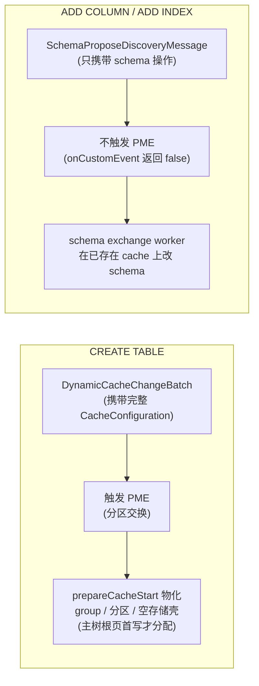

# 三个 DDL 操作的存储层影响 · 地图(先看这篇)

> 这是 `docs-research/storage-layer-biz/` 系列的**地图**。
> 配套:`03-ignite-storage-layer.md`(存储层全景,源码级)、`02-create-table-execution-flow.md`(建表全链路)、`storage-layer/`(存储层阶梯梯子)。
> **本系列只回答一个问题**:你执行一句 `CREATE TABLE` / `ALTER TABLE ADD COLUMN` / `CREATE INDEX`,存储引擎底下到底**多建了什么、改了什么、搬不搬数据、崩了怎么办**。

---

## 0. 一个问题钩住你

你已经(读完 `storage-layer/`)知道 Ignite 的存储层长这样:堆外页池 + 数据页/FreeList + B+Tree + WAL/Checkpoint + 分区。那现在问:

> 同样是"改一改表的定义",这三句 SQL 在存储层的**代价天差地别**——

- `CREATE TABLE`:搭**骨架**(缓存组 / 分区 / 空的存储壳;主树根页要等首次写入才分配),**不碰任何数据行**;
- `ALTER TABLE ADD COLUMN`:**一行数据都不碰**,只动**二进制 schema 元数据**;
- `CREATE INDEX`:新建一棵**B+Tree**,然后把**全表存量数据**逐行搬进去——是三者里唯一的"重活儿"。

更微妙的是,它们连**分布式协调方式都不同**:建表走一条路,加字段/加索引走另一条路。本系列就是把这三者的存储层动作拆开讲清楚。

---

## 1. 三操作速览(先记住这张表)

| 操作 | 存储层动作量 | 搬存量数据? | 分布式路径 | 触发 PME? | schema 怎么持久化 | 失败成本 |
|---|---|---|---|---|---|---|
| 建表 | 中(建结构) | 否(新表为空) | `DynamicCacheChangeBatch` | **是** | 随 CacheConfiguration 落盘 | 停缓存回滚 |
| 加字段 | **极小**(O(1) 元数据) | **否** | `SchemaProposeDiscoveryMessage` 两阶段 | 否 | 写 cache 配置文件(不走 WAL) | 作废新 schema |
| 加索引 | **大**(扫全表) | **是**(后台回填) | `SchemaProposeDiscoveryMessage` 两阶段 | 否 | 写 cache 配置文件(不走 WAL) | 丢弃半成品树重做 |

> 把这张表记个大概,后面三篇都是在展开它的每一格。

---

## 2. 核心洞察:两条分布式路径(全系列最重要的一根线)

**为什么不同?**

- **建表**是"从无到有"创建一个缓存组——要分配分区、算亲和性,必须走 **PME**(分区交换 `GridDhtPartitionsExchangeFuture`)。
- **加字段/加索引**改的是**已经存在的表**——分区早分配好了,只需让所有节点把 schema 变更"各自执行一遍 + 互相确认",走轻量的 **schema 两阶段**(propose 提议 → confirm 确认),不碰 PME。

> 证据锚点:`02-create-table-execution-flow.md:379` 早已埋下这条线——"CREATE TABLE 的 schema **不是**靠 `SchemaProposeDiscoveryMessage`,而是随 `CacheConfiguration` 传播"。本系列就把它和"加字段/加索引"对照着讲透。
> 对照行号:建表发广播 `GridCacheProcessor.java:4137`;加字段/加索引发 schema 消息 `GridQueryProcessor.java:3536`;收到 schema 消息后**不触发 PME** `GridCacheProcessor.java:4240-4241`。

---

## 3. 怎么读这个系列

| 文档 | 主题 | 一句话 |
|---|---|---|
| `01-create-table.md` | 建表 | 全链路已在 02 覆盖,本文只讲**存储层一次性动作**(瘦身版) |
| `02-add-column.md` | 加字段 | **零数据重写**的纯元数据操作 + schema-on-read 为什么行得通 |
| `03-add-index.md` | 加索引 | 建新 B+Tree + **后台扫全表回填** + 在线读写全程不阻塞 |
| `99-comparison.md` | 横向对比 | 把三者的存储层成本并排收口 |

**建议顺序**:本篇 → `01`(快速过)→ `02`(重点:schema-on-read)→ `03`(重点:rebuild 回填)→ `99`(收口)。

---

## 4. 约定(对齐 `storage-layer/` 系列)

- 默认你已读过 `storage-layer/`(页 / FreeList / B+Tree / WAL / 分区 / 读写全链路),这些术语直接用,不重新定义。
- 所有结论落 `file:line`(相对 `vendors/ignite`,tag **2.17.0**)。
- **图优先**:每个操作至少含两类图——**调用链时序图** + **存储结构变化对比图**。
- 每篇结尾有「你现在应该能回答」自测题。
- 区分**逻辑层动作**(改 schema/注册元数据)与**物理层动作**(建树/写页/记 WAL),并说明各自是否必需。
