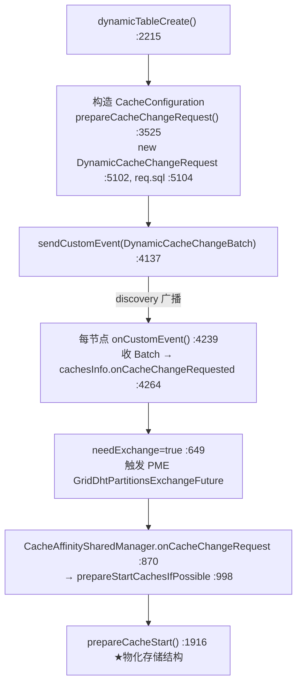

# CREATE TABLE 对存储层的影响(瘦身版)

> 配套:`02-create-table-execution-flow.md`(建表**全链路**,已覆盖 SQL 解析 → CacheConfiguration 构造 → discovery 广播 → 返回;§4 是存储层速览)、`00-map.md`。
> **本文是瘦身版**:建表全流程已在 02 详述,这里**只展开"存储层物化时做的一次性动作"**,并把它的分布式路径与"加字段/加索引"对比清楚。

---

## 0. 一句话结论

建表在存储层是一次性的**"搭骨架"**:为这个新缓存组创建 `CacheGroupContext` + offheap 管理器,为每个本节点拥有的分区建 `GridDhtLocalPartition` + **空的 `CacheDataStore` 外壳**(主树 `CacheDataTree` 及首个根页延迟到首次写入才创建),并在 H2 层物化 schema。**不涉及任何存量数据迁移**(表是空的)。它走 `DynamicCacheChangeBatch` + **PME**——和加字段/加索引那条 schema 两阶段**不是同一条路**。

---

## 1. 存储层一次性动作清单

`prepareCacheStart()`(`GridCacheProcessor.java:1916`)是物化入口,它做了这些事(逐条 file:line):

| # | 物化动作 | file:line |
|---|---|---|
| 1 | 创建 `CacheGroupContext`(构造器只填字段,不分配页) | `GridCacheProcessor.java:2479` → `CacheGroupContext.java:219` |
| 2 | 起 offheap 管理器(`GridCacheOffheapManager`/`IgniteCacheOffheapManagerImpl`) + 分区拓扑 | `CacheGroupContext.java:1044, 1039, 1052` |
| 3 | 为每个**本节点拥有的**分区建 `GridDhtLocalPartition`(只建 affinity 分给自己的,非全 1024) | `GridDhtPartitionTopologyImpl.java:518, 523-557` → `GridDhtLocalPartition.java:185` |
| 4 | 每分区建**空的 `CacheDataStore` wrapper**(`delegate==null`,主树/元页都还没建) | `GridDhtLocalPartition.java:229` → `GridCacheOffheapManager.java:234` |
| 5 | **建表时不建主树**(见下:lazy)——主树 `CacheDataTree` 与首个根页延迟到首次写入 | `GridCacheOffheapManager.java:1825`(`init0` 守卫 `!exists → null`) |
| 6 | 在 H2 层物化 schema(注册 H2 表/索引) | `GridCacheProcessor.java:1923` → `GridQueryProcessor.onCacheStart0():1068` |

> **主树根页的时机(已核实:lazy,推翻"建表即分配"的直觉)**:建表完成时**主数据树 `CacheDataTree` 尚未创建、首个根页尚未分配**。`init0(checkExists)`(`GridCacheOffheapManager.java:1825`)有守卫:`if (checkExists) { if (!exists) return null; }`(`:1831-1833`),新表 `exists==false`(无分区文件)故直接返回。全 core 模块 `dataStore().init()` **仅恢复路径一处调用**(`:530`),建表不走。主树和首根页**延迟到首次写入**:`update()`/`insertRows()` → `init0(false)`(`:2317`,绕过守卫)→ `getOrAllocatePartitionMetas` + `new CacheDataTree`(`:1914`)→ `initTree(true)`→ `allocatePage`(`BPlusTree.java:1106`)。**结论:建表只搭空壳,首写才建主树、才分配首个根页。**

---

## 2. 分布式路径:DynamicCacheChangeBatch + PME

**关键对比(本系列的核心线):**

| | CREATE TABLE | ADD COLUMN / ADD INDEX |
|---|---|---|
| discovery 消息 | `DynamicCacheChangeBatch`(`GridCacheProcessor.java:4137`) | `SchemaProposeDiscoveryMessage`(`GridQueryProcessor.java:3536`) |
| 请求对象 | `DynamicCacheChangeRequest`(携完整 `CacheConfiguration`) | `SchemaAbstractOperation` 子类 |
| **是否触发 PME** | **是**(`onCustomEvent` 返回 `true`,`ClusterCachesInfo.java:649`) | **否**(`:4240-4241` 收到 `SchemaAbstractDiscoveryMessage` 返回 `false`) |
| 是否调 `prepareCacheStart` | **是**(`:1916`,经 exchange 链) | 否 |
| 为什么 | 要分配分区、算亲和性 → 必须 PME | 改已存在表的 schema → 轻量两阶段即可 |

> 这正是 `02-create-table-execution-flow.md:379` 早已埋下的伏笔:"CREATE TABLE 的 schema **不是**靠 `SchemaProposeDiscoveryMessage`,而是随 `CacheConfiguration` 传播"。本篇把它坐实到行号。

---

## 3. WAL 与持久化(已核实)

- **建表时每分区只记 1 条 WAL**:`GridDhtLocalPartition` 创建时记一条 `PartitionMetaStateRecord`(`GridDhtLocalPartition.java:232-233`),仅当 `persistenceEnabled && walEnabled && !recovery`。此刻**只构造空 wrapper,主树/元页都还没初始化**(见 §1 lazy 结论)。
- **树与元页的初始化 WAL 延迟到"首次写入"才记**:首写触发 `init0(false)` → `getOrAllocatePartitionMetas` 分配 4 个分区元页(`allocatePage` 本身不记 WAL)并初始化树/FreeList,此时才记:`PageSnapshot`(分区 meta 页)、`InitNewPageRecord`(各树首个 leaf 页、两个 reuseList 根)、`MetaPageInitRootInlineFlagsCreatedVersionRecord`(各树 meta 页)——约 7~8 条结构初始化 WAL。**建表那一刻不产生这些。**
- **schema/CacheConfiguration 持久化**:不走 WAL,随 cache 配置文件落盘(与加字段同通道,见 `02-add-column.md §5`)。

---

## 4. 建表"没有"的事(对照另两个操作)

- **没有数据迁移**:表是空的,分区是 affinity 新分配的(`GridDhtPartitionTopologyImpl.java:523-557`),不是从别处搬。
- **没有 rebuild / 回填**:无存量数据要填。
- **没有 schema-on-read 兼容问题**:schema 是新建的,不存在新旧 schema 共存。
- **失败回滚**:走 `stopCacheSafely()`(`GridCacheProcessor.java:2036`)→ `prepareCacheStop`(`:2598`)/`stopCacheGroup`(`:2963`),即"停掉刚建的缓存"。

---

## 5. 存储层影响清单(6 维度,精简)

| 维度 | 影响 | 证据 |
|---|---|---|
| 数据结构 | 建 group / offheap / 分区 / 空存储壳 / H2 schema(主树首写才建,见 §1) | `GridCacheProcessor.java:2479, 1916` |
| 数据迁移 | **无**(新表空) | affinity 新分配 `GridDhtPartitionTopologyImpl.java:523-557` |
| schema 元数据 | 随 CacheConfiguration 传播并物化 | `DynamicCacheChangeRequest.java`; `GridQueryProcessor.java:1068` |
| WAL | 分区创建记 `PartitionMetaStateRecord` | `GridDhtLocalPartition.java:232-233` |
| 分布式 | `DynamicCacheChangeBatch` + **PME** | `GridCacheProcessor.java:4137`; `ClusterCachesInfo.java:649` |
| 并发/失败 | 失败回滚 = 停缓存 | `GridCacheProcessor.java:2036, 2598, 2963` |

---

## 6. 你现在应该能回答

1. 建表的 schema 为什么**不走** `SchemaProposeDiscoveryMessage`?(提示:走 `DynamicCacheChangeBatch` + PME)
2. 建表时存储层**新建了哪些**物理结构?主树的第一个根页是建表时分配的吗?(提示:建表只搭空壳;根页延迟到首次写入,经 `init0(false)` → `CacheDataTree` → `BPlusTree.allocatePage`)
3. 建表会**扫描或迁移数据**吗?(提示:不会,表是空的)

---

## 7. 对应到已有文档

- `02-create-table-execution-flow.md` 全文——建表全链路(本文是其存储层部分的展开 + 与另两操作对比)。**强烈建议先读 02**。
- `02-create-table-execution-flow.md §4`——存储层速览,本文是其完整展开。
- `03-ignite-storage-layer.md §4/§5`——CacheGroupContext / CacheDataStore / B+Tree 初始化的源码级细节。
