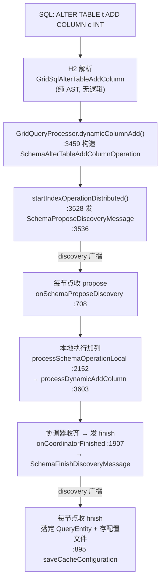
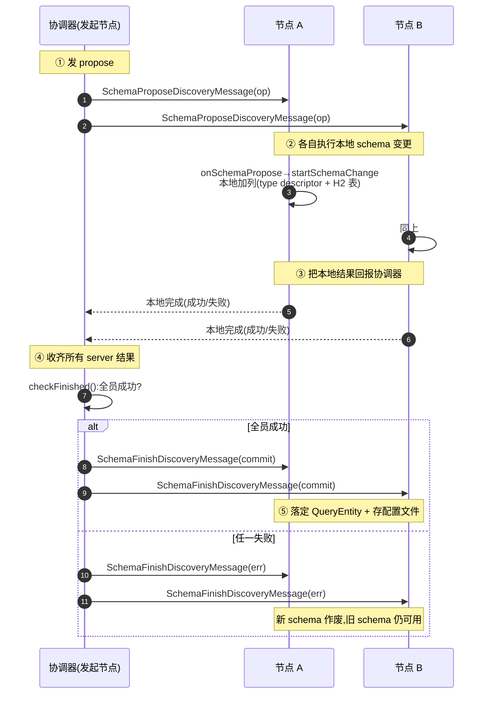
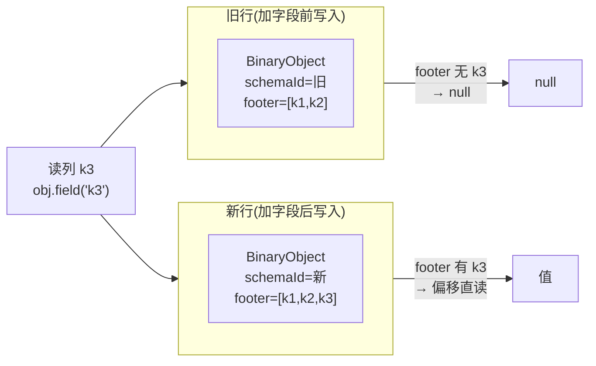

# ALTER TABLE ADD COLUMN 对存储层的影响

> 配套:`00-map.md`(本系列地图)、`03-ignite-storage-layer.md §8.2`(BinaryObject 二进制格式,本篇反复引用)。
> 本篇回答:`ALTER TABLE ADD COLUMN` 在存储层到底动了什么?为什么它几乎是"什么都不做"?

---

## 0. 一句话结论

**纯元数据操作,零数据重写。** 通过 propose→confirm 两阶段 discovery 消息,让所有节点往**内存 type descriptor + H2 表对象**里加一列,**完全不触碰存量数据页**;旧行里没有这列,读出来就是 `null`(schema-on-read);schema 变更**不经 WAL**,靠写 cache 配置文件持久化。

代价与表大小**无关**——O(1)。

---

## 1. 端到端执行链



**调用链(逐行 file:line):**

```
GridSqlAlterTableAddColumn.java:23            ← AST 节点(只持 schemaName/tblName/cols[])
GridQueryProcessor.dynamicColumnAdd():3459     ← DDL 入口
  → new SchemaAlterTableAddColumnOperation(cols)   SchemaAlterTableAddColumnOperation.java:28
  → startIndexOperationDistributed(op):3528
      → ctx.discovery().sendCustomEvent(new SchemaProposeDiscoveryMessage(op))   :3536  ★propose 发出
```

> 注意:发出去的是 `SchemaProposeDiscoveryMessage`,**不是**建表那套 `DynamicCacheChangeBatch`。这是本系列"两条分布式路径"的分叉点(见 `00-map.md §2`)。

---

## 2. 分布式两阶段:propose → confirm(重点)

### 2.1 为什么不能像建表那样一次广播?

- **建表**是"从无到有"建缓存组,所有节点都从零开始,**一次广播各自建即可**。
- **ALTER TABLE** 改的是**已经有数据的表**,必须保证:① 每个节点都**成功**完成本地 schema 变更;② **全员就绪**后才能"发布"新 schema。否则会出现"A 节点已按新 schema 写入、B 节点还认旧 schema"的脑裂。

所以它是一个**分布式两阶段提交**用在 schema 变更上的形态:**prepare/ack + commit**。

### 2.2 两阶段时序



### 2.3 两个阶段各做什么(落 file:line)

| 阶段 | 入口 | 关键动作 |
|---|---|---|
| **Propose** | `onSchemaProposeDiscovery():708` → `onSchemaPropose():846` → `startSchemaChange():961` | discovery 线程登记提案、做 NOT NULL 校验(`checkNotNullAllowed` `:751`);exchange 线程起 `SchemaOperationWorker` 执行**本地**变更(`SchemaOperationWorker.java:111`)。**同一 schema 的多个操作串行**(`schemaOps` 队列,`:820-832`)。 |
| 本地加列 | `processSchemaOperationLocal():2152` → `processDynamicAddColumn():3603` | `QueryTypeDescriptorImpl.addProperty(p, true)`(`:423`)往 `props` map 加一项;`SchemaManager.addColumn()`(`:825`)→ H2 监听器 `onColumnsAdded`(`H2SchemaManager.java:341`)→ `GridH2Table.addColumns()`(`:1114`)重建 `Column[]` 数组。 |
| **Confirm** | `onCoordinatorFinished():1907` 发 `SchemaFinishDiscoveryMessage`(`:1909`) | 每节点收 finish:`onSchemaFinishDiscovery():871` → `QuerySchema.finish()`(`:201`/`:259`)把新列**正式写进 `QueryEntity`**;然后 `saveCacheConfiguration()`(`:898`)持久化(见 §5)。 |

> **核心**:本地加列那一步(`processDynamicAddColumn → addProperty → addColumns`)**全是内存对象操作**——加一个 map entry、扩容一个数组。**没有任何方法读取或遍历数据页**。

---

## 3. schema-on-read:为什么不搬数据也够(重点)

这是整篇最关键、也最反直觉的部分:**改了表结构,凭什么旧行不用动?**

### 3.1 前置:行里存的是什么(衔接 `03 §8.2 / §8.3`)

一行在数据页里的字节顺序(`DataPageIO.writeRowData:51`):

```
[ payloadSize | cacheId? | keyBytes | valueBytes | version | expireTime ]
```

读取时,`CacheDataRowAdapter.readFullRow()`(`:502`)把 **key 和 value 当成不透明的 `[len][type][bytes]` 整块读出**(`:548` `toCacheObject(coctx, type, bytes)`)——**整条读路径不知道、也不关心"列"**。列是后续按需从 value 里取的。

而 value(SQL 模式下)是一个 **`BinaryObject`**。它的格式(`03 §8.2`,24 字节定长头):

```
偏移: 0    1    2      4     8     12    16    20    24
      ┌────┬──┬──────┬─────┬─────┬─────┬─────┬─────┬────────────┐
      │type│ver│flags │typeId│hash│total│schema│schema│  字段值 ... │
      │OBJ │  │(2B)  │      │Code│ Len │ Id   │/rawOff            │
      └────┴──┴──────┴─────┴─────┴─────┴─────┴─────┴────────────┘
      1B   1B  2B    4B    4B    4B    4B    4B     后面是各字段值 + footer(偏移表)
```

两个关键字段:**头里有 `schemaId`**(`BinaryObjectImpl` 读 `SCHEMA_OR_RAW_OFF_POS` `:414`),后面跟着 **footer = 字段偏移表**(`footerStartOffset()` `:441`,按 `order` 算每个字段位置 `:465-474`)。这意味着**任意字段可按偏移直读,无需读其它字段**(部分反序列化)。

`schemaId → BinarySchema`(字段名/偏移映射)由 `BinaryContext.schemas`(`:184` `Map<Integer, BinarySchemaRegistry>`)统一注册。

### 3.2 加字段做了什么 = 注册一个新 schema

加一列,本质是**注册一个新的 `BinaryType`/新 `schemaId`**(字段集合变了,schemaId 自然变)。**存量行里那些 `BinaryObject` 一个字节都没动**——它们仍带着**旧的 schemaId + 旧的 footer**。

### 3.3 旧行读新列 = null

新列的值是在**查询/索引阶段**按需取的,入口 `QueryBinaryProperty.value()`:取出 value(一个 `BinaryObject`)→ `obj.field(propName)` → `BinaryReaderExImpl.findFieldById(fieldId)`(`:354`)。

- 对**新写入的行**:新对象用新 schemaId + 新 footer,**包含**新列 → 正常返回。
- 对**旧行**:旧 footer 里**没有**这个字段 → `findFieldById` 找不到 → **返回 `null`**(`BinaryReaderExImpl.java:354` 及 `:365/370/381/386` 多处 `return null`)。



**这就是 Ignite 的 schema-on-read**:每个 `BinaryObject` 自描述(自带 schemaId + footer),新列在旧对象里查不到就返回 `null`,语义自洽,**所以根本不需要搬数据**。

### 3.4 一个容易混淆的点:对象级 schemaId vs 表级 schemaId

> 有人(包括某些分析)会说"加字段不换 schemaId"——这个说法**半对**:
> - **对**:Ignite **没有"表级递增 schemaId"**(`SchemaDescriptor` 只有 `schemaName + tbls map`,无版本号字段)。读端不靠一个全局表 schema 做路由。
> - **但**:每个 **`BinaryObject` 内部是有 schemaId 的**(见 `03 §8.2`)。加字段产生新 `BinaryType` → 新对象用新 schemaId,旧对象保留旧 schemaId。
>
> 合起来:加字段**不碰数据页**,靠的是"对象级自描述 schemaId + footer",而不是"表级 schemaId + 全表偏移表"。这正是它能 O(1) 的根本原因。

---

## 4. 不重写数据页的铁证

直接看加列方法体——**全是内存操作,无任何数据访问**:

```java
// SchemaManager.addColumn() :825-849
H2TableDescriptor tbl = table(schemaName, tblName);   // 查表(内存对象)
...
lsnr.onColumnsAdded(tbl, cols);                       // 回调 → H2 重建 Column[]
// ↑ 没有 forEach / rowStore / freeList / pageStore 任何调用
```

```java
// GridH2Table.addColumns() :1114-1153
Column[] newCols = Arrays.copyOf(safeColumns, safeColumns.length + cols.length);
// 追加新 Column,setColumns() :1144,incrementModificationCounter() :1148
// ↑ 不读任何索引行、不重建索引
```

**反差证据**(很有说服力):`processSchemaOperationLocal` 里,**建索引**那个分支(`:2092-2146`)才会 new 一个 `SchemaIndexCacheVisitorImpl`(扫数据的 visitor,`:2118`);而**加字段**这个分支(`:2152-2158`)**没有**任何 visitor。同一个方法里两种分支,有没有 visitor 一目了然——加字段不扫数据,建索引才扫。

> **边界(NOT NULL 新列,已核实:约束被静默破坏)**:propose 阶段的 `QueryUtils.checkNotNullAllowed`(`QueryUtils.java:1476-1484`)**只校验两项**——cache 开了 `readThrough` 或设了 `interceptor` 就拒绝,**不要求默认值、不检查表是否非空**。更关键:SQL 解析层**禁止** `ALTER TABLE ADD COLUMN ... DEFAULT`(`GridSqlQueryParser.java:1419-1422`),加列时根本带不了默认值。于是:可给**已有数据**的表加 NOT NULL 列,但旧行读该列得 `null`,而 NOT NULL 的运行时校验 `QueryTypeDescriptorImpl.validateProps`(`:633-635`,`if (propVal==null && prop.notNull()) throw`)**只在写入路径**调用(写 cache / DML),**读路径不校验**(`H2CacheRow.getValue0` 把 null 直接转 `ValueNull.INSTANCE`)。结论:**DDL 成功,旧行实质违反 NOT NULL 约束,Ignite 既不报错也不回填**,直到该行被重写——这是值得警惕的生产陷阱。

---

## 5. schema 怎么持久化(不经 WAL)

这是又一个反直觉点:**schema 变更本身不记 WAL**。

finish 阶段(`:895-898`):

```
cacheDesc.schemaChangeFinish(msg)        ← 改内存 QueryEntity (QuerySchema.finish :259)
ctx.cache().saveCacheConfiguration(cacheDesc)   ← 持久化
  → GridCacheProcessor.saveCacheConfiguration()  :4057
  → GridLocalConfigManager.saveCacheConfiguration()  :285-334
      → writeCacheData():序列化整个 StoredCacheData(含更新后的 QueryEntity 列表)
      → 写到 tmp 文件 → 原子 rename        :316-323
```

所以 schema 的持久化走的是**与 pageStore/WAL 完全分离的"cache 配置文件"通道**。重启时从这里恢复 schema,**不重放 WAL**。

> 这也解释了为什么加字段对 WAL 零开销:schema 不进 WAL,数据页又没动 → 没有任何 WAL 记录。

---

## 6. 存储层影响清单(6 维度)

| 维度 | 影响 | 证据 |
|---|---|---|
| **数据结构** | value 仍是自描述 `BinaryObject`;H2 `Column[]` 扩容;`QueryTypeDescriptorImpl.props` 加 entry | `GridH2Table.java:1122-1144`;`QueryTypeDescriptorImpl.java:439` |
| **数据迁移** | **无**。零行重写,零数据页扫描 | `SchemaManager.addColumn()` 无任何数据访问;对照建索引才有 visitor |
| **schema 元数据** | 内存:type descriptor + H2 表 + QueryEntity;持久化:cache 配置文件 | `QuerySchema.java:281-303`;`GridQueryProcessor.java:895-898` |
| **WAL** | **无**。schema 不走 WAL,数据页也没动 | schema-operation 包内无任何 `wal.log` 调用;持久化走 `GridLocalConfigManager` |
| **分布式** | 两阶段 propose/confirm;同 schema 串行;协调器收齐所有 server 结果才 finish | `GridQueryProcessor.java:820-832`;`SchemaOperationManager.java:212-243` |
| **并发/失败** | propose 在 exchange 线程串行;任一节点失败 → finish 带 err → 新 schema 作废,旧 schema 仍可用 | `SchemaOperationManager.java:219-243` |

---

## 7. 你现在应该能回答

1. 加字段和建表为什么走**不同的 discovery 消息**?各自的消息类是什么?(提示:`DynamicCacheChangeBatch` vs `SchemaProposeDiscoveryMessage`)
2. 为什么加字段**不用遍历数据页**?旧行读新列得到的值是什么,机制是什么?(提示:`BinaryObject` 自描述 + footer)
3. schema 变更**记不记 WAL**?那它是怎么保证重启不丢的?(提示:cache 配置文件)

---

## 8. 对应到已有文档

- `03 §8.2`(BinaryObject 二进制格式 / schemaId / footer)——本篇 §3 的前置知识,**必须先读**。
- `03 §8.3`(行在数据页的字节布局)——本篇 §3.1 的前置。
- `02-create-table-execution-flow.md` §4 ——建表的存储层(走另一条路径,对照本篇)。
- `storage-layer/03-btree-index.md` ——索引的存储;本篇只讲"加字段不建索引",建索引见本系列 `03-add-index.md`。
