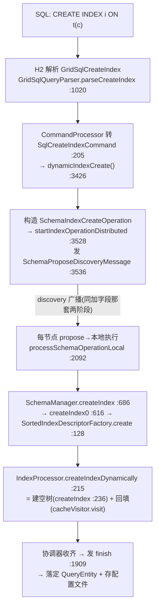
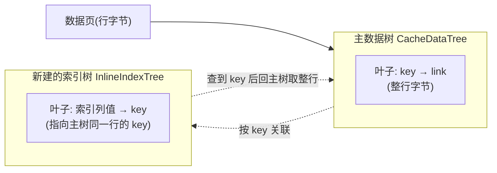
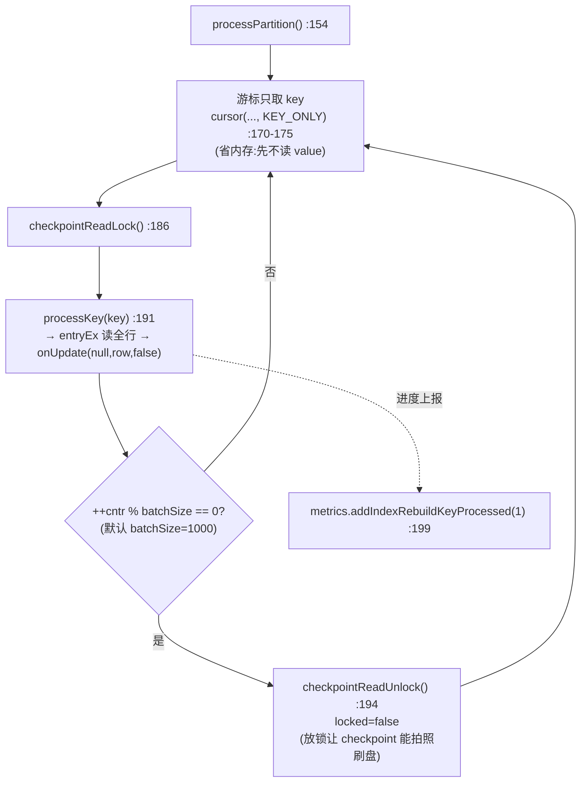

# CREATE INDEX 对存储层的影响

> 配套:`00-map.md`、`storage-layer/03-btree-index.md`(B+Tree 基础)、`03-ignite-storage-layer.md §5`(B+Tree/数据页)。
> 本篇回答:加一个索引,存储层要新建什么、存量数据怎么进新树、表还能不能正常读写、rebuild 中途崩了怎么办。
> **这是三个 DDL 操作里唯一的"重活儿"**——它要扫遍全表。

---

## 0. 一句话结论

`CREATE INDEX` 在存储层做两件事:**① 新建一棵独立的 B+Tree(`InlineIndexTree`,与主数据树 `CacheDataTree` 平级);② 把全表存量行按分区并行、后台回填进这棵新树**。分布式上**复用与加字段相同的 schema 两阶段**;rebuild 期间表的在线读写**全程不阻塞**,靠读写锁分层 + per-entry 锁保证正确;每个索引页的写入都记 WAL,但通过"每 1000 行放一次 checkpoint 锁"防止 WAL 被撑爆。

---

## 1. 端到端执行链



**调用链:**

```
GridSqlCreateIndex.java:28                       ← AST
CommandProcessor.convertH2Command():205          ← 转 native command
GridQueryProcessor.dynamicIndexCreate():3426     ← DDL 入口,构造 SchemaIndexCreateOperation
  → startIndexOperationDistributed():3528
      → sendCustomEvent(SchemaProposeDiscoveryMessage)   :3536   ★与加字段同一个发送点
  → 各节点 SchemaOperationWorker.body()  SchemaOperationWorker.java:114
      → processSchemaOperationLocal():2092  (SchemaIndexCreateOperation 分支)
          → new SchemaIndexCacheVisitorImpl()              :2118   ← rebuild visitor
          → schemaMgr.createIndex(...):2145
              → SchemaManager.createIndex0():616 → SortedIndexDescriptorFactory.create():128
                  → indexProcessor().createIndexDynamically(..., cacheVisitor)   :128
                      → IndexProcessor.createIndexDynamically():215  ★建树 + 回填
```

> **关键**:加索引和加字段走的是**同一套 schema 两阶段协调器**(`SchemaProposeDiscoveryMessage` + `SchemaOperationWorker` + `SchemaOperationManager`)。区别只在 `processSchemaOperationLocal` 里对 `SchemaIndexCreateOperation`(`:2092`)vs `SchemaAlterTableAddColumnOperation`(`:2152`)的分支不同。详见 `02-add-column.md §2`。

---

## 2. 索引的物理形态:一棵独立的 B+Tree

### 2.1 不是主树的子结构,而是平级的另一棵树

| | 主数据树 | 索引树 |
|---|---|---|
| 类 | `CacheDataTree extends BPlusTree<CacheSearchRow, CacheDataRow>` | **`InlineIndexTree extends BPlusTree<IndexRow, IndexRow>`** |
| 存什么 | key → 整行(link) | **被索引列的值 → key** |
| file:line | `CacheDataTree.java:56` | `InlineIndexTree.java:77` |
| 持有者 | `CacheDataStore`(每分区一棵) | `InlineIndexImpl`(字段 `segments[]`) `InlineIndexImpl.java:64` |



### 2.2 段(segment):一棵索引其实是多棵树

一个索引对象 `InlineIndexImpl` 持有**多个段** `segments[]`,每个段是一棵独立的 `InlineIndexTree`。写入时按 `partition % segmentsCnt` 路由到某个段(默认段数 = 分区数,可配 `SqlSegments`)。**不同段可并发写**——这是索引高吞吐的基础。

### 2.3 新建树:分配索引页

```
SortedIndexDescriptorFactory.create():128
  → IndexProcessor.createIndex():236   (ddlLock.writeLock 建树那一刻,见 §4)
      → InlineIndexFactory.createIndexSegment()  InlineIndexFactory.java:80
          → new InlineIndexTree(...)
              → GridCacheOffheapManager.rootPageForIndex():908
                  → indexStorage.allocateCacheIndex(cacheId, idxName, segment)  :909
              → BPlusTree.initTree(initNew):1103
                  → long rootId = allocatePage(null)  :1106   ★新树首叶页分配
                  → write(metaPageId, ..., rootId, ...)  :1111
```

> 这一段对应 `storage-layer/03-btree-index.md` 讲的"B+Tree 初始化分配根页"——建索引就是**再来一遍这个过程**,只是树的类换成 `InlineIndexTree`、叶子存的是索引行。

---

## 3. rebuild 回填(核心)

建完空树,树里还没有数据。**把存量行填进去**就是 rebuild。

### 3.1 入口:建树 + 回填,一气呵成

```java
// IndexProcessor.createIndexDynamically() :215
public Index createIndexDynamically(..., IndexFactory factory, IndexDefinition definition,
                                    @Nullable SchemaIndexCacheVisitor cacheVisitor) {
    Index idx = createIndex(cctx, factory, definition);   // 先建空树(writeLock 建树那一刻)
    if (cacheVisitor != null)
        cacheVisitor.visit(row -> {
            if (idx.canHandle(row))
                idx.onUpdate(null, row, false);            // :223 ★回填:逐行写进索引树
        });
    return idx;
}
```

注意回填闭包(`:223`):`onUpdate(null, row, false)`——**prevRow=null、prevRowAvailable=false**。这和在线写入的 `onUpdate(prevRow, row, prevRowAvailable=true)`(`:463`)不同,是区分"rebuild 填充"与"在线增量写"的关键开关(见 §4.3)。

### 3.2 后台 + 按分区并行

回填**不是同步阻塞**调用线程,而是提交到**后台线程池** `buildIndexExecutorService`("index create/rebuild" 池,大小 `IgniteConfiguration.setBuildIndexThreadPoolSize`,`IgniteConfiguration.java:188/320/1048`),并**按本地分区并行**:

```
SchemaIndexCacheVisitorImpl.visit()  SchemaIndexCacheVisitorImpl.java:118-128
  对 cctx.topology().localPartitions() 的每个本地分区:
      new SchemaIndexCachePartitionWorker(part)         :118
      → buildIndexExecutorService().execute(worker)    :127   ★提交后台
  → 全部分区的 future 汇总(CompoundFuture)
```

> SQL 里的 `CREATE INDEX ... PARALLEL N` 受这个线程池上限约束(`GridQueryProcessor.java:2100-2112`)。

### 3.3 单分区的回填:KEY_ONLY 游标 + 分批放 checkpoint 锁

这是 rebuild 最精巧的部分(`SchemaIndexCachePartitionWorker.processPartition()` `:154`,已逐行核实):



关键设计点:

- **KEY_ONLY 游标**(`:170-175`):遍历主树时先**只取 key**(不读 value),到 `processKey()` 时再按 key 读全行(`entryEx` → `read(this)`)。**省内存**——不会一次把全表 value 都读进堆。
- **每 1000 行放一次 checkpoint 锁**(`:193-197`,`DFLT_IGNITE_INDEX_REBUILD_BATCH_SIZE = 1000`):为什么?见 §5——防止 rebuild 持锁过久冻结 checkpoint、撑爆 WAL。
- **进度可见**:每处理一行上报 `metrics.addIndexRebuildKeyProcessed(1)`(`:199`),通过 `CacheMetrics.isIndexRebuildInProgress()`/`getIndexRebuildKeysProcessed()` 可查。

### 3.4 逐 key 写入索引树

```
SchemaIndexCachePartitionWorker.processKey(key):226
  → cctx.cache().entryEx(key) :233
  → entry.updateIndex(wrappedClo) :236
      → GridCacheMapEntry.updateIndex(): lockEntry() → read 全行 → clo.apply(row)
  → clo.apply → IndexProcessor 回填闭包 → idx.onUpdate(null, row, false)   IndexProcessor.java:223
  → InlineIndexImpl 把 IndexRow put 进 segments[seg]
```

---

## 4. rebuild 期间,在线读写不阻塞

这是加索引"在线"特性的核心——**rebuild 进行时,表照常可读写**。靠的是锁的**分层**:

| 锁 | 谁持有 | 保护什么 | file:line |
|---|---|---|---|
| `ddlLock.writeLock` | `createIndex()`/`dropIndex()` 建/删索引**那一刻** | 保护 `cacheToIdx` 注册表(加/删索引条目) | `IndexProcessor.java:237, 259` |
| `ddlLock.readLock` | 在线写 `store(...)` + rebuild 回填 `onUpdate` | 两者都拿读锁,**互不阻塞** | `IndexProcessor.java:173, 188` |
| entry 锁(`GridCacheMapEntry.lockEntry`) | rebuild 读行 / 在线写行 | **per-key 互斥**:同 key 串行,不同 key 并行 | (updateIndex 内) |
| `InlineIndexImpl.lock`(读写锁) | 每次 `onUpdate`/查询 | 保护段树的读写一致性 | `InlineIndexImpl.java:82` |

> 注意 `ddlLock.writeLock`(`:237`)只在**建空树的那一瞬间**持有;**回填阶段不持写锁**——回填走的 `onUpdate` 经的是**读锁**路径。这就是为什么 rebuild 不阻塞在线写。

### 4.1 增量写怎么也进新树

rebuild worker 在扫存量行,与此同时**在线新写入的行**走正常 cache 写路径:

```
IndexProcessor.store(newRow, prevRow, prevRowAvailable):169   ← 在线写
  ddlLock.readLock().lock():173
  ... idx.onUpdate(prevRow, row, prevRowAvailable=true):463   ← 也写进同一棵新索引树
  ddlLock.readLock().unlock():188
```

所以:**rebuild worker 扫存量行 + 在线事务写增量行,两者并发往同一棵 `InlineIndexTree` 插**,靠 per-entry 锁 + B+Tree 内部锁保证正确。在 rebuild 完成前,新树已对增量写入开放,只是查询优化器在 schema finish 前还不会用它。

### 4.2 prevRowAvailable:put vs putx

| 场景 | 调用 | prevRowAvailable | 走 |
|---|---|---|---|
| rebuild 回填 | `onUpdate(null, row, false)` `:223` | `false` | `put`(返回被替换的旧行,用于**发现重复键**) |
| 在线写 | `onUpdate(prevRow, row, prevRowAvailable)` `:463` | `true` | `putx`(条件替换) |

---

## 5. WAL 与 Checkpoint:rebuild 为什么不会撑爆系统

### 5.1 索引页写入全程记 WAL

rebuild 产生的**每个**索引页修改都产生 WAL 记录(每行一个 `InsertRecord` `BPlusTree.java:3646-3655`,页分裂记 `SplitExistingPageRecord` 等),**没有任何 rebuild 期的 WAL 抑制/节流**。一张大表加索引,会产生海量 WAL。

### 5.2 为什么不会失控:每 1000 行放一次 checkpoint 锁

危险在于:`checkpointReadLock` 持有期间,checkpoint 线程**不能** `acquireSnapshot` 拍照(`GridCacheDatabaseSharedManager.java:1592-1598` 注释明说)。如果整次 rebuild 一直持锁:

```
持锁太久 → checkpoint 冻结 → 脏页无法刷盘 → WAL 无限增长 → 恢复时重放 OOM
```

`SchemaIndexCachePartitionWorker` 的解法(`:193-197`):**每处理 batchSize(1000) 行,就 `checkpointReadUnlock()` 放一次锁**,让 checkpoint 能在批次之间拍照刷盘、回收 WAL。

> 这是 rebuild 设计里最关键的一个细节:**用"分批放锁"换"checkpoint 能持续推进"**,从而把"海量索引页写入"对系统的影响限制在可控范围。

---

## 6. 崩溃恢复:rebuild 中途崩了怎么办

rebuild 可能很长(大表),必须能从崩溃中恢复:

1. **rebuild 开始时**:在 metastore 写一条 "rebuild pending" 标记——`onStartBuildNewIndex`(`GridQueryProcessor.java:2125`)。
2. **rebuild 完成时**:调 `onFinishBuildNewIndex`(`:2136`)。
3. **但标记不是立即删**:只在**完成后的某个 checkpoint 结束后**,才从 metastore 删除(`IndexBuildStatusStorage.afterCheckpointEnd`,`IndexBuildStatusStorage.java:253-274`)——因为只有 checkpoint 刷盘后,这棵索引树的数据才真正落盘可靠。
4. **重启时**:若 metastore 里标记还在(说明上次 rebuild 没等到 checkpoint 就崩了),**丢弃那棵半成品树,重新 rebuild**(`GridQueryProcessor.java:446` 恢复逻辑 + `RebuildIndexAction.java:175-194` 维护模式重做)。

> 一句话:半成品索引树绝不复用——靠 metastore 标记 + checkpoint 时机,要么"已落盘可靠",要么"丢弃重做"。

---

## 7. 逻辑层 vs 物理层(区分动作的归属)

| 层 | 动作 | 位置 | file:line |
|---|---|---|---|
| **逻辑层** | 在表描述符上注册索引元数据:`SchemaManager.createIndex`(读锁查表)→ `createIndex0`→ `addIndex`(写锁把 `IndexDescriptor` 放进 `TableDescriptor.indexes()`) | `SchemaManager` | `:686, :616, :724` |
| **逻辑层(注册表)** | 在 `IndexProcessor.cacheToIdx` 注册 `Index` 实例(供查询/写路径查) | `IndexProcessor` | `:242` |
| **物理层① 建树** | 分配索引页 + 首叶页,构造 `InlineIndexTree` | `GridCacheOffheapManager` + `BPlusTree` | `:908-909`; `BPlusTree.java:1103-1111` |
| **物理层② 回填** | 后台扫主树每行,写入新索引树 | `SchemaIndexCacheVisitorImpl` + `SchemaIndexCachePartitionWorker` | `:127`; `:154-218` |

> 逻辑层让系统"知道"有这个索引;物理层让索引真正"有数据"。**只有物理层②(回填)是与表大小成正比的成本**。

---

## 8. 存储层影响清单(6 维度)

| 维度 | 影响 | 证据 |
|---|---|---|
| **数据结构** | 新增 `InlineIndexTree extends BPlusTree`(每段一棵),与主 `CacheDataTree` 平级、独立分配页 | `InlineIndexTree.java:77`; `BPlusTree.java:1106` |
| **数据迁移(rebuild)** | 后台按分区并行扫主树、回填索引树;每 1000 行批,批间放 checkpoint 锁 | `SchemaIndexCachePartitionWorker.java:154-218`; `SchemaIndexCacheVisitorImpl.java:127` |
| **schema 元数据** | `SchemaManager.addIndex` 注册 `IndexDescriptor`;逻辑层 `GridH2Table` 注册索引 | `SchemaManager.java:616, 724` |
| **WAL** | 索引页写入**全程记 WAL**,无抑制;靠批间放 checkpoint 锁防撑爆 | `BPlusTree.java:3646-3655`; `SchemaIndexCachePartitionWorker.java:193-197` |
| **分布式** | 复用 `SchemaProposeDiscoveryMessage` 两阶段;与加字段同一套协调器 | `GridQueryProcessor.java:3536, 1909`; `SchemaOperationManager.java:212-243` |
| **并发/失败** | 在线写与 rebuild 并发(均走 `ddlLock.readLock` + per-entry 锁);崩溃靠 metastore 标记丢弃半成品重做 | `IndexProcessor.java:173, 215-227`; `IndexBuildStatusStorage.java:253-274` |

---

## 9. 你现在应该能回答

1. 加索引和加字段走的是不是**同一套**分布式协调?区别在哪?(提示:同一套 schema 两阶段,区别在 `processSchemaOperationLocal` 的分支)
2. rebuild 期间**表能正常读写吗**?靠什么保证?(提示:ddlLock 读写分层 + per-entry 锁)
3. 大表加索引会产生海量 WAL,系统靠什么**避免失控**?(提示:每 1000 行放一次 checkpoint 锁)
4. rebuild 到一半进程崩了,重启后那棵半成品索引树**会复用吗**?(提示:metastore 标记 + checkpoint 时机,丢弃重做)

---

## 10. 对应到已有文档

- `storage-layer/03-btree-index.md` / `03-ignite-storage-layer.md §5` ——B+Tree 基础,本篇 §2 的前置。
- `02-add-column.md §2` ——schema 两阶段机制(加索引复用同一套)。
- `03-ignite-storage-layer.md §6`(WAL/Checkpoint)——本篇 §5 的前置。
- `storage-layer/02-row-link-freelist.md` ——主数据树的行存储,rebuild 扫的就是它。
