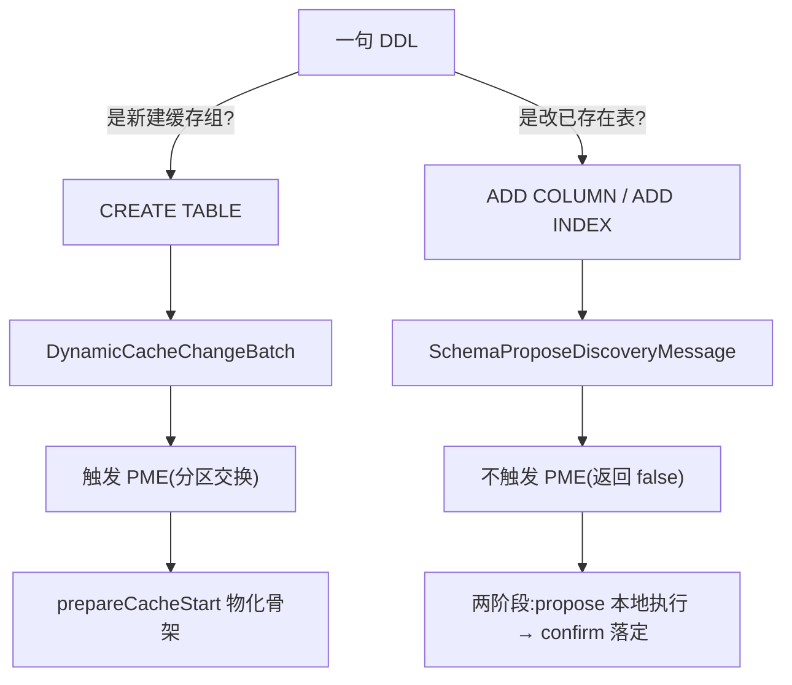
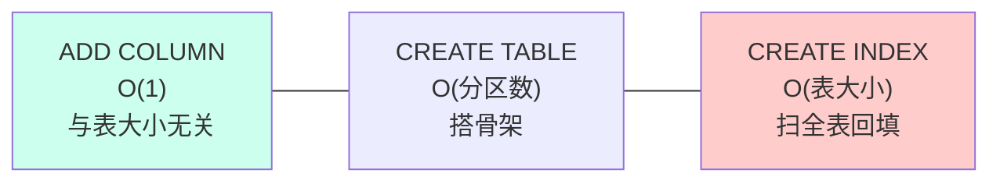

# 三个 DDL 操作的存储层影响 · 横向对比(收口)

> 配套:`00-map.md` + `01/02/03` 三篇。本篇把三者并排放在一起,做最终对照。

---

## 1. 终极对比表

| 维度 | CREATE TABLE | ALTER TABLE ADD COLUMN | CREATE INDEX |
|---|---|---|---|
| **存储层动作量** | 中(搭骨架) | **极小**(O(1) 元数据) | **大**(扫全表) |
| **新建物理结构** | 缓存组 + 分区 + 空存储壳 + H2 schema(主树根页首写才分配) | 无(只扩 `Column[]`/`props` map) | **一棵新 B+Tree**(`InlineIndexTree`) |
| **搬存量数据?** | 否(表空) | **否** | **是**(后台回填) |
| **成本与什么成正比** | O(本节点分区数) | **O(1),与表大小无关** | **O(表大小)** |
| **分布式路径** | `DynamicCacheChangeBatch` | `SchemaProposeDiscoveryMessage` 两阶段 | `SchemaProposeDiscoveryMessage` 两阶段 |
| **触发 PME?** | **是** | 否 | 否 |
| **WAL 开销** | 少量(分区创建记 `PartitionMetaStateRecord`) | **0**(schema 不进 WAL,数据页没动) | **海量**(每个索引页都记 WAL) |
| **schema 持久化** | 随 CacheConfiguration 落盘 | 写 cache 配置文件(不经 WAL) | 写 cache 配置文件(不经 WAL) |
| **在线读写受阻?** | 新表,无影响 | 不受阻 | **不受阻**(读写锁分层) |
| **失败处理** | 停缓存回滚 | 作废新 schema,旧 schema 仍可用 | 丢弃半成品树,重启重做 |
| **核心机制** | PME + prepareCacheStart 物化 | schema-on-read(BinaryObject 自描述) | rebuild 回填 + 分批放 checkpoint 锁 |

---

## 2. 两条分布式路径(全系列的轴)

| | 建表 | 加字段/加索引 |
|---|---|---|
| 消息类 | `DynamicCacheChangeBatch` `GridCacheProcessor.java:4137` | `SchemaProposeDiscoveryMessage` `GridQueryProcessor.java:3536` |
| 触发 PME | ✅ `ClusterCachesInfo.java:649` | ❌ `GridCacheProcessor.java:4240-4241` |
| 协调方式 | PME 统一驱动各节点建 | propose→各节点本地改→收齐 ack→confirm 提交 |
| 为何如此 | 要分配分区、算亲和性 | 分区已存在,只需 schema 全员一致 |

---

## 3. 存储层成本直觉

把三个操作的"存储层工作量"画到一条轴上:

- **加字段**最便宜:不动任何数据页,只改元数据。无论表有 1 行还是 10 亿行,代价一样。
- **建表**居中:代价取决于**本节点分到几个分区**(affinity),与数据量无关(表是空的)。
- **加索引**最贵:必须把**每一行**都塞进新树,代价与表大小线性相关,还会产生海量 WAL。

> 直觉记忆:**改定义(加字段)≈免费;建容器(建表)=中等;给已有数据建索引=最重。**

---

## 4. WAL 触发对比(三者的反差很大)

| 操作 | 记不记 WAL | 为什么 |
|---|---|---|
| 加字段 | **完全不记** | schema 走 cache 配置文件通道;数据页没动 |
| 建表 | 少量(分区创建) | 只为新建的分区记 `PartitionMetaStateRecord` |
| 加索引 | **海量** | 每个索引页修改都记 `InsertRecord`;靠"每 1000 行放 checkpoint 锁"防止 WAL 撑爆系统 |

> 一个易错点:**schema 变更本身一律不进 WAL**(加字段、加索引的 schema 部分都靠 cache 配置文件持久化)。加索引产生的大量 WAL 来自**索引数据页的写入**,不是 schema。

---

## 5. 失败处理对比

| 操作 | 中途失败 | 恢复方式 |
|---|---|---|
| 建表 | 缓存没建成功 | `stopCacheSafely` 停掉刚建的缓存,回滚干净 |
| 加字段 | 某节点本地加列失败 | finish 消息携带 err,**新 schema 作废**,旧 schema 仍可用;因为是纯元数据,没有"半成品数据"要清理 |
| 加索引 | rebuild 中途崩溃 | metastore 留"rebuild pending"标记,重启时**丢弃半成品树重做**(绝不复用未落盘的索引) |

> 一个对照:**加字段失败几乎无成本**(没动数据),**加索引失败有成本**(已经回填的那部分索引树白写了,要丢弃重来)——这正反映了"是否动了数据"的根本差异。

---

## 6. 三者的"存储层性格"(一句话收口)

- **CREATE TABLE** —— *"搭骨架"*:从无到有建缓存组/分区/存储壳(主树根页首写才建),走 PME,空表无数据负担。
- **ALTER TABLE ADD COLUMN** —— *"改牌子"*:纯元数据,靠 BinaryObject 自描述的 schema-on-read,一行数据都不碰,O(1)。
- **CREATE INDEX** —— *"搬砖"*:建新树 + 后台扫全表回填,唯一与表大小成正比的重活儿,但在线读写全程不阻塞。

> 这就是三个上层 DDL 操作在存储层的完整画像。回到 `00-map.md §0` 的钩子——现在你应该能清楚地回答"执行这句 SQL,存储引擎底下到底多建了什么、改了什么、搬不搬数据、崩了怎么办"了。
