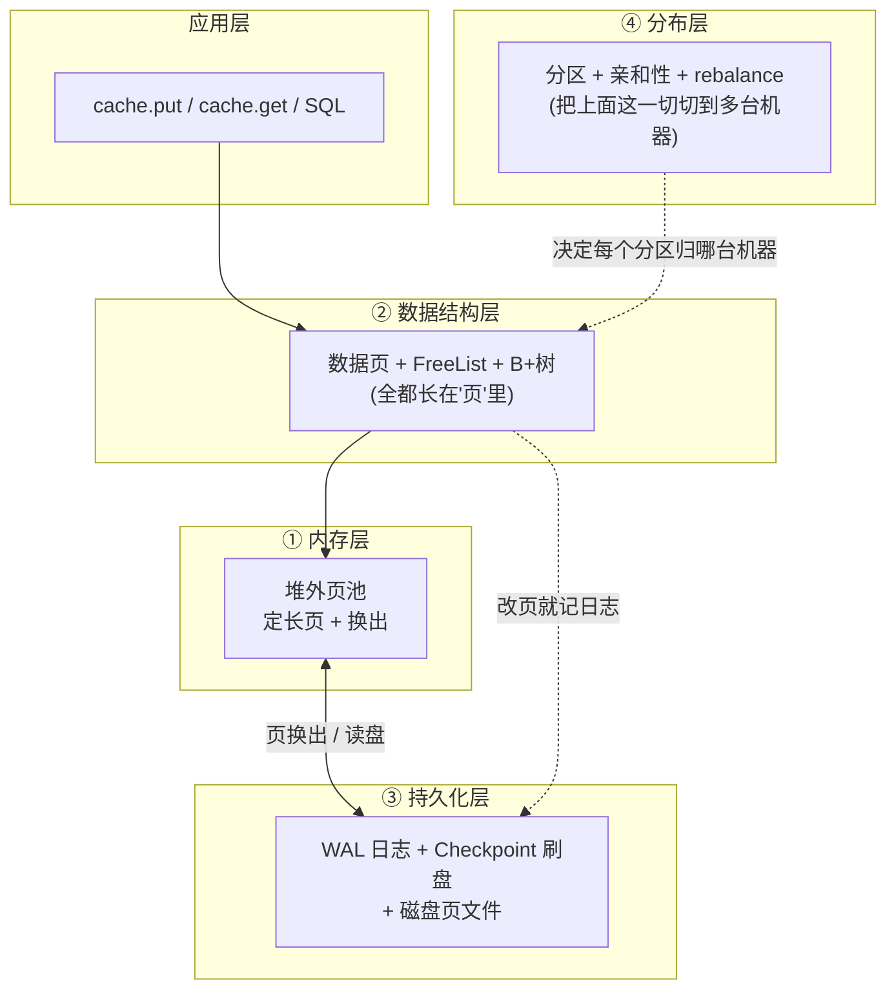

# Ignite 存储层 · 地图(先看这篇)

> 这是 `docs-research/storage-layer/` 系列的**地图**:用最少的概念给你搭一个骨架,后面的每一阶都是往骨架上挂一块肉。
> 配套的"天花板"文档是 `docs-research/03-ignite-storage-layer.md`(源码级、信息密度高);**本系列是帮你读懂它的梯子**——读完这里,再回头看 03 就不晕了。

---

## 0. 一个问题钩住你

你一定写过 `cache.put(k, v)`。那这个 `k, v` **最后到底落在哪、怎么存、怎么找、机器崩了怎么不丢、数据多了怎么分到多台机器**?

这就是**存储层**要管的事。它要给"海量数据"提供"**又快、又靠谱、还能横向扩展**"的存取服务。"又快"靠内存,"靠谱"靠日志+落盘,"横向扩展"靠切分到多机。

围绕这三个目标,存储引擎其实只在回答 **6 个根本问题**。本系列就按这 6 个问题,一阶一阶往上爬。

---

## 1. 六个根本问题(也就是本系列的六阶)

| 阶 | 要回答的问题 | 一句话答案 | 对应 03 |
|---|---|---|---|
| 1 | 数据放哪种内存? | **堆外**(off-heap)的、定长的**"页"**池;内存只当磁盘的缓存 | §4 |
| 2 | 一页里怎么塞下变长的行? | **数据页** + **link** 指针 + **FreeList** 空间管理 | §5.3–5.5 |
| 3 | 怎么按键快速找到那行? | **B+树**,叶子只存 link | §5.1–5.2 |
| 4 | 机器崩了怎么不丢数据? | 先写**日志(WAL)**再改页,定期**刷盘(Checkpoint)** | §6 |
| 5 | 单机装不下 / 要高可用怎么办? | **分区** + **亲和性** + **rebalance** | §7 |
| 6 | 一次读写到底怎么串起来? | put / get **全链路** | §9 |

**这 6 个问题有严格的依赖顺序**:第 2 阶(怎么放行)必须先有"页"(第 1 阶);第 3 阶(怎么找行)必须先有"link"(第 2 阶);第 4 阶(崩了不丢)必须先有"页"和"改页"的概念;第 5 阶(分布式)是单机存储的多机化。

所以**后面每一阶,都是上一阶"留下的悬念"的自然解答**——概念像长出来的一样,这就是本系列的编排原则。

---

## 2. 全景图:六层怎么叠

先记住一个分层(不用记类名,记**角色**):

一句话串起来:**应用要读写数据 → 在数据结构层(B+树/数据页)里找 → 数据结构和页都由内存层的页池供给 → 改过的页靠持久化层落盘保命 → 分布层决定这些页分属哪台机器。**

> 现在你看这图大概率还是"每个词都认识、连起来不知道在说啥"——**没关系**。这就是地图的作用:你只要先记住"有这么 6 件事、它们大致这么叠"。每件事的细节,留给对应的那一阶慢慢填。

---

## 3. 怎么读这个系列(约定)

每一阶都按同一个**模具**写,你读到第二阶就能形成预期:

- **从问题出发**:每阶开头先点出"上一阶留下的、本阶要解决的矛盾",再看答案。
- **每个知识点五段式**:① 痛点(没它会怎样)→ ② 类比(用你熟悉的 Java 东西比)→ ③ 原理(配图,不贴源码)→ ④ 为什么这么设计(对比替代方案)→ ⑤ 代码锚点(最后才给 03 里的 `file:line`,印证用,点到为止)。
- **术语第一次出现一定有大白话定义**,之后才直接用。
- **图优先**:能用图说清的不堆文字。
- **每阶结尾**有两个小栏目:
  - **「你现在应该能回答」**:3 个自测题。
  - **「对应到 03 文档」**:指明本阶覆盖了 03 的哪几节,鼓励你去原文印证。

准备好了,翻到 `01-pages-and-offheap.md`,从"数据到底放哪种内存"开始。
