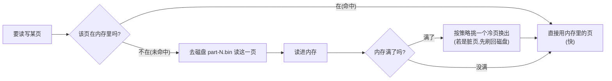
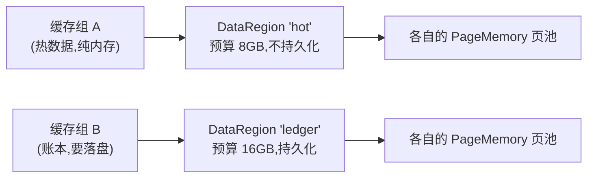

# 第 1 阶:为什么要"页"和"堆外"——内存怎么管

> **对应天花板文档**:`docs-research/03-ignite-storage-layer.md` §4
> **本阶只管一件事**:数据到底放在哪种内存里,以及这块内存怎么被管理。

---

## 开场:地图留下的第一个悬念

地图说,Ignite 要**在内存里高速存取海量数据**。那第一道关就来了:

> **这些数据,到底放在哪种内存里?**

你的第一反应大概是:放 Java **堆**(heap)里啊,`new` 出来不就行了?——对几百 MB 数据可以,但 Ignite 要扛 **TB 级**数据。一旦堆里塞进几十上百 GB 的对象,**GC(垃圾回收——JVM 自动找出不再使用的对象、回收它们所占内存的机制)会被拖垮**:一次 Full GC(扫描整个堆、最慢的那种回收)可能停顿几秒甚至几十秒,整个节点在这期间像个死机一样。对"低延迟缓存/数据库"来说,这是致命的。

所以第 1 阶只解决一件事:**数据不放堆里,放堆外;堆外内存太大没法随手管,于是切成定长的"页"来管;内存装不下全部数据,就让内存只当磁盘的缓存。**

下面把这个过程拆成四个台阶。每个台阶都先说**它解决什么痛点**,再说**怎么解决**。

---

## 台阶一:数据放哪?——堆外(off-heap)

> 术语:**堆外内存(off-heap)** = 在 JVM 管理的堆之外、向操作系统直接申请的内存。JVM 不管它的回收,得应用自己分配和释放。

**痛点** — 把海量数据塞进 Java 堆,GC 会越来越慢。堆越大,Full GC 扫描的对象越多,停顿越长。这是"用堆装大数据"的根本死穴:你越想多装,系统越卡。

**类比** —
- **堆**像"小区公共垃圾桶":东西扔进去,有保洁(GC)定期清运。东西少时很省心;东西一多,清运越来越频繁、每次越来越久,整个小区(应用)被堵。
- **堆外**像"你自己租的独立仓库":小区保洁不管它,你想放多少放多少,但**搬进搬出全靠自己**。

**原理** — Ignite 用 `ByteBuffer.allocateDirect(...)`——这是 **NIO**(Java 的高性能 IO API)提供的 **DirectBuffer**(直接缓冲区,即直接分配在堆外内存上的字节缓冲区)——向 OS 申请一大块堆外内存,然后**自己**在这块字节里安排数据的读读写写。JVM 的 GC 看不见这块内存,所以数据再多也不会触发针对它的 GC。

| | Java 堆 | 堆外(off-heap) |
|---|---|---|
| 谁管回收 | JVM(GC 自动) | **应用自己** |
| 受 GC 影响 | 是,数据多 → GC 停顿长 | **否** |
| 上限 | 堆大小(堆越大 GC 越慢) | 物理内存 |
| Ignite 用它存 | 可选的小块 on-heap 缓存 | **全部主数据** |

**为什么这么设计** — 有人会问:那我**把堆调到几百 GB** 不也能装下吗?能装下,但**堆越大、GC 越慢**,这是 JVM 的硬伤,治标不治本。堆外的本质是**把"存数据"这件事从 GC 的管辖范围里摘出去**,一劳永逸。代价是:堆外内存不会自动回收,得**自己管**——这就引出下一个台阶。

📍 **代码锚点**:堆外页池的实现在 `PageMemoryImpl`(`PageMemoryImpl.java:130`);它底下就是一片 DirectBuffer。对应 03 §4.2。

---

## 台阶二:堆外那么大块,怎么管?——切成定长的"页"

> 术语:**页(page)** = 一块**固定大小**(Ignite 默认 **4KB**)的内存单位。整个堆外内存被切成一页一页,就像一本书切成一页一页。

**痛点** — 堆外内存是一大块**连续的裸字节**。如果你**要多少字节就申请多少字节**(这种叫**变长分配**,类似 C 语言里按需申请内存的 `malloc`),反复申请/释放后会产生**碎片**(空隙零散,凑不出一块够大的连续空间),而且记录"哪段用了、哪段空着"本身就很麻烦。

**类比** — 操作系统的**虚拟内存**也是按 4KB 分页的;图书馆的书架按"格"分。**固定大小**的好处是:分配就是"给一个空格",回收就是"收回一个格",**单位统一,永远不会碎片**,寻址也极简(第 N 页就在固定偏移)。

**原理** — Ignite 把堆外内存切成一个个 4KB 的页,每页给一个编号(`pageIdx`,第几页)。要存数据?拿一个空页来用;数据删了?把页标记为空,下次复用。**因为单位统一(都是 4KB),分配和回收都是 O(1),也不会有碎片。**


**为什么这么设计** — 对比"变长分配"(要多少给多少,像 C 的 `malloc`):灵活,但**碎片化 + 合并成本高**,长期跑会越来越难找到连续空间。**定长分页是数据库和操作系统的通用解**——牺牲一点点空间利用率(一行可能占不满一页),换来分配/回收/寻址的全部简化。值得。

📍 **代码锚点**:默认页大小 `DFLT_PAGE_SIZE = 4 * 1024`(`DataStorageConfiguration.java:92`)。对应 03 §4.2。

---

## 台阶三:一页叫什么?——pageId,一个 64 位数"自描述"一切

> 术语:**pageId** = 一个页的唯一编号,是一个 **64 位整数**。

**痛点** — 要定位一个页,光知道"第几页"还不够——还得知道它是**哪个分区**的、是**什么种类**的(存数据的页?存索引的页?还是内部结构页?)。如果这些信息分开存,每用一次都得查表,慢。

**原理** — Ignite 把"分区号、页号、种类"**打包进一个 64 位整数**:

```
 bit:  63      56 55   48 47      32 31                 0
      ┌─────────┬────────┬───────────┬────────────────────┐
      │ offset  │  flag  │  partId   │      pageIdx       │
      │  (8b)   │  (8b)  │  (16b)    │      (32b)         │
      └─────────┴────────┴───────────┴────────────────────┘
```

- **pageIdx(32 位)**:第几页。
- **partId(16 位)**:分区号(分区是第 5 阶的概念,这里先知道"页属于某个分区"即可)。
- **flag(8 位)**:页种类——`FLAG_DATA=1`(数据页)、`FLAG_IDX=2`(索引页)、`FLAG_AUX=4`(内部结构页)。
- **offset(8 位)**:这里通常是 0;它的位置后面会在"link"里被复用,第 2 阶再讲。

**类比** — 像身份证号,把"省/市/县/序号"全编码进一串数字,**光看号码就能还原一切**,不用再去查别的表。

**为什么这么设计** — 因为"一个 64 位数就能自描述地定位一个页",后面才能造出一个更厉害的东西:**link**——一个**只占 8 字节**、却能指向"某分区某页某位置"的指针。link 是第 2、3 阶的主角(B+树靠它串起来)。**这里是在为后面铺路。**

📍 **代码锚点**:位布局见 `PageIdUtils`(`PageIdUtils.pageId:161`、`link:92`);flag 常量在 `PageIdAllocator:32-45`。对应 03 §4.1。

---

## 台阶四:数据比内存大怎么办?——PageMemory 是"磁盘页的内存缓存"

> 术语:**换出(eviction)** = 内存满了,把暂时不用的页"挪走",腾地方给新页。

**痛点** — 数据有 TB 级,内存通常只有几十 GB。**内存根本装不下全部数据。** 那"在内存里高速存取"不就成了一句空话?

**类比** — 你的电脑内存 16GB,硬盘 1TB,你照样能"高速"用远超 16GB 的文件——因为**操作系统把内存当成磁盘的缓存**:常用的文件块留在内存,冷门的留在磁盘,要用再读回来。Ignite 的 `PageMemory` **干的是一模一样的事**,只不过它在用户态(堆外)自己实现了一套。

**原理** — `PageMemory` 本质上是**"磁盘页文件在内存里的缓存"**:



- **命中**:要的页恰好在内存,直接用,飞快。
- **未命中**:去磁盘把这一页读进内存;如果内存满了,就按**换出策略**挑一个"冷页"(很久没用的)挪走,腾地方。
- **脏页先刷盘**:被换出的页如果被改过(叫**脏页**,dirty page),挪走前得先把它的新内容写回磁盘,否则数据就丢了。(怎么写回、怎么保证不丢,是第 4 阶 WAL/Checkpoint 的事。)

**换出策略**:默认用 **CLOCK 算法**(时钟算法,近似 LRU——"最近最少使用")。简单理解:给每个页一个"访问标记",一个时钟指针转圈扫,标记为"没访问过"的页就被换出。

**为什么这么设计** — 三个选项摆面前:① 全放内存——贵且装不下;② 每次都读盘——慢;③ **内存当缓存 + 冷页换出**——兼顾容量和速度。数据库/OS 清一色选 ③。代价是要管"换谁出去、脏页怎么保命",但这些都有成熟解法。

📍 **代码锚点**:页池实现在 `PageMemoryImpl`;默认换出策略 `CLOCK`(`DataRegionConfiguration` 的 `pageReplacementMode`);磁盘页文件 `part-N.bin`(`FilePageStoreManager`)。对应 03 §4.2、§4.4。

---

## 台阶五(收尾):DataRegion——把"内存预算 + 策略"打包

> 术语:**DataRegion(数据区)** = 一份**内存预算** + 一套**策略**(换出策略等)的捆绑包。

前面说的页池不是全局唯一一个。Ignite 允许你划分多个 **DataRegion**,每个区有**独立的内存上限和策略**:



- **默认区**:不指定时用一个叫 `default` 的区,预算默认是**物理内存的 20%(至少 256MB)**。
- **为什么要多个区**:**隔离工作负载**——让"热缓存"纯内存快进快出,"重要账本"持久化保命,互不抢内存、互不拖累。

一个缓存组(cache group)**终身绑定**一个区,它所有的页都从这个区的页池里分配。

📍 **代码锚点**:`DataRegion.java:26`(不可变捆绑);默认预算 `DFLT_DATA_REGION_MAX_SIZE`(`DataStorageConfiguration.java:87`)。对应 03 §4.5、§4.6。

---

## 你现在应该能回答

1. 为什么 Ignite 不把主数据放在 Java 堆里?如果硬放,会出什么问题?
2. 为什么要把堆外内存切成定长的"页",而不是按需变长分配?
3. 数据比内存大得多,Ignite 却还能"在内存里高速存取",靠的是什么机制?脏页换出时为什么要先做一件事?

> 如果这三题你都能用自己的话答出来,本阶就通了。卡壳的那题,回去看对应台阶。

---

## 对应到 03 文档

本阶覆盖了 03 的 **§4(内存层)** 全部主干:
- 堆外 / 页 → §4.2(`PageMemoryImpl`)
- pageId 位编码 → §4.1
- 换出(页级 CLOCK / 条目级)→ §4.4
- DataRegion → §4.5、§4.6

03 里还有两个细节本阶**故意没讲**,留给后面:
- **页锁 / 段分片**(并发细节)——等讲到"改页"和 Checkpoint 时再展开。
- **两种换出机制的区分**(页级 vs 条目级)——知道"内存是缓存、满了换冷页"就够入门了,细节看 03 §4.4。

---

## 留给下一阶的悬念

现在我们有了:**一块堆外内存,切成 4KB 的页,每页有个自描述的 pageId,内存装不下就把冷页换出到磁盘。**

但马上一个新问题冒出来:**一页固定 4KB,而我要存的一条"行"(key + value)可能是几十字节,也可能好几 KB,甚至比一页还大。** 这条变长的行,到底怎么塞进定长的页里?塞进去之后,我又怎么"指"到它?

这就是第 2 阶要回答的:**数据页、link、FreeList**。
