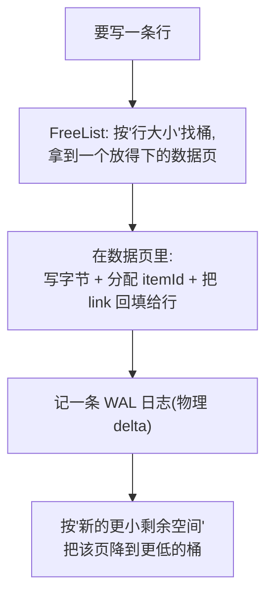

# 第 2 阶:一页之内怎么放下变长的行——数据页、link、FreeList

> **对应天花板文档**:`docs-research/03-ignite-storage-layer.md` §5.3–5.5
> **本阶只管一件事**:一条变长的"行",怎么塞进定长的页里;塞进去之后,怎么用一个指针"指"到它。

---

## 开场:第 1 阶留下的悬念

第 1 阶我们有了:**堆外内存切成 4KB 的页,每页有个自描述的 pageId。**

但马上一个新问题:一页固定 4KB,而我要存的一条**行**(一条缓存记录,包含 key、value、版本等)可能是几十字节,也可能好几 KB,**甚至比一页还大**。这变长的行,到底怎么塞进定长的页里?塞进去之后,我又怎么"指"到它(因为外面比如索引,需要能定位到它)?

本阶回答两件事:**怎么塞(数据页布局 + FreeList)**、**怎么指(link)**。

---

## 台阶一:一条行怎么塞进页里?——数据页的"槽位表"

> 术语:**行(row)** = 一条缓存记录的字节(key + value + 版本 + 过期时间)。**数据页** = flag 为 `FLAG_DATA`、专门存行的页。

**痛点** — 一页 4KB,要塞若干条**长度不一**的行。如果随便往后追加:删掉一条中间的行,就留下一个"洞";再塞一条更长的,放不进这个洞,只能往后堆——页里就全是碎片。

**类比** — 像**通讯录**:一头记"第 N 条在第几行"(条目索引),一头存条目内容,两头往中间长,中间空着。删一条只抹掉索引和内容,中间空隙还能复用。

**原理** — Ignite 的数据页就是这个"两数组相向生长"的经典布局:

```
 ┌──────────────────────┬─────────────────────────────┐
 │  items 表(每项 2B)  │        行字节(变长)        │
 │ direct / indirect    │  key | value | ver | expire │
 │  →→→ 生长            │              ←←← 生长       │
 └──────────────────────┴─────────────────────────────┘
        free space = 中间空隙(还能放新行的空间)
```

- 左边 **items 表**:每项 2 字节,记录"某条行在页内的偏移"。从前往后长。
- 右边 **行字节**:真正的行内容,从后往前长。
- 中间是 **free space**(空闲空间)。

两种 item:
- **direct item**(直接项):正常存的行,直接记它的偏移。
- **indirect item**(间接项):一行被删后产生,它指向某个 direct item。

**为什么这么设计** — indirect item 的妙处:即使页里做了**碎片整理**(defrag,把行压实),**行在"外部"的编号(item id)永远不变**——变的只是它内部偏移。这让"外面用一个固定地址指过来"成为可能(下一台阶的 link 就靠它)。

📍 **代码锚点**:`AbstractDataPageIO`(类 `:166`,布局 Javadoc `:39-165`)。对应 03 §5.4。

---

## 台阶二:怎么"指"到某条行?——link,一个 8 字节的自描述指针

> 术语:**link** = 一个 64 位(8 字节)的指针,能自描述地定位到"某分区、某页、某槽位"的某条行。

**痛点** — 索引(下一阶的 B+树)要能"指"到某条行。这个指针得**够小**(索引里要存千千万万个)、且**自描述**(不用查表就能还原位置)。

**原理** — Ignite 用 **link** 这个 8 字节指针。它由两部分拼成:

```
link (64 位) = pageId | (itemId << 56)

   高 8 位          低 56 位(就是 pageId 的低 56 位)
 ┌──────────┬──────────────────────────────────────────┐
 │ itemId   │   flag(8) │ partId(16) │ pageIdx(32)     │
 │  (8b)    │           │            │                 │
 └──────────┴──────────────────────────────────────────┘
```

- **pageId**:复用第 1 阶那个自描述页号(还记得它高 8 位是 offset 吗?link 把这 8 位**复用**成 itemId)。
- **itemId**:这条行在页内 items 表里的槽号(≤ `0xFE`,即最多 254 条/页)。

**类比** — 像"门牌号 + 房间号"拼成一个编码:`楼栋-楼层-房间`,一个数就能找到具体那张桌子。

**为什么这么设计** — 因为 link **只占 8 字节、还能自描述地定位一切**(分区/页/槽),下一阶的 B+树叶子就能**每个条目只存一个 link**,索引因此极省空间。这是"link 只占 8 字节却能定位一切"的直接成果。

📍 **代码锚点**:`PageIdUtils.link:92`(`link = pageId | (itemId << 56)`,`itemId ≤ 0xFE`)。对应 03 §5.5。

---

## 台阶三:写新行时,怎么快速找到"放得下"的页?——FreeList

> 术语:**FreeList(空闲表)** = 一个**按"剩余空间"给数据页分档**的索引,用来 O(1) 找到"能放下 N 字节"的页。

**痛点** — 要写一条 150 字节的行,哪一页放得下?挨个翻所有页看剩余空间 = O(几万页),太慢。需要一种结构:**"给我 N 字节,立刻给我一个 ≥N 空闲的页"**。

**类比** — 像**仓库货架按剩余容量分档**:要放 150 字节的东西,直接去"能放 ≥128 字节"那一档拿货位,不用挨个翻。

**原理** — FreeList 把所有数据页按**剩余空间**分 **256 个桶**,按 2 的幂分级(每档步长 = pageSize/256 = 4KB/256 = 16 字节):

```
桶 255: [ 全空页 ]              ← 回收的整页空位
桶   8: [ 页A (剩余~128B) ]
桶   4: [ 页B, 页C (剩余~64B) ]
桶   1: [ 页D (剩余~16B) ]
```

要放一个 S 字节的行 → 取 `bucket(S)`,**该桶或更高桶里的任意页,都保证放得下**(剩余 ≥ S)。这就是经典的"大小分级空闲表":**分摊 O(1) 放置,碎片被桶宽上界限制**。写入后,该页剩余变小,就降到更低的桶里去。

**为什么这么设计** — 对比"维护一个按剩余空间排序的有序结构":查找/插入都要 O(log n),还高并发下锁争用大。**按 2 的幂分桶**牺牲一点点精度(把剩余空间量化到桶宽),换来 **O(1) 放置 + 实现简单**。值得。

📍 **代码锚点**:`AbstractFreeList`(`BUCKETS=256`、`REUSE_BUCKET=255`、`bucket(freeSpace)=freeSpace>>>shift`)。对应 03 §5.3。

---

## 台阶四:一次写入怎么串起来?

把上面三块拼成"写一条行"的完整流程:



关键点:**link 不是外面算好塞进去的,而是行字节写进数据页时,由页本身把 `pageId|itemId` 回填给行对象**(`setLinkByPageId`),随后调用方再把这个 link 插进索引(下一阶的 B+树)。

📍 **代码锚点**:写入主流程 `AbstractFreeList.insertDataRow`;回填 link `AbstractDataPageIO.setLinkByPageId`。对应 03 §5.3、§5.5。

---

## 你现在应该能回答

1. 一页 4KB,删掉中间一条行后,留下的"洞"为什么不会让页永久碎片化?(提示:items 表 + 两种 item)
2. link 是 8 字节,它是怎么做到"自描述地指向某条行"的?
3. 要写一条 150 字节的行,Ignite 怎么在几万个数据页里 O(1) 找到一个放得下的页?

---

## 对应到 03 文档

本阶覆盖 03 的 **§5.3–5.5**:数据页布局(§5.4)、link 编码与回填(§5.5)、FreeList 空间管理(§5.3)。

03 里本阶**故意没细讲**的:行在数据页里的**精确字节顺序**(key/value/version/expire 各占几字节)——那是序列化层(03 §8)的事,需要时再去翻。

---

## 留给下一阶的悬念

现在:行能塞进页了,也有了 **link** 可以"指"过去。

但是——**给我一个 key,我怎么快速找到它的 link?** 最笨的办法是把所有数据页顺序翻一遍(O(n),几亿条数据翻不起)。我们需要一个**按键有序、能快速定位**的结构。

这就是第 3 阶的主角:**B+树**。
