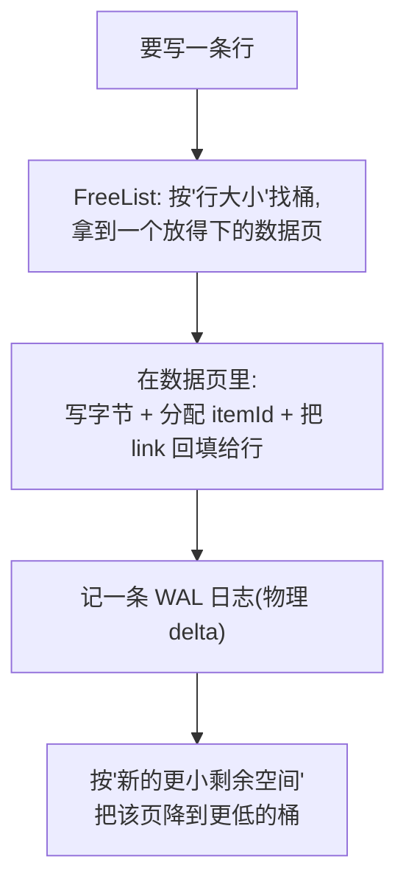

# 第 2 阶:一页之内怎么放下变长的行——数据页、link、FreeList

> **对应天花板文档**:`docs-research/03-ignite-storage-layer.md` §5.3–5.5
> **本阶只管一件事**:一条变长的"行",怎么塞进定长的页里;塞进去之后,怎么用一个指针"指"到它。

---

## 开场:第 1 阶留下的悬念

第 1 阶我们有了:**堆外内存切成 4KB 的页,每页有个自描述的 pageId。**

但马上一个新问题:一页固定 4KB,而我要存的一条**行**(一条缓存记录,包含 key、value、版本等)可能是几十字节,也可能好几 KB,**甚至比一页还大**。这变长的行,到底怎么塞进定长的页里?塞进去之后,我又怎么"指"到它(因为外面比如索引,需要能定位到它)?

本阶回答两件事:**怎么塞(数据页布局 + FreeList)**、**怎么指(link)**。

---

## 台阶一:一条行怎么塞进页里?——数据页的"槽位表"

> 术语:**行(row)** = 一条缓存记录的字节(key + value + 版本 + 过期时间)。**数据页** = flag 为 `FLAG_DATA`、专门存行的页。

**痛点** — 一页 4KB,要塞若干条**长度不一**的行。如果随便往后追加:删掉一条中间的行,就留下一个"洞";再塞一条更长的,放不进这个洞,只能往后堆——页里就全是碎片。

**类比** — 像**通讯录**:一头记"第 N 条在第几行"(条目索引),一头存条目内容,两头往中间长,中间空着。删一条只抹掉索引和内容,中间空隙还能复用。

**原理** — Ignite 的数据页就是这个"两数组相向生长"的经典布局:

```
 ┌──────────────────────┬─────────────────────────────┐
 │  items 表(每项 2B)  │        行字节(变长)        │
 │ direct / indirect    │  key | value | ver | expire │
 │  →→→ 生长            │              ←←← 生长       │
 └──────────────────────┴─────────────────────────────┘
        free space = 中间空隙(还能放新行的空间)
```

- 左边 **items 表**:每项 2 字节,记录"某条行在页内的偏移"。从前往后长。
- 右边 **行字节**:真正的行内容,从后往前长。
- 中间是 **free space**(空闲空间)。

两种 item:
- **direct item**(直接项):正常存的行,直接记它的偏移。
- **indirect item**(间接项):一行被删后产生,它指向某个 direct item。

**为什么这么设计** — indirect item 的妙处:即使页里做了**碎片整理**(defrag,把行压实),**行在"外部"的编号(item id)永远不变**——变的只是它内部偏移。这让"外面用一个固定地址指过来"成为可能(下一台阶的 link 就靠它)。

📍 **代码锚点**:`AbstractDataPageIO`(类 `:166`,布局 Javadoc `:39-165`)。对应 03 §5.4。

---

## 台阶二:怎么"指"到某条行?——link,一个 8 字节的自描述指针

> 术语:**link** = 一个 64 位(8 字节)的指针,能自描述地定位到"某分区、某页、某槽位"的某条行。

**痛点** — 索引(下一阶的 B+树)要能"指"到某条行。这个指针得**够小**(索引里要存千千万万个)、且**自描述**(不用查表就能还原位置)。

**原理** — Ignite 用 **link** 这个 8 字节指针。它由两部分拼成:

```
link (64 位) = pageId | (itemId << 56)

   高 8 位          低 56 位(就是 pageId 的低 56 位)
 ┌──────────┬──────────────────────────────────────────┐
 │ itemId   │   flag(8) │ partId(16) │ pageIdx(32)     │
 │  (8b)    │           │            │                 │
 └──────────┴──────────────────────────────────────────┘
```

- **pageId**:复用第 1 阶那个自描述页号(还记得它高 8 位是 offset 吗?link 把这 8 位**复用**成 itemId)。
- **itemId**:这条行在页内 items 表里的槽号(≤ `0xFE`,即最多 254 条/页)。

**类比** — 像"门牌号 + 房间号"拼成一个编码:`楼栋-楼层-房间`,一个数就能找到具体那张桌子。

**为什么这么设计** — 因为 link **只占 8 字节、还能自描述地定位一切**(分区/页/槽),下一阶的 B+树叶子就能**每个条目只存一个 link**,索引因此极省空间。这是"link 只占 8 字节却能定位一切"的直接成果。

📍 **代码锚点**:`PageIdUtils.link:92`(`link = pageId | (itemId << 56)`,`itemId ≤ 0xFE`)。对应 03 §5.5。

---

## 台阶三:写新行时,怎么快速找到"放得下"的页?——FreeList

> 术语:**FreeList(空闲表)** = 一个**按"剩余空间"给数据页分档**的索引,用来 O(1) 找到"能放下 N 字节"的页。

**痛点** — 要写一条 150 字节的行,哪一页放得下?挨个翻所有页看剩余空间 = O(几万页),太慢。需要一种结构:**"给我 N 字节,立刻给我一个 ≥N 空闲的页"**。

**类比** — 像**仓库货架按剩余容量分档**:要放 150 字节的东西,直接去"能放 ≥128 字节"那一档拿货位,不用挨个翻。

**原理** — FreeList 把所有数据页按**剩余空间**分 **256 个桶**,按 2 的幂分级(每档步长 = pageSize/256 = 4KB/256 = 16 字节):

```
桶 255: [ 全空页 ]              ← 回收的整页空位
桶   8: [ 页A (剩余~128B) ]
桶   4: [ 页B, 页C (剩余~64B) ]
桶   1: [ 页D (剩余~16B) ]
```

要放一个 S 字节的行 → 取 `bucket(S)`,**该桶或更高桶里的任意页,都保证放得下**(剩余 ≥ S)。这就是经典的"大小分级空闲表":**分摊 O(1) 放置,碎片被桶宽上界限制**。写入后,该页剩余变小,就降到更低的桶里去。

**为什么这么设计** — 对比"维护一个按剩余空间排序的有序结构":查找/插入都要 O(log n),还高并发下锁争用大。**按 2 的幂分桶**牺牲一点点精度(把剩余空间量化到桶宽),换来 **O(1) 放置 + 实现简单**。值得。

📍 **代码锚点**:`AbstractFreeList`(`BUCKETS=256`、`REUSE_BUCKET=255`、`bucket(freeSpace)=freeSpace>>>shift`)。对应 03 §5.3。

---

## 台阶四:一次写入怎么串起来?

把上面三块拼成"写一条行"的完整流程:



关键点:**link 不是外面算好塞进去的,而是行字节写进数据页时,由页本身把 `pageId|itemId` 回填给行对象**(`setLinkByPageId`),随后调用方再把这个 link 插进索引(下一阶的 B+树)。

📍 **代码锚点**:写入主流程 `AbstractFreeList.insertDataRow`;回填 link `AbstractDataPageIO.setLinkByPageId`。对应 03 §5.3、§5.5。

---

## 深入(选读):数据页 item 机制

> 前面台阶一为了入门,把 item 机制简化了。这一节把它**到底怎么动**讲透——删一条、插一条时槽位怎么变、itemId 怎么复用、为什么这么设计。**初读可跳过**,等你想搞懂"删除/更新后页内到底发生了什么"再回来。

### 1. 一个 item 长什么样?怎么区分 direct / indirect?

每个 item 固定 **2 字节**,但这两字节按**位置**有两种解释。区分类型**不看内容,只看下标**——下标落在 `[0, directCnt)` 就是 direct,落在 `[directCnt, directCnt+indirectCnt)` 就是 indirect(页头存了 `directCnt`、`indirectCnt` 两个 1 字节计数):

```
items 表(每项 2 字节):
┌──────┬──────┬────────────┬──────────────────┐
│ idx0 │ idx1 │   ......   │ idx=directCnt... │
│direct│direct│   direct   │    indirect      │
└──────┴──────┴────────────┴──────────────────┘
 ├──── direct 段 [0, directCnt) ────┤├── indirect 段 ──┤
```

两种 item 的 2 字节含义不同:

```
direct  item:  [ dataOff(2B) ]                         ← 行字节在页内的偏移;它的 itemId = 它的下标
indirect item: [ itemId(高1B) | directIdx(低1B) ]      ← 自己对外的id | 指向"真正存 dataOff 的那个 direct item"的下标
```

> 关键:**同一片 2 字节,在 direct 位上读成"dataOff",在 indirect 位上读成"[itemId|directIdx]"——解释方式由位置决定。** 这也是为什么 direct 段必须连续(下面会用到)。

### 2. 删一条"中间行":把末尾行搬进洞,再留个 indirect 指路

删一条行,它的外部 link(B+树里那条)会被移除;但物理上不能留个"洞"在 direct 段中间(否则 `[0,directCnt)` 连续就破了,判型规则失效)。Ignite 的做法是(`moveLastItem`):

1. 把**末尾那个 direct item**(下标 = `directCnt-1`)的 dataOff,**搬进被删的洞**;
2. 把腾出来的**末尾槽改成 indirect**,记录"被搬的那行 itemId,现在指向新位置"。

这样洞被挪到了 direct 段边界,`directCnt` 减 1 就收掉了,direct 段重新连续。代价:只动 1 个 item + 写 1 个 indirect。

### 3. 完整 trace:删一条,再插一条

设一页有 a,b,c,d,e(directCnt=5),B+树里每行的 link 就是它的 itemId:

```
下标:    0     1     2     3     4
item:  [ a |   b |   c |   d |   e ]              directCnt=5  indirectCnt=0
link:   a→0   b→1   c→2   d→3   e→4
```

**删 b(itemId=1)**:b 的 link 移除;末尾的 e 搬进洞1,槽4 变 indirect(4→1)。

```
下标:    0     1     2     3     4
item:  [ a |   e |   c |   d |  (4→1) ]           directCnt=4  indirectCnt=1
                                  ▲ indirect
读法:
  itemId=4 → (4→1) → 槽1 → e      ✅ e 的 link 完好(只是从槽4搬到了槽1)
  itemId=1 → 槽1 → e              ⚠️ 但 itemId=1 是"死的"(b 已删,B+树里没有 1 了)
活 link: a→0  c→2  d→3  e→4        死号:itemId=1
```

**插 f**:新行候选 itemId = `directCnt` = 4;正好有个 indirect 的 itemId=4,触发**转换**。注意——**转换不是把 4 给 f**,而是:

```
① e 从借住的槽1,搬回它的本命槽4 → itemId=4 仍指向 e ✅(活 link 没破)
② f 接管被释放的死槽1(itemId=1)→ f 拿到全新 link itemId=1 ✅(复用的是死号)

下标:    0     1     2     3     4
item:  [ a |   f |   c |   d |   e ]              directCnt=5  indirectCnt=0
活 link: a→0  f→1  c→2  d→3  e→4                  全部正确!
```

> **铁律:被复用的 itemId,必定是"原主已删、B+树 link 已移除"的死号。** 活的 itemId 永远不被新行抢占——所以你担心的"指错"不会发生。indirect item 的角色是"一个活行暂借了死槽,留张条子说明真身";转换就是"归还借用 + 死槽再利用"。

### 4. 为什么非这么设计不可?(四换一)

这一套用一个 indirect item(2 字节)的代价,同时换来四件事:

| 想要的 | 这套设计怎么给 |
|---|---|
| 行能在页内搬、但**外部 link 不变**(不用动 B+树) | indirect item 当间接层 |
| **O(1)** 判 direct / indirect | direct 段连续前缀,看下标 vs `directCnt` |
| 删除 **O(1)**、只动一个 item | 搬末尾行填洞 |
| **itemId 可回收**(扛得住无限增删) | 插入时转换,死号复用 |

两个推论:

- **`indirectCnt ≤ directCnt` 恒成立**:每条活行恰好占一个 direct 槽(它的 dataOff 在那);indirect item 对应的是"被搬过的活行",是活行的子集,所以不会比 direct 槽多。
- **"死槽死在那"为什么不行**:① itemId 每页上限 `0xFE=254`,不回收的话一页**最多接受 254 次 insert** 就废了(哪怕字节还空着);② 留洞会破坏 direct 段连续性,第 1 条的 O(1) 判型规则就失效,得额外加位图/自由链表。所以这套机制不是"可以偷懒的地方",而是它存在的核心理由。

📍 **代码锚点**:item 编解码 `AbstractDataPageIO.indirectItem / directItemIndex / itemId`(`:691-723`);判型靠页头 `directCnt`/`indirectCnt`;删除搬运 `moveLastItem`(`:734`)、`removeRow`(`:819`);插入转换 `addItem`(`:1021`)+ Javadoc 的 "Items insertion and deletion" 小节;itemId 上限 `PageIdUtils.MAX_ITEMID_NUM=0xFE`。对应 03 §5.4。

### 5. 空闲空间怎么记账?什么时候压缩整理?

(承接:前面讲了删/插时 item 表怎么动。但有个问题——**删除后行字节并不挪走**,那"剩余容量"到底怎么算?这页还能放多少?)

**两个"空闲"概念,别混**

页里同时存在两个量:

- **`freeSpace` 计数器**(页头 `FREE_SPACE_OFF`,2 字节)= **总共可回收的字节 = 连续空隙 + 删除留下的洞**。它被维护得绝对精确——`setRealFreeSpace` 里 assert `freeSpace == actualFreeSpace(...)`(`:319`)。删除时它 `+=` 被删 entry 的大小(`removeRow:886`)。
- **连续空隙** = items 表尾到 `dataOff` 之间那块**马上能写**的连续空间。删除**不动 `dataOff`**,所以连续空隙**不增长**——回收的字节变成行字节区中间的"洞",进不了连续空隙。

> 所以:**计数器 ≥ 连续空隙**,差额就是那些散落的洞。

**FreeList 用计数器(扣预留);"不连续"靠写入时按需压缩兜底**

`getFreeSpace`(`:337`)= 计数器 − 预留(`ITEM+PAYLOAD+LINK = 12B`),语义是"**保证能放下的最大行(必要时先整理)**"。FreeList 就按它分桶(`putPage(io.getFreeSpace(...))`,`AbstractFreeList:171`)。

那"计数器比连续空隙大"会不会挑错页?不会——写入路径(`getDataOffsetForWrite:1050` → `compactIfNeed:991`)这样兜底:

```
要写新行(前提:rowSize ≤ getFreeSpace,挑页时就保证了)
  ├─ 连续空隙够放? ─是→ 直接在 dataOff 下方挖空间写
  └─ 连续空隙不够(但计数器够)─→ compactDataEntries 把洞压成连续 → 再写
```

因为 计数器 = 连续空隙 + 所有洞,压缩后连续空隙 = 计数器,必然放得下。**FreeList 给的页绝不会"说能放却放不下"**,最多写入前在页内整理一次。

**压缩整理怎么动(`compactDataEntries:1306`)**

把活行往页尾(高地址)挪、挤掉洞,并更新各自 direct item 的 dataOff:

```
整理前(删过几行,有洞):
[页头][items表][ 连续空隙(小) ][活x][洞1][活y][洞2][活z]   ←到页尾
            表尾          ^dataOff

整理后(活行压到页尾):
[页头][items表][        连续空隙(变大)         ][活x][活y][活z]   ←到页尾
            表尾                          ^dataOff(上移)
```

做法:按 dataOff 给活行排序,从高地址往低扫,每段活行右移去填前面的洞,并用 `setItem(itemId, directItemFromOffset(新位置))` 更新它 direct item 的 dataOff。

**各部分变化 + 不动 link**

- **页头**:`directCnt`/`indirectCnt` **不变**;`dataOff` **上移(变大)**;计数器前后一致(洞只是从"散落"变成"并入连续空隙")。
- **items 表**:**结构完全不变**(下标 / itemId / 谁 direct 谁 indirect 都不动),变的只是每个 direct item 里存的 dataOff 数值;indirect item 连动都不用(它存的是"指向哪个 direct item 的下标")。
- **行字节**:物理位置挪了(压到页尾),内容一字不改。
- **link / B+树**:**完全不动**。link = pageId | (itemId<<56),itemId 没变(变的只是页内 dataOff),所以 B+树一条都不用改——这正是 direct/indirect item 设计的回报:**把"字节在哪(dataOff,可动)"和"外面怎么找(itemId/link,不动)"解耦**。

> 另:Checkpoint / WAL 快照时还有一次**快照压缩**(`compactPage:1242`),它只是往另一个 buffer 复制一份"无垃圾"的短页写盘、省持久化空间,活页本身结构不变,当然也不动 link。

📍 **代码锚点**:空闲计数器 `getRealFreeSpace`/`setRealFreeSpace`(`:318/:366`)、对外值 `getFreeSpace`(`:337`);写入兜底 `getDataOffsetForWrite`(`:1050`)→ `compactIfNeed`(`:991`)→ `isEnoughSpace`(`:916`);页内整理 `compactDataEntries`(`:1306`);快照压缩 `compactPage`(`:1242`)。对应 03 §5.4。

### 6. 连续删多条,item 表会演化成什么样?(含删"已搬过的行")

> 承小节 2、3:单条删除、删+插都讲过了。那**连续删好几条**呢?而且其中有的行可能**已经被搬过**——删它会怎样?

**演化 trace:8 行连续删 3 条中间行**

初始 `[a b c d e f g h]`(directCnt=8),依次删 c(itemId2)、e(4)、a(0):

```
删 c(2): [ a | b | h | d | e | f | g | (7→2) ]            directCnt=7 indirectCnt=1
删 e(4): [ a | b | h | d | g | f | (6→4) | (7→2) ]        directCnt=6 indirectCnt=2
删 a(0): [ f | b | h | d | g | (5→0) | (6→4) | (7→2) ]    directCnt=5 indirectCnt=3
活行+本命link: b→1  d→3  f→5  g→6  h→7        死号: 0(a) 2(c) 4(e)
```

规律:

- **每删一条中间行:`directCnt−1`、`indirectCnt+1`,表尾多一个 indirect**——末尾 direct 被搬去填洞,腾出的尾槽变 indirect。
- **indirect 全堆在表尾,且按 itemId 升序**(`(5→0)(6→4)(7→2)`),为的是按外部 itemId 查 indirect 时能**二分查找**。
- **direct 段变"杂"**:原位行(b、d)和借位搬来的行(f、h、g)混在一起;**死 itemId(0,2,4)恰好 = 被借去放搬动行的那些槽**。
- **`indirectCnt ≤ directCnt` 始终成立**。
- 注:删**最后一个 direct**(itemId=directCnt−1)是**干净直砍**,`directCnt−1` 但**不产生 indirect**(没洞要填)。

**边角:删一条"已经被搬过的行"**

上面末态里,h 是搬过的行(本命 itemId=7 ≥ directCnt=5,要经 indirect `(7→2)` 才能找到)。现在**删 h**:

```
删 h 前:   [ f | b | h | d | g | (5→0) | (6→4) | (7→2) ]   directCnt=5 indirectCnt=3
删 h(7):  [ f | b | g | d | (5→0) | (6→2) ]               directCnt=4 indirectCnt=2
活行+link: b→1  d→3  f→5(via 5→0)  g→6(via 6→2)      [h 已删]
```

发生了什么:

1. itemId=7 ≥ directCnt → 是 indirect;**先二分找到它的 indirect 项**(slot7,`7→2`),顺着它定位到真正存 h 字节的 direct 槽(slot2)。
2. 在 slot2 上做"搬末尾填洞":末尾 direct(g,slot4)搬进 slot2;但 **g 自己也是搬来的(有 indirect `6→4`)**,于是把那个 indirect **改指**为 `6→2`。
3. 把 h 的 indirect 项(slot7)从 indirect 区**摘掉、压实**。
4. 结果:**directCnt 5→4、indirectCnt 3→2**(注意:删搬动行是**消耗**一个 indirect,`indirectCnt−1`,而不是产生);其余 link 全保。

> 对比一下两种删除对 indirect 区的影响:
> - 删一条 **native direct**(在原位、本命 id < directCnt)→ **产生**一个 indirect(`indirectCnt+1`);
> - 删一条**已搬动行**(本命 id ≥ directCnt)→ **消耗**一个 indirect(`indirectCnt−1`)。
>
> 所以持续增删下,indirect 区**有增有减、动态平衡**,不会无限膨胀。

**那这些项挪来挪去,link 怎么还找得到?**

(承接:上面 indirect 项被左移、被改指、被丢弃——位置一直在变,但外部 link 不会错。原因在于:**link 里的 itemId 不是当地址下标用的**,direct 和 indirect 两套查找规则不同。)

按外部 link 的 itemId=X 找行(`getDataOffset`):

| X 落在哪 | 怎么找 |
|---|---|
| **X < directCnt**(direct) | **槽位下标 == itemId** → 直接读 `slot[X]` 拿 dataOff |
| **X ≥ directCnt**(indirect) | **二分 indirect 区**,找"存的 itemId == X"的那项,再顺它指的 direct 槽 |

> 关键:**indirect item 是按它"存的 itemId"二分查找的,跟它坐在哪个槽位无关。** 所以 `(5→0)` 放 slot4 还是 slot5 都行。

用删 h 后的状态 `[ f | b | g | d | (5→0) | (6→2) ]`(directCnt=4)逐条验证:

```
查 f(itemId=5): 5≥4 → 二分 indirect → slot4 的 (5→0) 命中 → direct 槽0 → f ✅
查 g(itemId=6): 6≥4 → 二分 indirect → slot5 的 (6→2) 命中 → direct 槽2 → g ✅
查 b(itemId=1): 1<4 → direct → slot1 → b ✅
查 d(itemId=3): 3<4 → direct → slot3 → d ✅
```

全对。**二分能成立,是因为 indirect 区始终保持按 stored itemId 升序**(左移 / 改指只是整体平移或改值,不破坏有序)。

> 一句话:**link 的 itemId 对 direct item 恰好等于下标(`slot[itemId]`),对 indirect item 是个"要被二分搜索的 key"**——项挪到哪个槽无所谓,只要它存的 itemId 对、且 indirect 区有序。这就是整个 direct/indirect 机制能让页内随便搬移、外部 link 却纹丝不动的根本原因。

📍 **代码锚点**:删除总入口 `removeRow`(`:819`);按 itemId 二分找 indirect `findIndirectItemIndex`;搬末尾填洞 `moveLastItem`(`:734`,含"末尾 direct 已被 indirect 指过"的改指分支);按 link 查行 `getDataOffset`(direct 走下标、indirect 走二分)。对应 03 §5.4。

---

## 你现在应该能回答

1. 一页 4KB,删掉中间一条行后,留下的"洞"为什么不会让页永久碎片化?(提示:items 表 + 两种 item)
2. link 是 8 字节,它是怎么做到"自描述地指向某条行"的?
3. 要写一条 150 字节的行,Ignite 怎么在几万个数据页里 O(1) 找到一个放得下的页?

---

## 对应到 03 文档

本阶覆盖 03 的 **§5.3–5.5**:数据页布局(§5.4)、link 编码与回填(§5.5)、FreeList 空间管理(§5.3)。

03 里本阶**故意没细讲**的:行在数据页里的**精确字节顺序**(key/value/version/expire 各占几字节)——那是序列化层(03 §8)的事,需要时再去翻。

---

## 留给下一阶的悬念

现在:行能塞进页了,也有了 **link** 可以"指"过去。

但是——**给我一个 key,我怎么快速找到它的 link?** 最笨的办法是把所有数据页顺序翻一遍(O(n),几亿条数据翻不起)。我们需要一个**按键有序、能快速定位**的结构。

这就是第 3 阶的主角:**B+树**。
