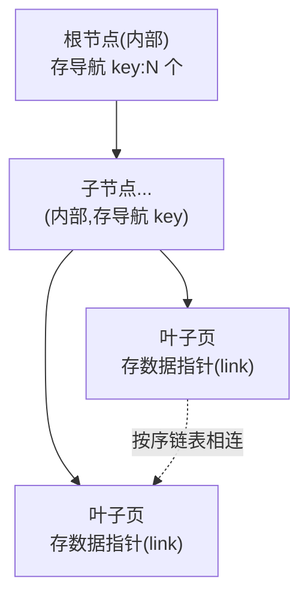

# 第 3 阶:怎么按键快速找到那行——B+树,叶子只存 link

> **对应天花板文档**:`docs-research/03-ignite-storage-layer.md` §5.1–5.2、§5.6
> **本阶只管一件事**:给一个 key,怎么快速定位到它的 link。

---

## 开场:第 2 阶留下的悬念

第 2 阶我们让"行能塞进页",并造出了 **link**——一个能指向某条行的 8 字节指针。

但问题来了:**给我一个 key,我怎么快速找到它的 link?** 最笨的法子是把所有数据页从头翻到尾(O(n)——几亿条数据,翻一次几分钟,不可接受)。我们需要一个**按键有序、能快速定位**的东西。

这就是**索引**。Ignite 用的是 **B+树**。

---

## 台阶一:为什么需要索引

**痛点** — 数据量大了,顺序扫描(从头找到尾)是不可接受的慢。

**类比** — 一本没目录、没音序的厚字典,找一个字只能一页页翻;而字典有**音序索引**后,几次翻页就能定位。索引的本质就是**"别每次都全量扫描"**。

**原理** — 维护一个**按 key 有序**的辅助结构,把"O(n) 扫描"变成"O(log n) 查找"。几亿条数据,log n 大概二三十次比较就能定位。

---

## 台阶二:B+树——又浅又胖的有序树

> 术语:**B+树** = 数据库里最主流的索引结构。要点:① 只有**叶子**存数据指针;② 内部节点只存"导航用的 key";③ 叶子按序**链表**相连。

**痛点** — 你可能知道 **TreeMap**(Java 里按 key 排序的 Map,底层是红黑树)——它是一棵**二叉**查找树(每个节点最多两个子)。二叉树的问题:**太瘦太高**。几亿个 key,二叉树有二三十层,每层若都要读一次页,IO 次数太多。我们要的是**又浅又胖**的树。

**类比** — 想象一棵"公司组织架构树":如果是二叉的(每个领导直管 2 人),几十亿员工要三十多层;如果每个领导直管几百人(胖),三四层就到底了。**B+树就是把每个节点做到"一页能装几百个 key"的胖树。**

**原理** — B+树三个关键点:



1. **只有叶子存数据指针**(link),**内部节点只存"导航 key"**——内部节点的作用纯粹是"告诉你该往哪个子节点走"。
2. **叶子按序链表相连**——范围扫描(查 `[a, b]` 之间的所有 key)时,顺着叶子链表走就行,不用回溯内部节点。
3. **节点很胖**——一个节点 = 一个 PageMemory 页(4KB),能装几百个 key。所以树**很浅**:2–4 层就能管几十亿 key → **一次点查只读"层数"个页**(2–4 页)。

> 一句话:**B+树用"胖节点"换"浅树",用"浅树"换"少 IO"。** 这是它快的老底。

**为什么这么设计** — 对比二叉查找树(瘦高,IO 多):胖节点充分利用"一页 4KB"的空间装更多 key,把树压扁。这是**磁盘/页式存储**下的最优解(数据库、文件系统都用 B+树家族,不是巧合)。

📍 **代码锚点**:通用堆外 B+树 `BPlusTree.java:214`(一个树节点 = 一个页)。注意一个细节:Ignite 的 B+树**不维护"非根节点半满"**这个不变量——所以别假设每个节点都装了一半以上,只假设结构正确。对应 03 §5.1。

---

## 台阶三:CacheDataTree——叶子只存 link,不存键值字节

**痛点** — 如果索引里把每条 key、value 的完整字节都存一份,索引会比数据本身还大,而且和数据页里的内容**重复**——浪费空间。

**原理** — Ignite 的缓存主索引叫 `CacheDataTree`(就是一棵 B+树),它的**叶子项只存 3 样东西**:

```
一个叶子项 = [ link (8B) | hash (4B) | cacheId (4B, 仅共享缓存组才有) ]
```

**注意:叶子不存 key 字节、不存 value 字节**,只存 `(link, hash[, cacheId])`。

那查找时怎么比较 key?**三级比较**:
1. 先比 `cacheId`(共享组才用);
2. 再比 `hash`(key 的哈希值,预算好存在这里);
3. **只有 hash 相同时,才顺着 link 去数据页读出真正的 key 字节来比较**。

**类比** — 像**图书馆卡片目录**:卡片上只记"书名首字母 + 书架号"(link),不把整本书抄进目录。绝大多数查找,光看卡片(hash 比对)就能排除;只有少数 hash 撞上的,才去书架(link)把书拿出来核对书名。

**为什么这么设计** — **不在索引里重复存键值字节**,索引因此极"瘦",一页能装更多条目 → 树更浅 → 查得更快。代价是 hash 撞上时要额外读一次数据页,但 hash 撞击很罕见,值得。

📍 **代码锚点**:`CacheDataTree.java:56`;叶子项写入 `AbstractDataLeafIO.storeByOffset`;比较逻辑 `CacheDataTree.compare` / `compareKeys`。对应 03 §5.2。

---

## 台阶四:性能杠杆——导航用轻探针,命中才读完整行

**原理** — Ignite 区分两种行对象:

| 类型 | 装了什么 | 用途 |
|---|---|---|
| **SearchRow**(搜索行,轻) | key、hash、cacheId(**没有 value**;`link()` 会抛异常) | B+树**导航探针**,只在树里"比 key"用 |
| **DataRow**(数据行,重) | + value、version、expireTime、partition、link | **完整行**,真正要用值时才读 |

B+树遍历全程都用便宜的 **SearchRow** 当"探针"在节点间比对;**只有命中目标叶子时**,才顺着 link 把完整的 **DataRow** 从数据页读出来。

**类比** — 找人时,你先拿着"姓名"(轻探针)挨个门牌比对;只有找到那扇门,才推门进去看本人(完整行)——没必要一路上把每个人都请出来看。

📍 **代码锚点**:轻探针 `SearchRow`(`SearchRow.java`,无 link);完整行 `DataRow`(`DataRow.java:31`);命中后读取 `CacheDataTree.getRow`。对应 03 §5.6。

---

## 深入(选读):B+树节点结构具象图

> 台阶二~四讲的是 B+树的**概念**。这一节把**节点(页)的真实字节布局**画出来,全部对着源码。初读可跳过,想搞懂"一页到底怎么装下几百个 key、叶子怎么串、内部节点怎么导航"再回来。

**总前提**:每个 B+树节点 = 一个页;每个页统一长这样(`BPlusIO`):

```
| 页头 HEADER | count(2B) | forwardId(8B) | removeId(8B) | items... |
```

- `count` = 本页 item 数;`forwardId` = **同层下一个页**的 link(0 = 没有);`removeId` = 删除时的树不变量校验用。

### 1. 叶子节点(level 0)

叶子的 `items` 区是一个**紧凑数组**(无空隙):

```
┌──────────┬───────┬───────────┬──────────┬─────────────────────────────────┐
│ 页头     │ count │ forwardId │ removeId │   叶子项数组                      │
│ HEADER   │ (2B)  │  (8B)     │  (8B)    │  item0 │ item1 │ ... │ itemN-1   │
└──────────┴───────┴─────┬─────┴──────────┴─────────────────────────────────┘
                         │
                         └─→ 指向同层下一个叶子(叶子链表);末叶 = 0

每个【叶子项 item】(CacheDataTree)= 不存键值字节!
┌──────────┬─────────┬────────────┐
│ link(8B) │ hash(4B)│ cacheId(4B)*│     * 仅共享缓存组才有
└────┬─────┴─────────┴────────────┘
     └─ 指向数据页里那行
```

一个 4KB 页、每项 ~12–16B,能装**几百个**叶子项——这就是 B+树"胖叶子"的来源。

### 2. 叶子按序链表相连

每个叶子的 `forwardId` 把同层叶子串成**单向链表**(每层都是一条前向链表;level 0 的前向链就是叶子链表,范围扫 `AbstractForwardCursor` 用它):

```
  叶子0                叶子1                叶子2                 末叶
┌─────────┐          ┌─────────┐          ┌─────────┐          ┌─────────┐
│item:k1  │ forwardId│item:k5  │ forwardId│item:k9  │ forwardId│item:k13 │
│item:k3  │────────► │item:k7  │────────► │item:k11 │═════════►│item:k15 │fwd=0
└─────────┘          └─────────┘          └─────────┘          └─────────┘
  key 全程递增: k1<k3 < k5<k7 < k9<k11 < k13<k15
```

范围扫 `[k4, k9]`:从根下钻定位到叶子1 → 沿 `forwardId` 走到叶子2 → 边走边收 → 到 k9 停。**全程只在叶子层平移,不回溯内部节点。**

### 3. 叶子节点 和 叶子项 的关系

**一对多的容器关系**:

| | 是什么 | 数量 |
|---|---|---|
| **叶子节点**(leaf node) | 一个页(容器) | 一棵树有很多个 |
| **叶子项**(leaf item) | 一条索引记录 `(link, hash, cacheId)` | 一个叶子节点装 `[1, max]` 个 |

一个叶子节点装多个叶子项;每个叶子项经 `link` 指向**一条真实行**(在数据页里)。类比:叶子节点 = 字典一页,叶子项 = 这页上一条目录条目(只记"词+页码",不抄释义)。

### 4. 内部节点(level ≥ 1)

内部节点的 `items` 区是 **item 和子指针交错(interlaced)**(`BPlusIO`):`| child0 | item0 | child1 | item1 | ... | itemN-1 | childN |`,即 **N 个 item + (N+1) 个 child**:

```
┌──────────┬───────┬───────────┬──────────┬──────────────────────────────────────────────┐
│ 页头     │ count │ forwardId │ removeId │  交错区:N 个 item + (N+1) 个 child            │
│ HEADER   │ (2B)  │  (8B)     │  (8B)    │ child0│item0│child1│item1│...│itemN-1│childN  │
└──────────┴───────┴───────────┴──────────┴──────────────────────────────────────────────┘

放大交错区:
 ┌────────┬────────┬────────┬────────┬───┬──────────┬────────┐
 │ child0 │ item0  │ child1 │ item1  │...│ itemN-1  │ childN │
 │ 页指针 │ 导航键 │ 页指针 │ 导航键 │   │ 导航键   │ 页指针 │
 └────────┴────┬───┴────────┴────┬───┴───┴─────┬────┴────────┘
          item0 左子=child0      │             │
               右子=child1 ──────┘             │
                                               itemN-1 右子=childN

每个 item(导航键)= [rowLink(8B) | hash(4B) | cacheId(4B)*]   ← 复制自某叶子的边界 key
每个 child          = 子页 pageId(8B)                        ← 指向下一层节点
```

> 两种"link"别混:**交错的 `child`** 是子页指针(指向下一层节点);**item 里的 `rowLink`** 是边界行的指针(当路标用)。内部 item 内容跟叶子项一样是 `(link, hash, cacheId)`。
>
> 导航:找 key K,在 item0..itemN-1 里二分,`K ≤ item_i` 走 `child_i`(左子),全大于则走 `child_N`。

### 5. 整棵 B+树

```
                       ┌──────────────────┐
                       │  meta 页          │  存 root 的 pageId + 树高(level)
                       └────────┬─────────┘
                                │
  level 2   ┌───────────────────┴────────────────────────┐
  (根,内部) │ child0  item0  child1  item1  child2       │
            └──────┬──────────────────┬────────────┬─────┘
                   │                  │            │
  level 1     ┌────┴────┐        ┌────┴────┐  ┌────┴────┐
  (内部)       │ 内部节点 │   ...  │ 内部节点 │  │ 内部节点 │
              └────┬────┘        └────┬────┘  └────┬────┘
                   │ ...              │ ...        │ ...
  level 0     ┌────┴────────────────────────────────────┐
  (叶子)       │  叶子链表(靠 forwardId 串联)            │
              │  ┌────┐ fwd ┌────┐ fwd ┌────┐ fwd  ┌────┐│
              │  │item│──► │item│──► │item│──►...│item││ fwd=0
              │  └─┬──┘     └─┬──┘     └─┬──┘      └─┬──┘│
              └────┼──────────┼──────────┼───────────┼────┘
                   │ link     │ link     │ link      │ link
                   ▼          ▼          ▼           ▼
              数据页里的真实行(叶子项不存键值,只靠 link 指过去)
```

对应台阶二的三条:① 只有叶子存数据指针(link);② 叶子按序链表;③ 节点胖 → 树浅(2–4 层管几十亿 key)。

### 6. 树 和 SearchRow / DataRow 的关系

**关键:树里存的是字节 `(link, hash, cacheId)`,不是 Java 对象;SearchRow / DataRow 是操作时临时构造的对象,不持久化在树里。**

```
                  B+树(堆外页)
            ┌────────────────────────────┐
            │ 叶子项/内部项 = 字节         │   link(8B)+hash(4B)+cacheId(4B)
            │ (link, hash, cacheId)      │   不含 key/value 字节,不是对象
            └────────────┬───────────────┘
                         │ 操作时才构造临时对象 ↓
          ┌──────────────┴───────────────┐
          ▼                              ▼
   【SearchRow 搜索探针】           【DataRow 完整行】
    key + hash + cacheId             key + value + version
    ✗ 无 value                       + expireTime + partition + link
    link() 抛异常(纯查键)            有完整数据
          │                              │
          │ 用于:findOne / 导航比对       │ 用于:插入(put 一整行)
          │ 在树里"比 key"               │      或命中叶子后读出完整行
          ▼                              ▼
   比对:先比 cacheId → 再比 hash → hash 相同才沿 item 的 link
        去数据页读 key 字节比 → 命中后按 link 读出 DataRow
```

一句话:**树存 `(link,hash)` 字节当索引;SearchRow 是"拿 key 去树里找"的探针,DataRow 是"找到后从数据页读回的完整行"**——后两者都是临时的,树里谁都不存。

📍 **代码锚点**:页头/交错布局 `BPlusIO`(`:32-77`);节点/链表/不变量 `BPlusTree` 类 Javadoc(`:96-212`);前向链 `BPlusIO.getForward`;叶子项 `AbstractDataLeafIO.storeByOffset`、内部项 `AbstractDataInnerIO.storeByOffset`;行对象 `SearchRow`/`DataRow`(`DataRow.java:31`)。对应 03 §5.1、§5.2、§5.6。

---

## 深入(选读):B+树的变更与维护成本

> 节点结构具象图讲的是"长什么样";这一节讲"**什么时候变、怎么变、代价多大**"。对着 `BPlusTree` 类 Javadoc 的 Operations / Invariants / Merge / Routing 几节(`:143-212`)。

**一句话结论**:B+树的**结构**(节点数、树高、节点间连接)只在**插入新 key** 和**删除 key** 时才变;**更新已有 key 的 value 一般只改某个 item 的字节、不重构**;读、数据页压缩/换出都不动树。

**触发场景 → 结构变化 → 成本**

| 触发 | 结构变化 | 频率 | 成本 |
|---|---|---|---|
| **插入新 key** | 叶子加一项;叶子满→**分裂**,边界 key 上推父节点;父也满→级联分裂到根→**树长高** | 罕见(每页几百项才分裂) | 均摊~1 页写;分裂时 O(树高) 页写 + 各一条 WAL |
| **删除 key** | 叶子删一项;叶子**变空→强制合并**;父变 routing page→继续级联合并;之后可选**常规合并**压实 | 罕见(叶子降到 0 项才强制合并) | 均摊~1 页写;合并级联时 O(树高) 页写 + WAL |
| **更新已有 key 的 value** | **几乎不变结构**——只把那个 item 的 link 原地改写(link 没变则连改都不用) | 每次更新 | ~1 页写(link 变)或 0;**不分裂不合并** |
| 读 / 数据页压缩 / 页换出 | **不变**(link 稳定) | — | 0 结构成本 |
| 分区 rebalance | 非"本树重构",而是**整棵树(整分区)拷贝**到另一节点 | 拓扑变化时 | 整分区字节流拷贝(第 5 阶) |

**插入:叶子满 → 分裂,可能级联长高**

叶子塞一项;若已满(`count==max`)**分裂**:一半项分给新叶子,边界 key 上推父节点;父也满再分裂……最坏级联到根 → 新根产生、**树高 +1**(这是树长高的唯一途径)。因一页能装几百 key,分裂罕见,**均摊一次插入只写 1 个叶子页**。

**删除:叶子空 → 强制合并,routing page 级联**

从叶子删一项。Ignite **只在叶子变空(0 项)时才强制合并**(不是半空就合并)。合并后父节点可能少一个孩子、掉一个 key:若父 item 降到 0 但还剩 1 个孩子指针 → 变 **routing page(0 key、1 指针)** → 触发又一轮强制合并向上级联。强制合并后还有**常规合并(regular merge)**:顺手把"当前祖先 + 兄弟"能装一页就合并、逐层往上试——**可选**的性能优化,不为维持不变量。

**更新:为什么一般不动树**

更新已有 key 的 value(`CacheDataStoreImpl.update`):

- 新 value **能就地写**回原数据页槽 → 行 **link 不变** → 叶子项一个字节都不用改 → **树完全不动**;
- 放不下、行搬到新数据页 → link 变了 → 用 `putx` 把那个叶子项的 link **原地改写**(key 没变→排序位置不变→**不分裂不合并**)。

所以**更新从不引起分裂/合并**,最多重写 1 个 item 的 8 字节 link——这是 B+树"按 key 组织"的天然红利。

**维护成本代价**

1. **写放大**:分裂/合并级联时,一次逻辑增删可能改 O(树高) 个页,每页改一条 WAL、终被 checkpoint 刷盘。但分裂/合并罕见,**均摊 ≈ 1 页/次**。
2. **并发锁**:页级锁;**自下而上**加锁、同层**从左到右**加锁防死锁;用**三角不变量**(`forward(left(i))==right(i)`)检测并发结构变更,冲突**重试**。
3. **空间碎片(关键取舍)**:**故意不维护"节点半满"**——只在叶子**全空**才强制合并。好处:删除便宜;坏处:删多了节点稀疏(一个叶子可能只剩 1 项)、空间利用率低、树可能略高,靠常规合并择机压实缓解。
4. **CPU / 比较**:导航 `compare` 按 cacheId → hash →(hash 撞上才)沿 link 读 key 字节,绝大多数只比 hash。
5. **索引页分配 / 回收**:分裂取新页(从 reuseList 取 `FLAG_IDX` 索引页),合并腾出的页回收到 reuseList。

> 一句话收口:B+树靠"**满才分裂、空才合并、不维护半满**"把结构变更压到最低频率——**绝大多数增删只动 1 个叶子页,更新连结构都不碰**;代价是接受一定空间稀疏,换来便宜的删除和高并发下的低维护开销。

📍 **代码锚点**:操作 / 不变量 / 合并 / 路由页 `BPlusTree` 类 Javadoc(`:143-212`);插入 `Put`、删除 `Remove` 内部类;更新路径 `CacheDataStoreImpl.update`(`IgniteCacheOffheapManagerImpl.java:1598`)、`putx`/`put`。对应 03 §5.1、§5.2、§5.7。

---

## 你现在应该能回答

1. 为什么 Ignite 用 B+树,而不是你熟悉的二叉查找树/TreeMap?(关键在"胖"和"浅")
2. B+树的叶子项为什么不存完整的 key/value 字节,只存 link?查找时 key 怎么比?
3. 为什么遍历 B+树用 SearchRow 而不是直接用 DataRow?

---

## 对应到 03 文档

本阶覆盖 03 的 **§5.1–5.2**(B+树 / CacheDataTree)+ **§5.6**(行对象)。
另有 §5.7(CacheDataStore 四件套)、§5.8(PendingEntriesTree,TTL)、§5.9(与 H2/SQL 衔接)是周边,本阶没展开,需要时去翻。

---

## 留给下一阶的悬念

到这里,单机存储的"快"已经齐了:**数据在堆外页里(第 1 阶)、变长行塞得下且能被 link 指到(第 2 阶)、按 key 一查就到(第 3 阶)。**

但一个要命的问题:**这一切都在内存里。机器一崩(断电、进程挂),内存里没落盘的页就全没了。** "又快又靠谱"的"靠谱"还没解决。

这就是第 4 阶的主题:**WAL + Checkpoint——崩了怎么不丢数据。**
