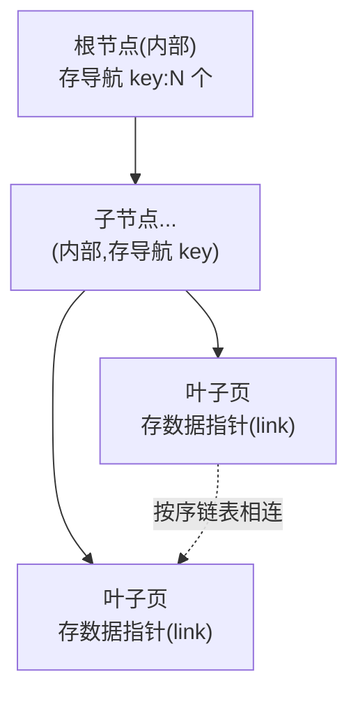

# 第 3 阶:怎么按键快速找到那行——B+树,叶子只存 link

> **对应天花板文档**:`docs-research/03-ignite-storage-layer.md` §5.1–5.2、§5.6
> **本阶只管一件事**:给一个 key,怎么快速定位到它的 link。

---

## 开场:第 2 阶留下的悬念

第 2 阶我们让"行能塞进页",并造出了 **link**——一个能指向某条行的 8 字节指针。

但问题来了:**给我一个 key,我怎么快速找到它的 link?** 最笨的法子是把所有数据页从头翻到尾(O(n)——几亿条数据,翻一次几分钟,不可接受)。我们需要一个**按键有序、能快速定位**的东西。

这就是**索引**。Ignite 用的是 **B+树**。

---

## 台阶一:为什么需要索引

**痛点** — 数据量大了,顺序扫描(从头找到尾)是不可接受的慢。

**类比** — 一本没目录、没音序的厚字典,找一个字只能一页页翻;而字典有**音序索引**后,几次翻页就能定位。索引的本质就是**"别每次都全量扫描"**。

**原理** — 维护一个**按 key 有序**的辅助结构,把"O(n) 扫描"变成"O(log n) 查找"。几亿条数据,log n 大概二三十次比较就能定位。

---

## 台阶二:B+树——又浅又胖的有序树

> 术语:**B+树** = 数据库里最主流的索引结构。要点:① 只有**叶子**存数据指针;② 内部节点只存"导航用的 key";③ 叶子按序**链表**相连。

**痛点** — 你可能知道 **TreeMap**(Java 里按 key 排序的 Map,底层是红黑树)——它是一棵**二叉**查找树(每个节点最多两个子)。二叉树的问题:**太瘦太高**。几亿个 key,二叉树有二三十层,每层若都要读一次页,IO 次数太多。我们要的是**又浅又胖**的树。

**类比** — 想象一棵"公司组织架构树":如果是二叉的(每个领导直管 2 人),几十亿员工要三十多层;如果每个领导直管几百人(胖),三四层就到底了。**B+树就是把每个节点做到"一页能装几百个 key"的胖树。**

**原理** — B+树三个关键点:



1. **只有叶子存数据指针**(link),**内部节点只存"导航 key"**——内部节点的作用纯粹是"告诉你该往哪个子节点走"。
2. **叶子按序链表相连**——范围扫描(查 `[a, b]` 之间的所有 key)时,顺着叶子链表走就行,不用回溯内部节点。
3. **节点很胖**——一个节点 = 一个 PageMemory 页(4KB),能装几百个 key。所以树**很浅**:2–4 层就能管几十亿 key → **一次点查只读"层数"个页**(2–4 页)。

> 一句话:**B+树用"胖节点"换"浅树",用"浅树"换"少 IO"。** 这是它快的老底。

**为什么这么设计** — 对比二叉查找树(瘦高,IO 多):胖节点充分利用"一页 4KB"的空间装更多 key,把树压扁。这是**磁盘/页式存储**下的最优解(数据库、文件系统都用 B+树家族,不是巧合)。

📍 **代码锚点**:通用堆外 B+树 `BPlusTree.java:214`(一个树节点 = 一个页)。注意一个细节:Ignite 的 B+树**不维护"非根节点半满"**这个不变量——所以别假设每个节点都装了一半以上,只假设结构正确。对应 03 §5.1。

---

## 台阶三:CacheDataTree——叶子只存 link,不存键值字节

**痛点** — 如果索引里把每条 key、value 的完整字节都存一份,索引会比数据本身还大,而且和数据页里的内容**重复**——浪费空间。

**原理** — Ignite 的缓存主索引叫 `CacheDataTree`(就是一棵 B+树),它的**叶子项只存 3 样东西**:

```
一个叶子项 = [ link (8B) | hash (4B) | cacheId (4B, 仅共享缓存组才有) ]
```

**注意:叶子不存 key 字节、不存 value 字节**,只存 `(link, hash[, cacheId])`。

那查找时怎么比较 key?**三级比较**:
1. 先比 `cacheId`(共享组才用);
2. 再比 `hash`(key 的哈希值,预算好存在这里);
3. **只有 hash 相同时,才顺着 link 去数据页读出真正的 key 字节来比较**。

**类比** — 像**图书馆卡片目录**:卡片上只记"书名首字母 + 书架号"(link),不把整本书抄进目录。绝大多数查找,光看卡片(hash 比对)就能排除;只有少数 hash 撞上的,才去书架(link)把书拿出来核对书名。

**为什么这么设计** — **不在索引里重复存键值字节**,索引因此极"瘦",一页能装更多条目 → 树更浅 → 查得更快。代价是 hash 撞上时要额外读一次数据页,但 hash 撞击很罕见,值得。

📍 **代码锚点**:`CacheDataTree.java:56`;叶子项写入 `AbstractDataLeafIO.storeByOffset`;比较逻辑 `CacheDataTree.compare` / `compareKeys`。对应 03 §5.2。

---

## 台阶四:性能杠杆——导航用轻探针,命中才读完整行

**原理** — Ignite 区分两种行对象:

| 类型 | 装了什么 | 用途 |
|---|---|---|
| **SearchRow**(搜索行,轻) | key、hash、cacheId(**没有 value**;`link()` 会抛异常) | B+树**导航探针**,只在树里"比 key"用 |
| **DataRow**(数据行,重) | + value、version、expireTime、partition、link | **完整行**,真正要用值时才读 |

B+树遍历全程都用便宜的 **SearchRow** 当"探针"在节点间比对;**只有命中目标叶子时**,才顺着 link 把完整的 **DataRow** 从数据页读出来。

**类比** — 找人时,你先拿着"姓名"(轻探针)挨个门牌比对;只有找到那扇门,才推门进去看本人(完整行)——没必要一路上把每个人都请出来看。

📍 **代码锚点**:轻探针 `SearchRow`(`SearchRow.java`,无 link);完整行 `DataRow`(`DataRow.java:31`);命中后读取 `CacheDataTree.getRow`。对应 03 §5.6。

---

## 你现在应该能回答

1. 为什么 Ignite 用 B+树,而不是你熟悉的二叉查找树/TreeMap?(关键在"胖"和"浅")
2. B+树的叶子项为什么不存完整的 key/value 字节,只存 link?查找时 key 怎么比?
3. 为什么遍历 B+树用 SearchRow 而不是直接用 DataRow?

---

## 对应到 03 文档

本阶覆盖 03 的 **§5.1–5.2**(B+树 / CacheDataTree)+ **§5.6**(行对象)。
另有 §5.7(CacheDataStore 四件套)、§5.8(PendingEntriesTree,TTL)、§5.9(与 H2/SQL 衔接)是周边,本阶没展开,需要时去翻。

---

## 留给下一阶的悬念

到这里,单机存储的"快"已经齐了:**数据在堆外页里(第 1 阶)、变长行塞得下且能被 link 指到(第 2 阶)、按 key 一查就到(第 3 阶)。**

但一个要命的问题:**这一切都在内存里。机器一崩(断电、进程挂),内存里没落盘的页就全没了。** "又快又靠谱"的"靠谱"还没解决。

这就是第 4 阶的主题:**WAL + Checkpoint——崩了怎么不丢数据。**
