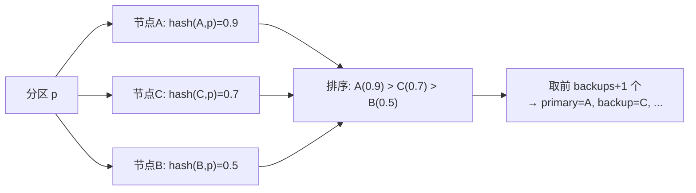
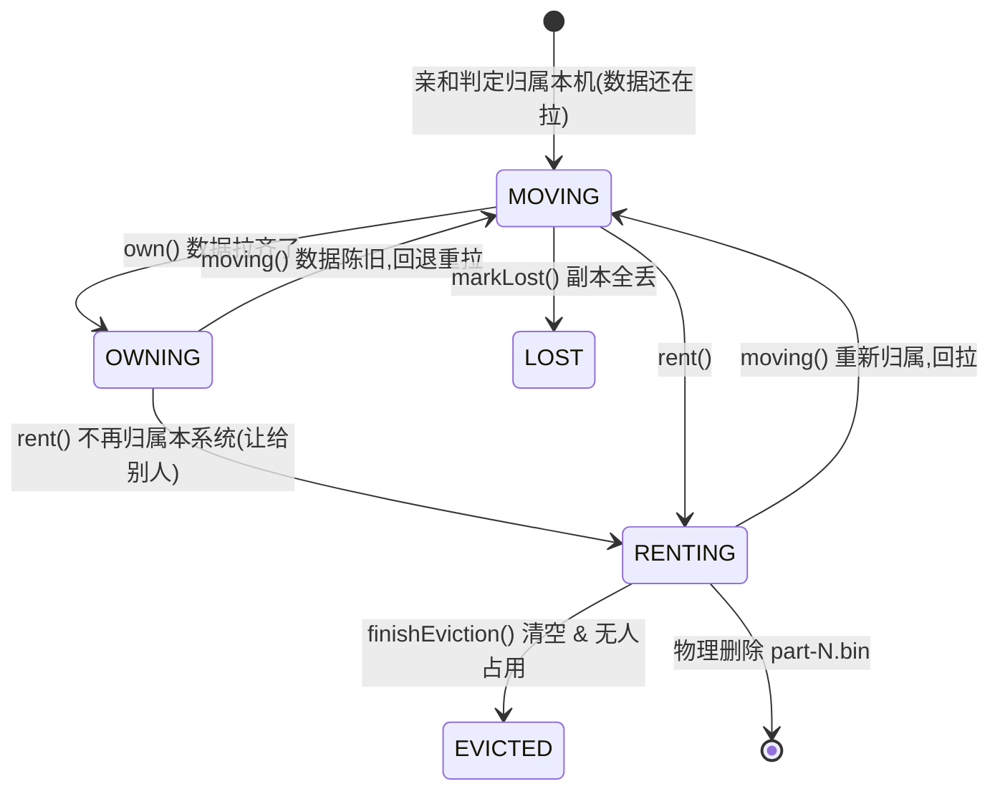
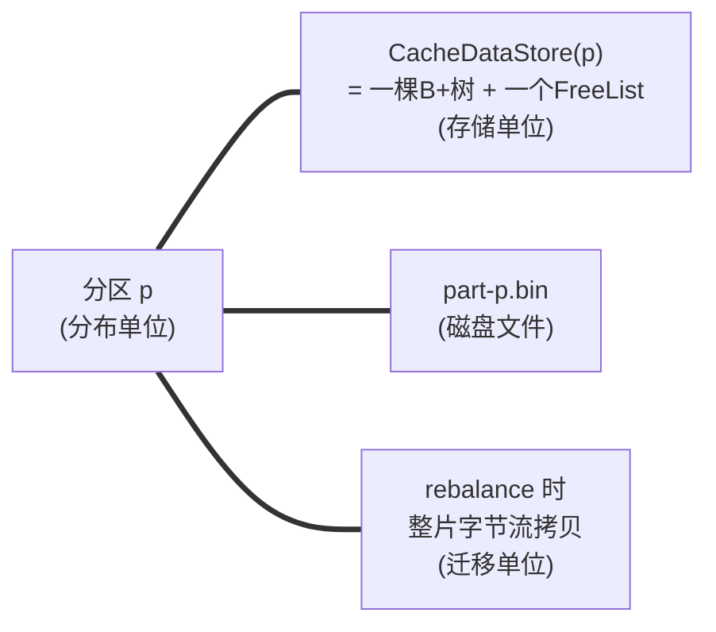
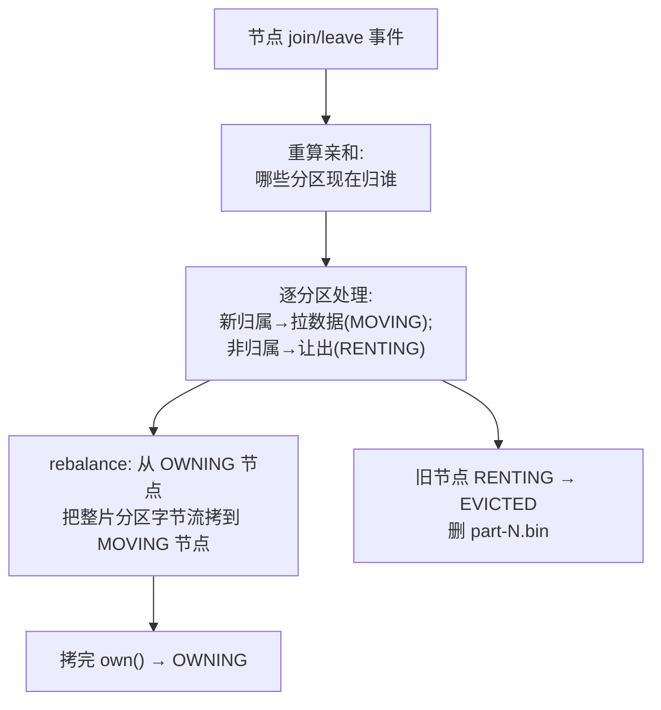

# 第 5 阶:单机装不下、还要高可用——分区、亲和性、rebalance

> **对应天花板文档**:`docs-research/03-ignite-storage-layer.md` §7
> **本阶只管一件事**:把存储从单机扩展到多机——数据怎么切分、每个分片归谁、节点增减时怎么迁移。

---

## 开场:第 4 阶留下的悬念

前四阶把"单机又快又靠谱"做完了。但生产环境里单机扛不住:**数据量超过单机容量**、且**一台机器挂了它负责的数据就不可用**。所以必须横向扩展到多台。

这引出三个问题:
1. 数据**怎么切**到多台?(分区)
2. 每个分片**归哪几台**?(亲和性)
3. 节点增减时,数据**怎么迁移**?(rebalance)

本阶一气讲完。好消息是:它们其实是把前面四阶那套单机存储,**整片整片地**搬到不同机器上。

---

## 台阶一:分区——把 key 空间切成固定数量的片

> 术语:**分区(partition)** = 把整个 key 空间(所有可能的 key)切成固定数量的"片",每片放到某几台机器上。**分区是分布、存储、迁移的共同单位。**

**痛点** — 不能"按 key 随机散到各台"——那样节点一增减,几乎所有 key 都得重新分配,迁移量爆炸。需要一种**稳定的切分**。

**原理** — Ignite 默认切 **1024 个分区**。一个 key 属于哪个分区,靠哈希算:

```
分区号 = hash(key) 映射到 [0, 1023]
```

> 术语:**哈希(hash)** = 把任意输入算成一个固定大小的数;**取模(modulo,%)** = 算"除以某数的余数",用来把一个大数框进固定范围。这里把 key 的哈希值框进 0–1023。

具体算分区号时还做了一次"扰动"(`hashCode ^ (hashCode>>>16)`,让哈希分布更均匀),2 的幂分区数走快速位掩码、否则取模。

**colocation(同址)**:还可以让"相关联的 key 落到同一分区"——比如把"订单"和它的"明细"放一起,join 时不用跨机。通过在 key 里标 `@AffinityKeyMapped` 字段实现。

**为什么这么设计** — 分区数固定(不随节点数变),所以**节点增减时,分区到节点的归属变了,但"key→分区"这个映射不变**——迁移只在"分区→节点"这一层发生,粒度粗、可控。

📍 **代码锚点**:默认分区数 `DFLT_PARTITION_COUNT = 1024`(`RendezvousAffinityFunction.java:79`);key→分区 `GridCacheAffinityManager.partition`。对应 03 §7.1。

---

## 台阶二:亲和性——每个分区归哪几台?用 Rendezvous 哈希

> 术语:**亲和性(affinity)** = 决定"分区 p 放在哪些节点上"的规则。一台 **primary**(主,读写首选)+ 若干 **backup**(备,主挂了顶上)。

**痛点** — 最朴素的法子是 `分区号 % 节点数`,但**加一台机器,几乎所有分区都要重新归属**——迁移量巨大。我们想要:**加/减一台机器,只动"和这台机器相关"的那少数分区,其余不动。**

**原理** — Ignite 用 **Rendezvous(最高随机权重)哈希**。对每个分区 p,给每个节点算一个分数 `hash(节点ID, p)`,**按分数从高到低取前 `backups+1` 个节点**作为 `[primary, backup...]`。



**为什么这么设计** — Rendezvous 的数学性质:**加一个节点,只有"该节点分数挤进 top-k"的那些分区归属会变;其余分区归属纹丝不动**。对比 `分区号 % 节点数`(加减一台几乎全重映射),迁移量降到最小。这正是分布式系统要的"亲和契约"。

📍 **代码锚点**:`RendezvousAffinityFunction.assignPartition`(Wang 64 位哈希混合)。对应 03 §7.2。

---

## 台阶三:分区状态机——一个分区在本机的"身份"

> 术语:**primary / backup**:主节点负责读写首选,备节点存副本以防主挂。

不是每个节点都拥有每个分区。一个分区在**本节点**上有个"状态",会随拓扑变化流转:



- **MOVING**:该归本机,但数据正从别处拉(rebalance),读可能不全。
- **OWNING**:完全归属,读写安全。
- **RENTING**:不再归属,正在排空让出。
- **EVICTED**:物理释放(删 `part-N.bin`)。
- **LOST**:所有副本都丢了,按策略标记。

为了防止"你正在读一个分区,拓扑却把它驱逐了",读写操作会先 **reserve(预留)** 把分区"钉住",用完再 **release**——`RENTING/EVICTED` 状态下 reserve 会失败。

📍 **代码锚点**:`GridDhtLocalPartition.java:94`(状态、预留数、大小打包进一个 `AtomicLong`);状态转换 `own/moving/rent/finishEviction/markLost`。对应 03 §7.3。

---

## 台阶四:三位一体——分区 == 存储 == rebalance 单位

这是 Ignite 分布式存储的**精髓**,把三个概念对齐到**同一个对象**:



**为什么这么设计** — 因为"一个分区"在分布层(归谁)、存储层(一棵 B+树)、磁盘层(一个文件)、迁移层(整片拷贝)都是**同一个东西**,所以:**迁移一个分区 = 把它的 `part-p.bin` 整个拷到新节点、在那重建一棵 B+树**。三件事用同一粒度,简单且高效。

📍 **代码锚点**:分区构造时 `store = grp.offheap().createCacheDataStore(id)`(`GridDhtLocalPartition.java:229`);磁盘文件 `part-p.bin`(`FilePageStoreManager`)。对应 03 §7.6。

---

## 台阶五:节点增减时怎么动?——PME + rebalance

**原理** — 节点加入/离开会触发一次 **PME(分区交换,Partition Map Exchange)**:



一句话:**PME 重算归属 → 该拉的拉(rebalance)、该让的让(驱逐)。** 因为用了 Rendezvous,实际只有少数分区需要动。

📍 **代码锚点**:`GridDhtPartitionsExchangeFuture.init`(PME 入口);`topology.afterExchange`(逐分区处理)。对应 03 §7.5。

---

## 你现在应该能回答

1. 为什么分区数固定(1024),而不是"每个节点分一些"?这对节点增减有什么好处?
2. Rendezvous 亲和性相比 `分区号 % 节点数`,核心优势是什么?
3. "分区 == 存储 == rebalance 单位"这个三位一体,为什么让迁移变得简单?

---

## 对应到 03 文档

本阶覆盖 03 的 **§7 全部**:分区与路由(§7.1)、Rendezvous 亲和(§7.2)、分区状态机(§7.3)、拓扑(§7.4)、PME + rebalance(§7.5)、三位一体(§7.6)。

---

## 留给下一阶的悬念

到这,所有零件都备齐了:内存页池、数据页/link/FreeList、B+树、WAL/Checkpoint、分区/亲和/rebalance。

零件齐了,但它们**怎么协作**完成一次真实的 `cache.put` / `cache.get`?用户的一次写入,到底依次经过了哪些层、动了哪些锁、写了哪些日志?

最后一阶,我们把一切**串起来**。
