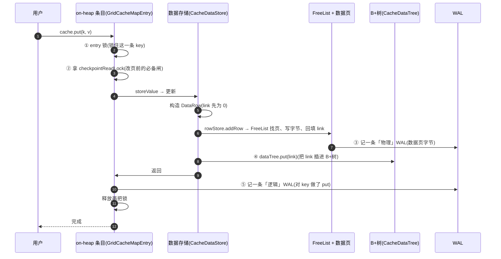
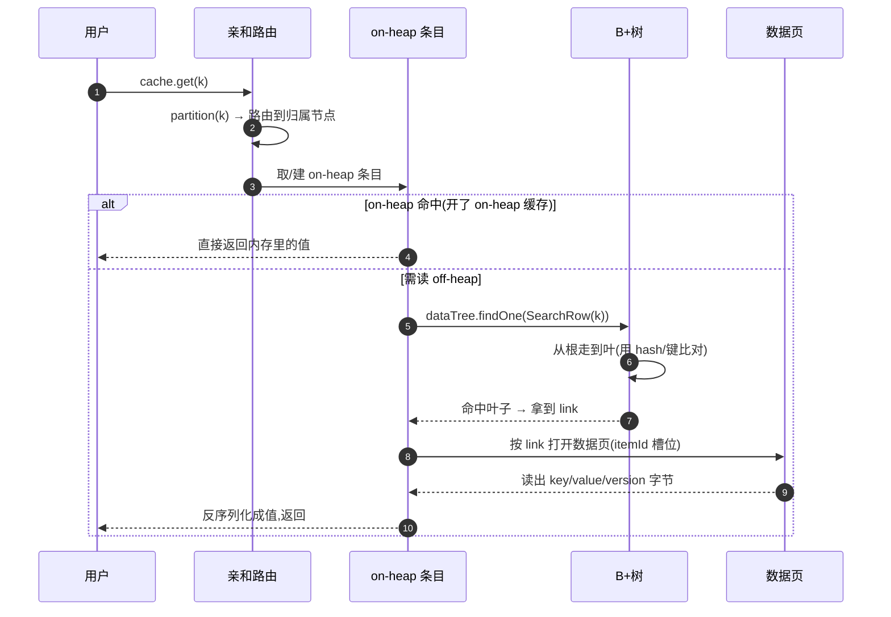
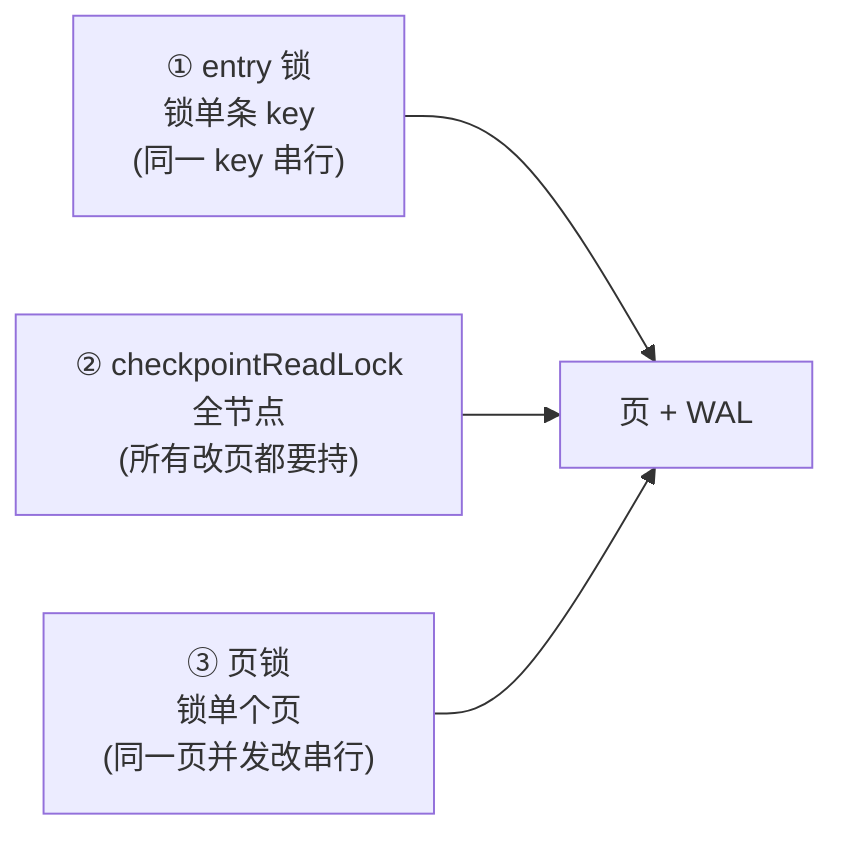

# 第 6 阶:串起来——一次 put / get 的全链路

> **对应天花板文档**:`docs-research/03-ignite-storage-layer.md` §9、§10
> **本阶只管一件事**:把前五阶的零件,串成一次真实的读写,看它们怎么协作。

---

## 开场:零件齐了,怎么看协作?

前五阶我们攒齐了所有零件:堆外页池、数据页/link/FreeList、B+树、WAL/Checkpoint、分区/亲和/rebalance。但零件散着还看不出"一台机器怎么跑"。本阶就用**一次 `cache.put(k, v)` 和一次 `cache.get(k)`**,把所有零件串起来走一遍。

走完这一遍,你再回头看 `00-map.md` 的全景图,会发现**每个词你都懂了**——这正是本系列的目的。

---

## 台阶一:一次 put 全链路

用户写下 `cache.put(k, v)`,内部依次发生:

按零件对一遍,你会看见前五阶全在线:
- **① entry 锁** —— 串行化**同一 key** 的并发改(不同 key 互不干扰)。
- **② checkpointReadLock** —— 第 4 阶那把"改页必备闸":持着它,Checkpoint 才不会在脚下拍快照。
- **③ FreeList + 数据页** —— 第 2 阶:找页、写字节、生成 itemId、把 **link** 回填给行。
- **③ 物理 WAL** —— 第 4 阶:记数据页字节增量,崩了能重建页。
- **④ B+树** —— 第 3 阶:把 `(link, hash)` 插进索引,以后能按 key 找回来。
- **⑤ 逻辑 WAL** —— 第 4 阶:记"对 key 做了 put",崩了能重放缓存语义。

> **两条 WAL**:一次 put 留下**物理** + **逻辑**两条记录,各有分工(第 4 阶讲过)。

📍 **代码锚点**:单行写入总编排 `CacheDataStoreImpl.update`(`IgniteCacheOffheapManagerImpl.java:1598`)。对应 03 §9.1。

---

## 台阶二:一次 get 全链路

用户写下 `cache.get(k)`:

关键:读的时候**先在 B+树里导航拿到 link,再沿 link 去数据页读真实字节**——正是第 2、3 阶铺的那条路。如果开了 on-heap 缓存,命中就直接返回,连 B+树都不用走。

📍 **代码锚点**:读路径 `offheap.read → dataTree.findOne`(命中取 link)→ 沿 link 读数据页。对应 03 §9.2。

---

## 台阶三:三道锁——分层并发控制

整条链路上其实有**三道锁**,各管一个粒度,别混淆:

| 锁 | 粒度 | 谁持 | 防什么 |
|---|---|---|---|
| **entry 锁** | 单条 key | 每次 put/get 同一 key 时 | 同一 key 的并发"读-改-写" |
| **checkpointReadLock** | 全节点 | 每个改页路径 | 被 Checkpoint 拍快照时撞上 |
| **页锁** | 单个页 | B+树/FreeList 内部 | 同一页的并发改动 |

> 术语:**锁(lock)** = 协调并发访问的机制,保证"同一时刻只有一个线程改某个东西"。**ReentrantLock**(entry 锁用的)是 Java 里一种可重入的互斥锁。

三道锁**由粗到细**:entry 锁管"业务 key"层、checkpoint 锁管"全局快照一致性"、页锁管"物理页"层。各管各的,互不替代。

📍 **代码锚点**:entry 锁 `GridCacheMapEntry.lock`(ReentrantLock);checkpointReadLock `CheckpointReadWriteLock`;页锁 `OffheapReadWriteLock`。对应 03 §10。

---

## 台阶四:事务——commit 时才真正落库(速览)

> 术语:**事务(transaction)** = 把多个操作打包成"要么全成、要么全废"的原子单元。

上面讲的是**单条原子 put**。如果是**事务**(多条 put 一起提交),Ignite 的做法是:**put 先写进 on-heap 条目和写集,等 `commit` 时才真正走 `CacheDataStore.update` 落到存储 + 写 WAL**。

分布式场景下,事务用 **2PC(两阶段提交)**:协调节点先 `prepare`、各参与者(主 + 备)都准备好再 `commit`。这保证跨节点的事务原子性。

> 注:Ignite 2.17.0 **没有**多版本并发控制(MVCC)的快照隔离——行是单版本的,靠版本号(`GridCacheVersion`)做冲突检测。代码里看到的 `ctx.mvcc()` 其实是**锁管理器**,不是快照 MVCC。

📍 **代码锚点**:事务 `IgniteTxManager.prepareTx / commitTx`。对应 03 §10。

---

## 你现在应该能回答

1. 一次 `put` 在内部依次经过哪些零件?哪一步生成 link、哪一步把 link 插进 B+树?
2. 一次 `put` 为什么会产生**两条** WAL 记录?
3. 三道锁各自管什么粒度?为什么需要三层而不是一层?

---

## 对应到 03 文档

本阶覆盖 03 的 **§9**(put/get 全链路)+ **§10**(并发与一致性、事务)。03 §9 的两张时序图比这里更详细(带每个步骤的 `file:line`),值得去对一遍。

---

## 收官:回到地图

现在请翻回 `00-map.md`,再看那张全景图和那六个根本问题:

- 数据放哪?——堆外页池 ✅(第 1 阶)
- 一页里怎么塞变长行?——数据页/link/FreeList ✅(第 2 阶)
- 怎么按 key 找?——B+树 ✅(第 3 阶)
- 崩了怎么不丢?——WAL/Checkpoint ✅(第 4 阶)
- 单机不够怎么办?——分区/亲和/rebalance ✅(第 5 阶)
- 怎么串起来?——put/get 全链路 ✅(本阶)

**每一个词你现在都能讲清楚了。** 这六阶就是一把梯子,它的终点是 03 那篇源码级的天花板文档。现在,带着这套心智模型去读 `03-ignite-storage-layer.md`,那些曾经"过于深奥"的 `file:line` 和架构图,会变得有迹可循。

后续如果想深入某一块(事务细节、SQL 执行、rebalance 调度),都可以在 03 对应章节的基础上继续挖。祝探索愉快。
